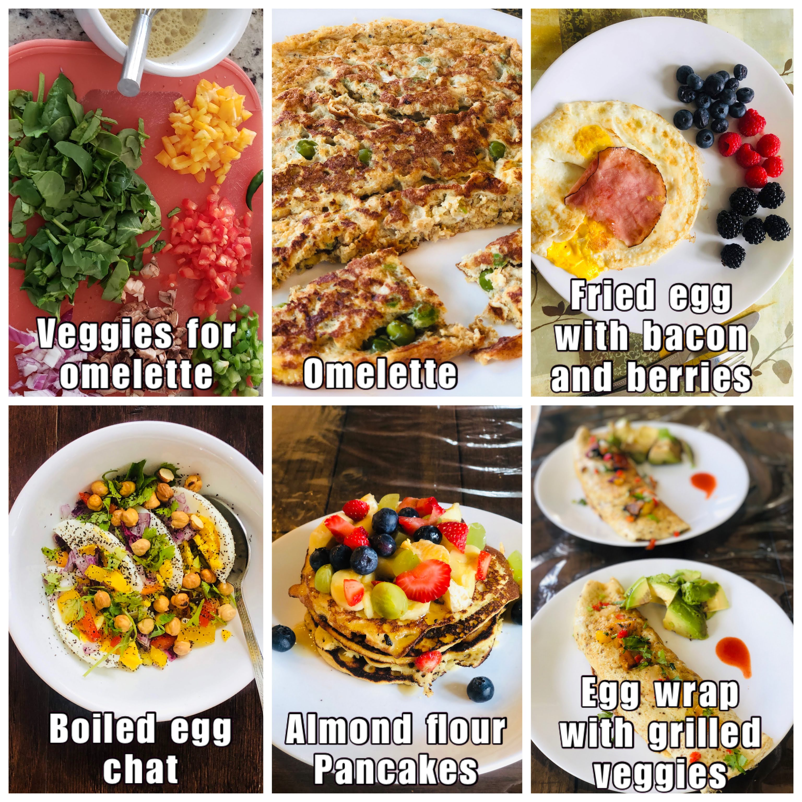
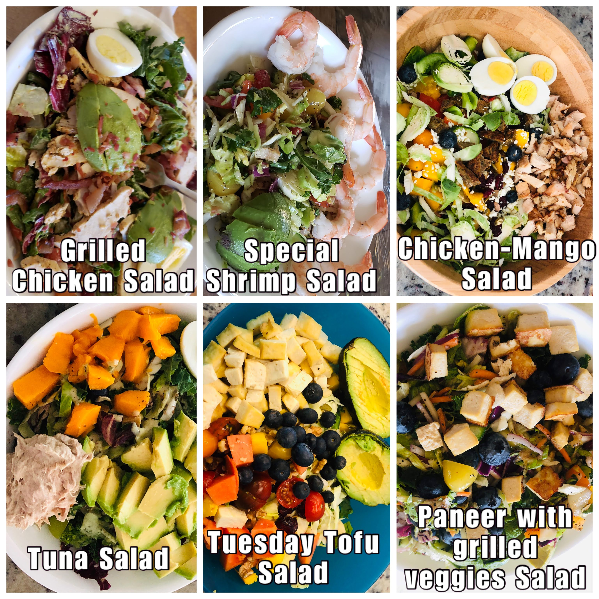
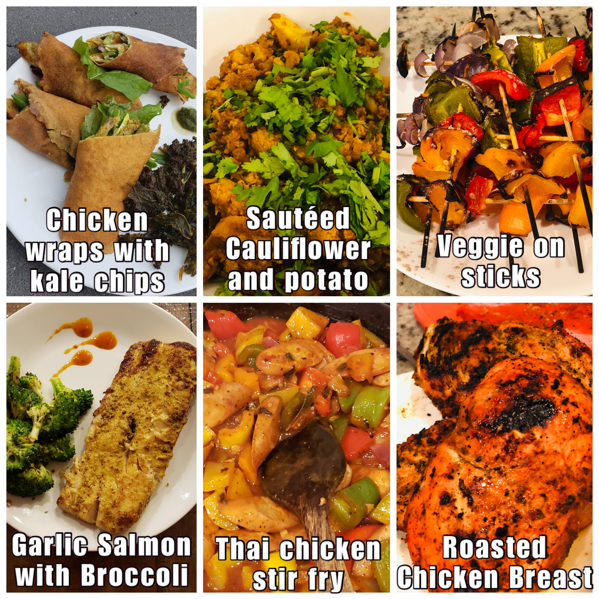
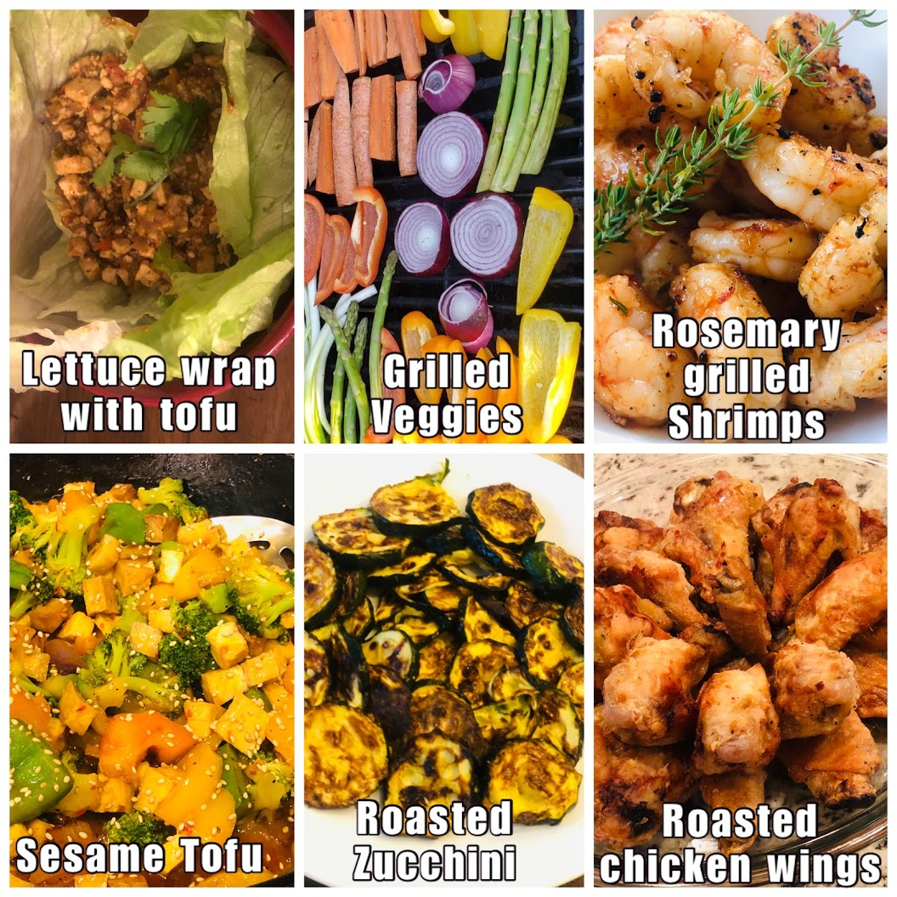

# Clean Eating

*Disclaimer: this is my interpretation of what I understood and did as part of clean eating. I am not aware if there is a standard definition for this and if there is one I do not wish to challenge it.*

Clean eating is not a diet. This is the number one thing I find myself explaining to people when they say "you have lost so much, what diet are you following". It is simply a decision of saying I am going to keep processed foods and sugars out of my body. Strictly speaking, only if you are eating something you have grown or you have hunted are you eating clean, but then let's be real here, unless you are living on a farm, this is not feasible. The next best thing we could do is to keep processed food and especially processed sugars out of our body. I don't need to say more on this except that there is tonnes of research available proving why processed food and refined sugars are just plain bad, do yourself a favor stay away from these.

Appendix A contains a checklist of what we confirmed with our trainer was allowed during clean eating. This is pretty exhaustive list. Before I get into the details of exactly what we ate, I would like to address something upfront. Is clean eating hard? Yes it is hard, but only to the extent of saying that nothing that is worthwhile is ever easy. Not being able to eat your favorite unhealthy snack is hard, I am not going to lie, but then it is for a fixed period of time. After all, no one ever became unhealthy because they could not eat ice-creams :). At the same time, clean eating is also not that hard when I compare it to other diets. The key difference is that you are not counting calories, counting calories is not sustainable, you cannot survive on a 1000 calories a day for long (several months maybe, can you do it for your whole life). Think of it, if counting calories was the solution then some food company would have figured it out and the shelves would be full of some magic food.

The intent of clean eating is to reset your system, calibrate your taste buds so that they begin to appreciate the natural tastes of different foods. I would know because I am the person who back in India would go (every now and then) for a late evening after dinner ice-cream (a fruit salad Sunday to be precise) and then as if that was not sweet enough, go to a [Kulfi](https://en.wikipedia.org/wiki/Kulfi) place right after that to top it off! 3 weeks into clean eating I found a papaya to be sweet, grapes to be just too sweet and eating an orange or two as a 4pm snack seemed just delightful.

Indulge me a little bit before we get into the details of breakfast/lunch/dinner. When we got married, we went to Europe for our honeymoon and one of the places we visited was the city of Nice in the south of France. Absolutely beautiful place, however, we did not quite develop an appreciation for the French food. We were looking for some Indian food or anything that had some spices and was not cold and bland (my apologies to anyone reading and thinking these folks don't know the first thing about French food). We found this Pakistani restaurant by the beach and were delighted to eat some Butter Chicken there. It was not hard to notice that we were from India because Nidhi was still wearing some distinctly Indian jewelry. The owner of the restaurant stopped by to talk to us and seeing we were Indian sat down for a conversation. He said, "you know, the French food is the best food in the world", we were listening but not quite agreeing, the butter chicken would not allow us. He continued "back home, we put so much spices in our food, cook it for so long that we never get to know what the ingredients actually tasted like...". Months of eating relatively clean (not strictly, I mean I do eat my ice-cream sometimes, I have had a pizza a few times), has made me realize that while I still cannot compare the taste of the Indian cooking with anything else, I do see the point of the natural taste of food. Our elder son likes a green chilly with his dinner, but the younger refuses to even recognize that "bitter" can also be a taste.

## A clean breakfast

Breakfast was mostly eggs, in any form. Egg fry (cooked in Ghee or Kerrygold butter), omelette (sometimes with tiny pieces of bacon thrown in), boiled eggs, scrambled eggs, egg wrap or any other variation one can think of. Along with coffee (for me, I am a coffee person) or tea (Nidhi is a tea person) with almond milk or an almond and coconut milk creamer. We used to think that removing dairy from our diet would be almost impossible, but surprisingly, that was one of the easiest things to do. Swapping whole milk with almond milk worked like a charm. I personally find the almond milk so light and have developed such a liking for it that I no longer feel like drinking regular milk at all. For the days we did not consume eggs, we had bananas or almond flour pan cakes. Another thing we really enjoyed for breakfast was frozen Acai bowl (you can get them at Costco, just don't eat the granola that comes along with it).

Here are some pictures. I would note that everyday the omelette may not have looked as good but was pretty close. It is real hard work to make breakfast this good everyday and the credit for this is one person's and one person's alone i.e. Nidhi :).



\pagebreak

## A lunch we really love

For lunch we used to have salads. I don't know about you but when I think of salads, i have two contrasting pictures in my head as reference (this is all prior to clean eating), one is a cold salad with raw vegetables and boiled eggs, along with some beans and chickpeas and broccoli and the other image is from a salad place like the one I often visited at Georgetown, exquisite salads with all sorts of "woke" ingredients. The first one was something I just did not find palatable at all and the second one was what I would wait for the whole week so that I could eat it whenever I was at Georgetown for a class. Surely there was some middle ground here, I would think, and there is.  

Costco has a bunch of good salad mixtures in their fridge section and they are all very good. We particularly liked the sweet kale salad (minus the dressing that comes with it, we did not use that). So we mixed the sweet kale, with additional ingredients such as spinach or other mixed greens and topped it with sunflower seeds, chia seeds, walnuts (sometimes cashews), some cranberries and my favorite, "blueberries". Used a home made dressing made of olive oil, lemon juice and herbs. Add a boiled egg, half an avocado and then either some grilled chicken or tuna. Some days we substituted chicken/tuna with grilled tofu. I am still surprised that even after more than 6 months of eating variants of it (keeping the base recipe the same) 4 to 5 times a week, we are still not bored of it, in fact we seem to like it as much as we liked it before. Each day, the salad tastes a little different and that was keeps it interesting.



One of thoughts I had and I believe many people would have is that salad does not satiate me, it does not full me up. That is actually not true, or was not certainly true for me as I found out. Eating a bowl and a half of salad does indeed fill you up. As before, I still like a cup of hot coffee after lunch. What does happen is that after 2 to 3 hours I felt the need for a mid afternoon snack. Previously this could have been any unhealthy options like chips, cookies, a diet soda, even a chocolate bar, basically anything you would typically find in a vending machine. That had to go, for good.

## The 4pm snack

A couple of small oranges at 4pm felt delightful. They tasted good, and the sugar content provides the boost the brain needs to shake off any mid afternoon lethargy or drowsiness. At times I also ate maybe 4 to 5 apricots, maybe an apple, or even some nuts such as walnuts/cashew nuts/almonds (not those packaged snack pouches please, we want to stay away from any processed food, as much as possible).

I did not try this as much, but sometimes I did have a "tea" such as a earl gray or English Breakfast, just a dip tea with hot water, no milk of any kind. It was nice, but me not being a tea person did not pursue it that much but it is certainly an option.


\pagebreak

## The grand finale a.k.a the dinner

If you try to stick to this routine, you would naturally find that you want to have your dinner early. What is early? For me, growing up, dinner was never before 7.30pm and then later in life as I got caught up with studies and then later at work and other things, it could be at 8 or 9pm or even later. That is not good, in fact, I would now say that is just absolutely unacceptable.

Now we really make an effort to wrap up dinner by 7.30pm, maybe 8pm at the latest. I start feeling hungry around 6pm, so a dinner around 7pm seems like the perfect fit. Eating dinner early helps to naturally avoid the urge for mindless snacking. As one of the people I happen to meet over the years who was into eating healthy said "You are not a goat, you don't have to keep munching all the time!". One way to avoid munching all the time is to eat at fixed times and eat full meals so that you don't feel hungry anymore. Instead of trying to eat just a little bit and continue what you are doing (whether it is work or anything else around the house) and wait for dinner, which inevitably leads to repeated snacking while waiting for the full meal, it is much easier to just tell your brain, wait for the full meal and then make sure you don't push off that meal to 2 hours later.

So, what did we have for dinner, lots of different types of food and I would happily say lots of tasty food. There is a lot of grilled food as you would notice. I did not realize this until I wrote this, a lot of our dinner is grilled either outside or in the oven. There are vegetarian options also and the vegetarian options are as tasty as the meats.





\pagebreak

## The results

The following charts show our progress in terms of weight loss, with the clean eating periods highlighted. We did a clean eating in February-March and then another in July-August.

We saw very good results in both the iterations. The first iteration produced much better results because obviously there was just too much weight to lose, but surprisingly the second iteration was also very effective. The way we see this now is that if we ever hit a really long plateau in the journey to achieve the desired weight we could just toughen our minds and do this again. It cannot hurt.

```{r echo=FALSE, fig.height=10, fig.width=14}
df_clean_eating_dates <- important_dates %>%
  select(-include)

df_iter1 <- df_clean_eating_dates %>%
  filter(str_detect(label, "Clean Eating")) %>%
  filter(str_detect(label, "Iteration 1")) %>%
  mutate(label = str_replace(label, "Clean Eating Iteration 1 ", "")) %>%
  spread(label, Date) 

df_iter2 <- df_clean_eating_dates %>%
  filter(str_detect(label, "Clean Eating")) %>%
  filter(str_detect(label, "Iteration 2")) %>%
  mutate(label = str_replace(label, "Clean Eating Iteration 2 ", "")) %>%
  spread(label, Date) 
  
df_clean_eating_dates <- bind_rows(df_iter1, df_iter2) 

df_tidy %>%
  filter(metric=="Weight") %>%
  filter(value > 50) %>% # remove incorrect data
  ggplot(aes(x=Date, y=value, col=name)) +
  geom_line() +
  geom_rect(data=df_clean_eating_dates, aes(x = NULL,y = NULL,xmin=Start, xmax=End, 
                                  ymin=-Inf, ymax=Inf, 
                                  alpha=0.05, fill=name, col=name), show.legend = FALSE) +
  facet_wrap(~name, scales = "free_y") + 
  scale_x_date(date_breaks = "3 months", date_labels = "%b-%y") +
  theme_fivethirtyeight() +
  theme(axis.title = element_text()) + ylab('Weight (lb)') +
  xlab("") +
  labs(title="How we lost the weight...",
       subtitle=glue("Shaded area represent clean eating iterations"),
       caption=CAPTION) + 
  theme(text = element_text(size=CHART_ELEMENT_TEXT_SIZE), legend.title = element_blank()) + 
  scale_color_tableau() + 
  scale_fill_tableau()
```

Here is another chart that compares the weight loss during clean eating and non-clean eating days. Note that even when we were not doing clean eating we were still careful about what we were eating (in other words we were not gorging on Pizzas and butter chicken, soft and hard drinks were still completely off limits).

The chart shows a boxplot representing the spread of the weight loss per day during clean eating periods and non-clean eating periods. The horizontal line inside the box represents the median value of the distribution. For example, I lost at least 0.435 lb per day on 50% of the days during clean eating whereas I only lost at least 0.005 lb on 50% of the days during non-clean eating period. The data for this chart includes both clean eating periods over a timespan from `r {min(df_tidy$Date)}` to `r {max(df_tidy$Date)}`.

```{r  echo=FALSE, fig.height=10, fig.width=14}
ce_start1 <- df_iter1$Start[1]
ce_end1 <- df_iter1$End[1]
ce_start2 <- df_iter2$Start[1]
ce_end2 <- df_iter2$End[1]
df_wt_loss2 <- df_wt_loss %>%
  mutate(clean_eating = ifelse(between(Date, ce_start1, ce_end1) | 
                                 between(Date, ce_start2, ce_end2),
                               "clean",
                               "careful-but-not-clean")) 
df_wt_loss_medians <- df_wt_loss2 %>%
  group_by(name, clean_eating) %>%
  summarize(med=round(median(loss_per_day, na.rm=TRUE), 4), .groups="keep")

df_wt_loss2 %>%
  drop_na() %>%
  filter(abs(loss_per_day) < 10) %>%
  ggplot(aes(x=name, y=loss_per_day, col=clean_eating)) + 
  geom_boxplot(show.legend = TRUE) +
  geom_text(data = df_wt_loss_medians,
            position=position_dodge(width=.75),
            aes(y = med, label = glue("{med} lb"), col=clean_eating), 
            size = 7, vjust = -.5, show.legend = FALSE) +
  #scale_y_continuous(breaks = seq(-2.5, 2.5, by = .5)) + 
  theme_fivethirtyeight() +
  xlab("") +
  theme(axis.title = element_text()) + ylab('Weight Loss (lb)/Day') +
  labs(title="Clean eating days Vs Others",
       subtitle=glue("Clean eating days clearly have a higher median per day weight loss."),
       caption=CAPTION) + 
  theme(text = element_text(size=CHART_ELEMENT_TEXT_SIZE), legend.title = element_blank()) + 
  scale_color_tableau() + 
  scale_fill_tableau()
  
```

## Is the 30 day challenge hard? 

It is not very hard, certainly I did not feel it was, BUT tedious and tiresome is how I would describe it. It has to be said though, it is hard for the chef for sure, our food menus did change. The fact that there isn't a restriction on eating vegetables or fruits makes it easier than other diet programs that I know of. It is a given that you are not eating potato fries everyday for lunch or a mango as an after dinner dessert every night. What makes it hard is that after the first few days the enthusiasm begins to wane and the new eating habits take some time to become friendly. Once you adjust, both body and mind, to the new eating regimen then it does not feel like a diet at all. It certainly helps to have a goal in mind and keep reminding yourself why are you doing this.

For me, I think after two weeks or so, I could certainly start feeling the benefits, I felt lighter, more energetic (no mid afternoon energy crashes), better quality of sleep, just overall lot of positives. While all this is happening, an interesting incident occurred. We had to be at a friend's place for a birthday dinner, the host was gracious enough to prepare some salads for us and we also took our own food with us. Midway through the party, I suddenly started feeling uncomfortable. The smell (aromas) of all the food and more so the alcoholic drinks made me feel nauseous, I felt like throwing up. Fortunately I did not throw up and we had a very enjoyable evening other than those 30 minutes. I was totally fine when we were back home, totally fine the next day as well. It must be that 3 weeks into clean eating the internal circuitry in my body had maybe begun to rewire itself, or so I thought.

Another thought that often came to my mind was that good food is a source of happiness, of joy. The sweet gulps of the [mango lassi](https://en.wikipedia.org/wiki/Lassi#Mango_lassi) soothe the soul, the tangy and crisp [Gol Gappe](https://en.wikipedia.org/wiki/Panipuri) tickle the brain, a [raddish or carrot or onion paratha](https://en.wikipedia.org/wiki/Paratha) satiate the stomach like nothing else, and what even comes close to a [butter chicken](https://en.wikipedia.org/wiki/Butter_chicken)? This is all true, however, food does not have to be the "only" source of happiness. There is happiness to be derived from good health, from feeling light, awake and agile throughout the day. A round of vigorous exercise resulting in a body drenched in sweat and a rush of endorphins is also happiness. Give it a chance, it will not disappoint you.

## What happens after the 30 day challenge?

Several people have asked me, "like other diets, do you go back to your old weight after you stop clean eating?". My answer is "yes, most certainly" and this should not be a surprise. While I would not call clean eating a "diet", it is certainly accurate to say that there is no such thing as a "one time fix". If you want the effects to be permanent then the lifestyle changes also have to be permanent, there are no quick fixes. I have often heard in other contexts that being fit/healthy/strong requires a lifestyle change. I agree, it certainly does. Does it mean we can never eat unhealthy food? No it does not mean that either. What it does mean is that you first become healthy enough and consistent enough with your nutrition and fitness so that a vacation, social gatherings or just plain eating out does not have to be viewed as a reason to say "Oh, I need to workout extra tomorrow to burn all of these extra calories, or I need to fast for a day now...", your regular fitness and eating regimen is able to take care of it.

As our 30 day challenge was coming towards an end I was very much looking forward to eating a lot of Indian delicacies, all in one meal. I did that, probably having deprived myself a lot, I went overboard. The results were not pleasant. After about an hour, I started feeling miserable. I felt bloated, tired, lethargic and sleepy. For a moment I could not understand what was happening, sounds like an exaggeration but I had almost forgotten what it felt like to overeat. Nidhi then pointed out it was probably because of all the food I ate, that made total sense. I felt so full, I did not eat anything in the afternoon, nothing in the evening for dinner either. Next morning I felt much better. This was my body's way of telling me that you do this again and I am going to react to this as if there is an alien invasion and the planet is in danger. Make no mistake, I have not stopped eating that food, I just eat smaller portions of it because I realize that what follows after the 30 minutes of pleasure is 24 hours of unpleasantness.


## A post 2020 update

We did not repeat the clean eating challenge again in 2021. Not because it was not useful anymore but because, it is a tool in the toolkit for attaining a healthy body weight, but it is not the only tool. Like all useful tools, it needs to be used judiciously. By the end of 2020 we understood to a good extent what kind of foods suited us, how are bodies reacted to certain food and so did not have the need or to a great extent the drive to do the challenge. The clean eating challenge at it's core, is an exercise in finding out the relationship the body has with various kinds of foods by the process of elimination.

What we were now figuring out was something that can be described as "infinitely sustainable". Chapter 11 of this book discusses this in detail. Also, as 2020 was ending and the festival season was approaching, clean eating challenge was no longer on our minds and then in 2021 we started experimenting with other things such as water fasting. So while we still eat reasonably clean (no soft drinks, no hard drinks either, minimal processed foods and sugars) doing the clean eating challenge again is not high on the list.  

## Chapter 4: At a glance

***

1. The 30 day clean eating challenge is a way to detox your body by staying away from any and all processed food and especially processed sugar. 

2. We mostly ate a diet high in protein, fiber and good fats. This meant we remained full for a longer time and were able to eliminate snacking and surprisingly (for us) did not experience cravings for any particular food.

3. The two times we did the 30 day clean eating challenge we definitely saw an increased weight loss per day on an average.


