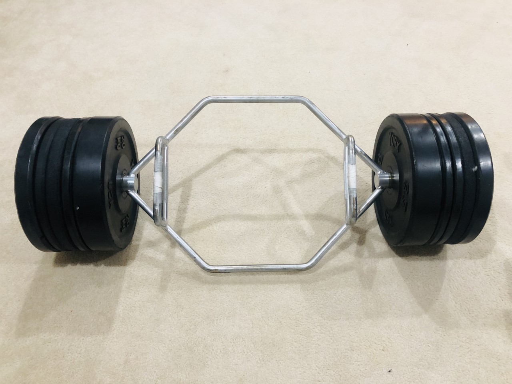

# Exercise: Putting in the hard yards

You would have probably heard that managing weight is 70% about nutrition and 30% about exercise. I think this correct. Having said that, we should not downplay the 30% i.e the exercise. As I have mentioned earlier in the book, a few years back I tried a purely diet based plan and achieved good results. The problem with it, like with all diet based plans, was that it was not sustainable. There is another aspect to this as well, when I tried losing weight purely via the diet route (a.k.a counting calories) my overall appearance became thinner or to use the more appropriate term here, weaker. While I do not recall feeling lack of energy but the appearance was as if I had just lost a lot of weight from sickness and it did not look healthy. Several people asked me out of genuine concern if I was sick and when I told them that I was doing this diet their reactions were on the lines of "ok, but don't do more of it". This time however, things are different, both me and my wife look leaner and fitter. Our body structure has become "denser" if that is the right word to use here and it is because of that we look thinner and fit into much smaller clothes. Appearance wise we do not have the starved look that I suppose comes from severe calorie restricted diets. Without a doubt, this is the result of the rather intensive exercise routine that we now have.

## Counting calories (and why it does not work)

If you have ever made a conscious effort to lose weight, chances are that you are aware of the phrase "counting calories" or "caloric restriction". These phrases refer to the idea that we note the calories we expect to get from the food items we eat and once we know that we restrict our daily caloric intake to a number lesser than the average recommended value (see the FDA guidelines [here](https://www.fda.gov/media/112972/download)). The idea being if we eat less than what our body requires then the body ends up burning stored fat reserves, ergo, we lose weight. The problem with this approach is that while the idea is correct but it is not sustainable. You can definitely lose weight by consuming less calories than what your body needs based on your specific life circumstance but then for how long? Nobody like to be deprived of foods they love (I am not suggesting we surrender to cravings for junk food that are specifically engineered to trigger those cravings), keep feeling hungry or worse feel stressed because we are not able to consume (in appropriate quantities) foods that we like. Think about it, if calorie counting worked then someone in the past 100 years would have figured out a way to make it work in a sustainable fashion, we know by looking all around us that it is not the case.

There are two things to understand here, a) calorie counting is a tool, it is a way of measuring how much is enough and b) not all calories are the same. When we are eating processed food, getting a realistic count of calories is difficult. The amount of energy that our bodies have to expend to metabolize processed food is much less than the amount of energy required to get the same number of calories from whole foods, thus the cost per calorie in terms of calories burnt and calories gained is much smaller for processed food. Put simply, processed food is going to make us fat, fast!

What if we were able to burn more calories rather than having to eat less food? This is where exercise and specifically strength training comes in. When we do strength training consistently over months and years, we build muscle and the body then has to keep burning fat (even when we are at rest) to generate calories to sustain these muscles. A balance of eating healthy and strength training regularly is what helps to ultimately find that fine equilibrium, just as Goldilocks found the porridge that was just right. It is important to mention that just as caloric restriction is not the panacea, the idea that "I can eat anything now that I workout 5 days a week" is also incorrect and most likely harmful in the long run even though it might prevent weight gain in the short term.

## There is always a first time

When I went to the gym for the first time this year, it was not just the first time for me in the year 2020 but it was for the first time in my entire life of 41 years. I had no illusions of how supremely unfit I was and how difficult this was going to be. Sometimes, I used to see people exiting after their class and I used to tell myself "OK, that person looked great, but that is probably because he has been working out since forever". Of course, this may or may not have been true, but my goal was to keep telling myself that if I was disciplined enough to show up rain or shine and do the exercises as told then I would get better, that is just how it works (at least that is what I told myself anyway). 

I look at some old videos now of me doing exercises like planks or air-squats when I started and I compare them with the more recent ones of me doing the same exercise. My movements used to be very clumsy, almost hilarious, and it is to the credit of the trainer that she did not give up on me. Nidhi on the other hand, being a dancer, her movements had a natural rhythm, she had flexibility and having done some exercises while growing up, she was much more comfortable with the whole setup. My objective was not to be as good as her but to simply by better than me from four weeks ago. Here is a picture of me doing squats, about a year apart. The one on the left is my attempt to do a squat with a box to support in case I fall down, the one the right is me doing the same exercise but this time with a 45lb kettlebell and heels elevated on a plate. Doesn't even look like the same person, does it :). Procrastination is the absolute worst thing we can do, no matter how uphill a battle it appears at the start, it is always the first step that lays the foundation and it is consistency that creates the stairway to success.


We started with working out twice a week, and then went to thrice, and then four times and now I work out five times a week. Nidhi tried the four times a week routine but is now nicely settled into three times a week. In about 8 months I went from having to push myself to workout twice a week to now chasing endorphins. Of course, it helps that because of Corona, we are all working from home so we have a little more flexibility with our schedules. If there was one silver lining that I could find in that otherwise disaster of an year, it was that we could fit in time for self-care.

One day a couple of months into training, I stumbled upon a YouTube video of the training routine of an actress who played the role of a superhero in one of her movies. Her trainer said when she came to the gym and looked at people doing pullups and deadlifts, her reaction was that "Oh yeah this is cool and all but I can't do that", and a few months later she was deadlifting 235 pounds. When I saw the video, I had a similar reaction. I thought sure, a Hollywood actress with a celebrity trainer can ofcourse do this, I cannot. I WAS WRONG. I recently deadlifted 325 pounds, and while I still do assisted pullups, I can at least visualize myself doing some real pullups by myself, not easy, but definitely possible. 

I am hugely inspired when I see a video of an athlete's working routine, a movie star spending weeks and months in the gym training for a particular role to look the part or just so many people who share fitness content on social media. Like everything else, social media also comes with it's share of the good, the bad and the ugly, it depends upon you which lens you choose to view the world.

## Our workout routine

I am not a personal trainer, therefore I am not qualified enough to talk about the technical details of what makes for a good workout but I would like to share what we did and loved.

Our workout sessions were an hour long and were mostly divided into five parts:

- Warm up (about 5 minutes)
- Strength (about 10 to 15 minutes)
- Strength & Conditioning (15 to 20 minutes)
- Core (5 minutes)
- Stretches (2 to 3 minutes)

With some rest time and setting up equipment for different exercises the above routines added upto an hour (give or take 5 minutes). From mid January when we started to about the end of March we were working out twice of week in our trainer's gym and since then we have been working out at home and our home gym has slowly metamorphosed from being your amateur home gym to a souped up version with lots of weights, barbell, deadlift equipment, resistance bands, boxes, pull up bars, rowing machine etc. Some of the stuff we bought, some our trainer was kind enough to lend us for a while (because Corona). Here are a couple of pictures.


For a long time, and even today, I tell myself before the workout, that warmups are easy, the strength portion is just 10 minutes so it will be over quickly before I realize and then the conditioning is the only part that I have to push through and then by the time I am half way through the conditioning it would be almost over and then core is super easy (it is not). This kind of mental setup helps me get through the hour. Of course once I am in the middle of it, unless the workout on the day absolutely pulverizes me, my mind goes almost totally blank, no thoughts at all. I have experienced this many times, going into the workout from a crisis at work is a huge mental shift. Once the workout is over, I realize that maybe the work problems are not that insurmountable as they appeared an hour back. It could be the exercise, or just the fact that I have had the opportunity to (forcibly) extricate myself from the crisis situation and now after an hour I am able to think more clearly. I do not know what is the reason, but I do know that I experience mental clarity after the workout.

The following tables show the different exercises we did, over time, as part of the warmups, strength, conditioning and core. These were done over a period of time, with the more difficult ones such as the Turkish getup added much later and for the ones which we did from the start we kept on increasing the weights or the numbers of sets and reps over time. 

This is a rather long list, we kept meticulous notes of what exercise we did and weights we used for those exercises (wherever applicable). The purpose of putting the entire list here is to emphasize two things, firstly a good training routine requires a lot of different exercises to train the big muscles, the small muscles and everything in between and secondly this is not DIY, there is a lot of thinking and planning that goes on behind the scenes that is done by a good PT (personal trainer). It is similar to a conversation I once had with my dentist about flossing my teeth, I asked her "so which teeth do I need to floss?", and she replied rather nonchalantly "only the ones you would like to keep...". It is the same with muscle groups.

At the same time, I do not want anybody who works out at home on a treadmill or a spin bike or goes out for a run or does any other form of exercise to see the following tables and feel overwhelmed. Any which way you get your 150 minutes per week of moderate intensity physical activity ([CDC guideline](https://www.cdc.gov/physicalactivity/basics/adults/index.htm)) is good. The more I think about it, the more I feel that we just organically fell into this routine. It was as if we found this beautiful path through the woods, decided to explore it further and loved every step of the trail.

One last point before ending this section, keeping track of your workouts is super important to see how you are progressing (not so much for the pace of progress but simply to know that there is progress, or not). However, this is hard to do manually and after a period of time simply impossible to do manually. There are some good apps out there which you can use, choose something that allows you to export all your data out so that you are not tied to that one app but can actually see the raw data for yourself in a spreadsheet.


```{r echo=FALSE, warning=FALSE, message=FALSE}
if (!knitr:::is_html_output()) {
  warmup_workout_table
} else {
  warmup_workout_table
}
```


```{r echo=FALSE, warning=FALSE, message=FALSE}
if (!knitr:::is_html_output()) {
  #kable(df_exercises, format="latex", booktabs=TRUE) %>% 
  #kable_styling(latex_options="scale_down")
  strength_workout_table
  
} else {
  #    df_exercises %>%
  #  gt::gt(groupname_col = 'Routine') %>%
  #  tab_header(
  #    title = md("**Exercise Routine**"),
  #    subtitle = md("Not a comprehensive list, just a random selection.")
  #  )
  strength_workout_table
}

```


```{r echo=FALSE, warning=FALSE, message=FALSE}
if (!knitr:::is_html_output()) {
  strength_and_conditioning_workout_table
} else {
  strength_and_conditioning_workout_table
}

```
  
  
```{r echo=FALSE, warning=FALSE, message=FALSE}
if (!knitr:::is_html_output()) {
  core_workout_table
} else {
  core_workout_table
}
```

The conditioning part of the routine usually consisted of either a 12 minute AMRAP (as many rounds as possible) or a 12 minute EMOM (every minute on the minute) or sometimes a HIIT (high intensity interval training) such as Tabata or on some days just a combination of exercises.

## Our calendar so far

The following charts shows the calendar for the year 2020 and 2021 with the days we exercised marked with an [E] and the amount of weight lost/gained reflected by the color. Red indicates weight loss and green indicates weight gain. More "red" than "green" in a month means overall we lost weight in that month. I like this chart a lot because it brings out very clearly that weight loss is never a straight line, you gain some (days) and you lose some (days), except in this case, losing is better.

```{r echo=FALSE}
plot_exercise_calendar <- function(df_exercise_dates, y) {
  df_exercise_dates <- df_exercise_dates %>%
  filter(year(date) == y) %>%
  gather(name, exercise, -date) %>%
  rename(Date=date)

df <- df %>%
  filter(year(Date) == y) %>%
  left_join(df_exercise_dates, by=c("Date", "name")) %>%
  mutate(exercise = ifelse(is.na(exercise), 0, exercise))

df <- df %>%
  left_join(df_wt_loss %>%
              filter(year(Date) == y) %>%
              select(Date, name, loss_per_day) %>%
              group_by(Date, name) %>% 
              filter(loss_per_day==max(loss_per_day)), by=c("Date", "name")) %>%
  rename(DateCol=Date, ValueCol=loss_per_day) %>%
  mutate(ValueCol = ifelse(is.na(ValueCol), 0, ValueCol))


#View(df_wt_loss %>% filter(name == P2_NAME))
dfPlot <- df %>% 
  mutate(weekday = wday(DateCol, label = T, week_start = 7), # can put week_start = 1 to start week on Monday
         month = month(DateCol, label = T),
         date = yday(DateCol),
         week = week(DateCol))

# isoweek makes the last week of the year as week 1, so need to change that to week 53 for the plot
dfPlot$week[dfPlot$month=="Dec" & dfPlot$week ==1] = 53 

dfPlot <- dfPlot %>% 
  group_by(month) %>% 
  mutate(monthweek = 1 + week - min(week))
if (y == 2020) {
  subtitle <- "Daily weight tracking started Feb 17, 2020. Exercise days marked as [E]."
} else {
  subtitle <- "Exercise days marked as [E]."
}

#View(dfPlot %>% filter(name == P2_NAME))
dfPlot %>%
  filter(name == P2_NAME) %>%
  ggplot(aes(weekday,-week, fill = ValueCol)) +
  geom_tile(colour = "white")  + 
  # geom_point(data=dfPlot %>% filter(exercise==1), aes(weekday, -week), position="dodge2") + 
  geom_text(aes(label = ifelse(exercise == 1, glue("{day(DateCol)} [E]"), day(DateCol))), size = 4, color = "black") + # day(DateCol)
  #geom_text(aes(label = ifelse(exercise == 1, glue("{round(ValueCol, 2)} [I]"), round(ValueCol, 2))), size = 2.5, color = "black") + # day(DateCol)
  theme(aspect.ratio = 1/2,
        legend.position = "top",
        legend.key.width = unit(3, "cm"),
        axis.title.x = element_blank(),
        axis.title.y = element_blank(),
        axis.text.y = element_blank(),
        panel.grid = element_blank(),
        axis.ticks = element_blank(),
        panel.background = element_blank(),
        legend.title.align = 0.5,
        strip.background = element_blank(),
        strip.text = element_text(face = "bold", size = 20),
        panel.border = element_rect(colour = "grey", fill=NA, size=1),
        plot.title = element_text(hjust = 0.5, size = 30, face = "bold",
                                  margin = margin(0,0,0.5,0, unit = "cm"))) +
  scale_fill_gradientn(colours = c("#6b9235", "white", "red"),
                       values = scales::rescale(c(-1, -0.05, 0, 0.05, 1)), 
                       name = "Weight Change (lb), red = weight loss, green = weight gain",
                       guide = guide_colorbar(title.position = "top", 
                                              direction = "horizontal")) +
  facet_wrap(~month, nrow = 4, ncol = 3, scales = "free") +
  labs(title = glue("Daily Weight Change Tracker, {y}"), subtitle=subtitle) +
  theme(plot.subtitle = element_text(size=15, face = "bold"))
}
```

```{r echo=FALSE, fig.height=10, fig.width=14}
print(plot_exercise_calendar(df_exercise_dates, 2020))
```

```{r echo=FALSE, fig.height=10, fig.width=14}
print(plot_exercise_calendar(df_exercise_dates, 2021))
```

You can notice in the charts the number of days marked as [E] (for exercise) has increased over the months in 2020 until August and from that point on it was settled at 5 days a week or 20 days a month for me and 3 days a week or 12 days a month for Nidhi. As we exercised more and ate right, the body became stronger and it could take on more work and so we exercised even more, it became a self driving cycle. Exercise also gives you a "high", a feeling of euphoria, you cannot miss it. Stated differently, this increased number of workouts, doing more sets and reps, this was only partially driven by just the motivation to lose weight, the rest of it was because A) the body became strong enough that the current load became easier and so a step up was needed and B) the desire for that "high", it makes you want to get more of the stuff that got you here in the first place. If this book ever gets into the hands of someone who has exercised for any length of time, I would like to add that what I have written here may seem routine and totally on expected lines to you but to me this was unlike anything I had experienced before, it was a joyous discovery. Lookup #chasingendorphins on Twitter or Instagram and you will see what I mean.


## That which does not kill us makes us stronger*

<i>*Quote from Friedrich Nietzsche</i>

Deadlifts are my favorite. They are a full body exercise, our trainer says deadlifts are a game changer. I have watched a lot of celebrity trainers on YouTube and heard them echo the same sentiments. While we did several different variants of the deadlift such as the single leg stiff leg deadlift, the sumo stance deadlift etc. but my personal favorite and something that I religiously tracked was the deadlift with a hexbar. Maybe it had to do something with the visual imagery I had in my head of this being a strong man's exercise. I remember that when I first saw the hexbar in the gym I asked our trainer when are we doing that and she said, you will get there in a couple of weeks (this was sometime in mid to late February). The hexbar weighed 55 pounds, it was the heaviest they had.

The first day I tried it, I recall that the trainer was very cautious, I don't know if she thought I could even do it (I was fat and never been to the gym until last 2 months remember, this was February). To this day, when I have graduated from lifting the hexbar with no weights to lifting the same hexbar with 135 pounds plates on either side, she is still extremely cautious and rightly so. My deadlift goal is 400lb, which as it stands of today (September 9, 2021) is 2.15 x my body weight. I currently deadlift 325lb which as of today is 1.74 x my body weight. 

Is the 400lb or 2x body weight just an arbitrary tough ask for an "alpha" exercise such as the deadlift or a truly worthy & aspirational goal for the "king" of exercises? Let me dwell on that number a little bit, where did this 400lb or 2x body weight goal come from? For me I believe it just came from the Internet, the usual fitness blogs, YouTube videos and the like. I have not come across a scientific study comparing the benefits of a 1.5x, 2x or say a 3x body weight deadlift. The Internet is filled with blogs from well respected strength coaches about 2x being the right of passage to real strength goals. My personal opinion (my book, my opinions :)) is that if you are not an athlete and on the other side of 40, then being able to deadlift 2x is a remarkable achievement that isn't something most people you would meet in an year would be able to do! It takes a lot of sustained training to lift anything more than bodyweight, truth be told, for me even getting to deadlift equal to my body weight was a lot of work. Getting the form correct, getting the breathing right, getting every muscle group involved in the exercise stronger, getting the focus right, it all takes some amount of doing. Plus there are highs, lows and plateaus, sometimes you just get stuck at a particular weight and need to change a few things in your technique to make progress or just wait it out.

A completely valid question that someone might ask is "Why do I need to deadlift? I am not a power lifter and this seems like it is a super specialized exercise.". A rather unexpected answer would  be that deadlift is not just a strength building exercise but also a rehab exercise for lower back precisely because it is a strength building exercise! Getting stronger is the best insurance against not getting injured, amd this is true not just in the gym but also in life. All of us use and will continue to use our lower backs so strengthening it should not be considered as an optional nice to have. If you lift something from the floor you are using the same musculature that you would use when you deadlift, better strengthen that back.

Here is a picture of my favorite hexbar with total weight 325 pounds (which includes 55 pounds of the bar itself).  


The following two chart puts all this in perspective.


```{r echo=FALSE, warning=FALSE, message=FALSE, fig.height=10, fig.width=14}
df_bw <- read_csv(P2_DATA_URL) %>%
  mutate(Date=ymd(Date), Weight=as.numeric(Weight))
df_deadlifts <- read_csv(P2_DEADLIFT_URL) %>%
  mutate(date=ymd(date))

# get the max deadlift on a particular data
df_deadlifts_only <- df_deadlifts %>%
  filter(excercise == "deadlift")

df_deadlift_max <- df_deadlifts_only %>%
  group_by(date) %>%
  summarize(weight = max(weight, na.rm=TRUE)) %>%
  arrange(desc(date))

# join with the weight data
df_deadlift_and_bodyweight <- df_deadlift_max %>%
  left_join(df_bw %>% select(Date, Weight) %>% 
            rename(bodyweight=Weight), by=c("date" = "Date")) %>%
  mutate(dl_to_bw_ratio = round(weight/bodyweight, 4))

title <- "Striving towards a deadlift goal of 400 lb..."
maxbw <- max(df_deadlift_and_bodyweight$bodyweight)
minbw <- min(df_deadlift_and_bodyweight$bodyweight)

maxdl <- max(df_deadlift_and_bodyweight$weight)
mindl <- min(df_deadlift_and_bodyweight$weight)

subtitle <- glue("Starting bodyweight={maxbw} lb, deadlift PR={mindl} lb, current bodyweight={minbw} lb, deadlift PR={maxdl} lb!")
journey_text <- glue("{min(df_deadlift_and_bodyweight$weight)} lb to {max(df_deadlift_and_bodyweight$weight)} lb deadlift in {ceiling(difftime(max(df_deadlift_and_bodyweight$date), min(df_deadlift_and_bodyweight$date), units='days')/30)} months")

options(repr.plot.width=20, repr.plot.height=8)
RATIO_GOAL <- 2
RATIO_STRETCH_GOAL <- 400/185
two_x_text <- glue("Body weight 185 lb, Deadlift weight 370 lb")
fh_text <- glue("Body weight 185 lb, Deadlift weight 400 lb")

p <- df_deadlift_and_bodyweight %>%
  ggplot(aes(x=date, y=dl_to_bw_ratio)) +
  geom_point() + 
  geom_line() +
  geom_hline(yintercept=RATIO_GOAL, color=I("red")) +
  geom_hline(yintercept=RATIO_STRETCH_GOAL, color=I("red"), linetype="dashed") +
  geom_smooth() +
  geom_segment(aes(x = min(date), y = min(dl_to_bw_ratio), xend = max(date), yend = min(dl_to_bw_ratio)), arrow = arrow(length = unit(0.5, "cm"))) +
  geom_label(aes(x = min(date)+250, y = RATIO_GOAL, label = two_x_text), fill = "lightgreen") +
  geom_label(aes(x = min(date)+250, y = RATIO_STRETCH_GOAL, label = fh_text), fill = "lightgreen") +
  geom_label(aes(x = min(date)+250, y = min(dl_to_bw_ratio), label = journey_text), fill = "lightgreen") +
  scale_y_continuous(breaks=seq(0, 2.5, 0.1), sec.axis = sec_axis(~ . * 1, breaks = seq(0, 2.5, 0.1))) +
  scale_x_date(date_breaks = "3 month", date_labels="%b-%Y") +
  theme_fivethirtyeight() + 
  labs(title=title,
       subtitle=subtitle) +
  theme(legend.position="none") +
  theme(axis.title = element_text(), axis.title.x = element_blank(), text = element_text(size=20)) + 
  xlab("") +
  ylab('Deadlift to Body Weight Ratio')
#p

one_bw_dl <- df_deadlift_and_bodyweight %>%
  filter(between(dl_to_bw_ratio, 1, 1.05)) %>%
  filter(date == min(date) & dl_to_bw_ratio == min(dl_to_bw_ratio))
months_to_one_x_bw_dl <- ceiling(difftime(one_bw_dl$date, min(df_deadlift_and_bodyweight$date), units="days")/30)

one_and_half_bw_dl <- df_deadlift_and_bodyweight %>%
  filter(between(dl_to_bw_ratio, 1.5, 1.55)) %>%
  filter(date == min(date))
months_to_one_and_half_bw_dl <- ceiling(difftime(one_and_half_bw_dl$date, min(df_deadlift_and_bodyweight$date), units="days")/30)

p +  
annotate(geom = "point", x = min(df_deadlift_and_bodyweight$date), y = min(df_deadlift_and_bodyweight$dl_to_bw_ratio), colour = "cadetblue1", size = 3) +
annotate(geom = "point", x = one_bw_dl$date, y = one_bw_dl$dl_to_bw_ratio, colour = "red", size = 3) +
annotate(geom = "text", x = one_bw_dl$date, y = one_bw_dl$dl_to_bw_ratio-0.05, , label = glue("1 x body weight, {months_to_one_x_bw_dl} months"), hjust = "left") +
annotate(geom = "text", x = one_and_half_bw_dl$date, y = one_and_half_bw_dl$dl_to_bw_ratio+0.06, , label = glue("1.5 x body weight, {months_to_one_and_half_bw_dl} months"), hjust = "left") +
annotate(geom = "point", x = one_and_half_bw_dl$date, y = one_and_half_bw_dl$dl_to_bw_ratio, colour = "blue", size = 3) +
annotate(geom = "point", x = max(df_deadlift_and_bodyweight$date)-1, y = max(df_deadlift_and_bodyweight$dl_to_bw_ratio), colour = "green", size = 3) +
annotate(geom = "text", x = max(df_deadlift_and_bodyweight$date)+1, y = max(df_deadlift_and_bodyweight$dl_to_bw_ratio), label = glue("{max(df_deadlift_and_bodyweight$weight)} lb\ndeadlift"), hjust = "left") +
annotate(geom = "text", x = min(df_deadlift_and_bodyweight$date)-5, y = min(df_deadlift_and_bodyweight$dl_to_bw_ratio), label = glue("{min(df_deadlift_and_bodyweight$weight)} lb\ndeadlift"), hjust = "right") 
```

```{r echo=FALSE, warning=FALSE, message=FALSE, fig.height=10, fig.width=14}
title <- "Body weight is going down and deadlift PR is going up..."
maxbw <- max(df_deadlift_and_bodyweight$bodyweight)
minbw <- min(df_deadlift_and_bodyweight$bodyweight)

maxdl <- max(df_deadlift_and_bodyweight$weight)
mindl <- min(df_deadlift_and_bodyweight$weight)

options(repr.plot.width=20, repr.plot.height=8)

df_dl_and_bw_tidy <- df_deadlift_and_bodyweight %>%
  select(-dl_to_bw_ratio) %>%
  rename(`deadlift weight`=weight, `body weight`=bodyweight) %>%
  gather(k, v, -date)

p <- df_dl_and_bw_tidy %>%
  ggplot(aes(x=date, y=v, col=k)) +
  geom_point(size=2, show.legend=FALSE) + 
  geom_line(size=1) +
  scale_y_continuous(breaks=seq(min(df_dl_and_bw_tidy$v), max(df_dl_and_bw_tidy$v), 20)) +
  scale_x_date(date_breaks = "3 month", date_labels="%b-%Y") +
  scale_color_tableau() +
  theme_fivethirtyeight() + 
  geom_segment(aes(xend = min(date), yend = min(df_deadlift_and_bodyweight$weight), x = min(date), y = max(df_deadlift_and_bodyweight$bodyweight)), arrow = arrow(length = unit(0.3, "cm")), color="red") +
  geom_segment(aes(x = max(date), y = min(df_deadlift_and_bodyweight$bodyweight), xend = max(date), yend = max(df_deadlift_and_bodyweight$weight)), arrow = arrow(length = unit(0.3, "cm")), color="darkgreen") +
  labs(title=title,
       subtitle=subtitle) +
  theme(legend.position="bottom", legend.title = element_blank()) +
  theme(axis.title = element_text(), axis.title.x = element_blank(), text = element_text(size=20)) + 
  xlab("") +
  ylab('Weight (lb)')
p +
annotate(geom = "text", x = max(df_deadlift_and_bodyweight$date)+2, y = max(df_deadlift_and_bodyweight$weight), label = glue("{max(df_deadlift_and_bodyweight$weight)} lb\ndeadlift"), hjust = "left") +
annotate(geom = "text", x = min(df_deadlift_and_bodyweight$date)-5, y = min(df_deadlift_and_bodyweight$weight), label = glue("{min(df_deadlift_and_bodyweight$weight)} lb\ndeadlift"), hjust = "right") +
annotate(geom = "text", x = max(df_deadlift_and_bodyweight$date)+1, y = min(df_deadlift_and_bodyweight$bodyweight), label = glue("{min(df_deadlift_and_bodyweight$bodyweight)} lb\nbodyweight"), hjust = "left") +
annotate(geom = "text", x = min(df_deadlift_and_bodyweight$date)-4, y = max(df_deadlift_and_bodyweight$bodyweight), label = glue("{max(df_deadlift_and_bodyweight$bodyweight)} lb\nbodyweight"), hjust = "right") 

```

The key observations from the above charts are:

- It gets progressively harder. Took 7 months to get to 1 x bodyweight, 11 months to get to 1.5 x bodyweight and then a total of 19 months to get to 1.75 x body weight so lifting 325lb with a bodyweight of 185lb. I expect to be at 2 x bodyweight or 370lb in the next 4 to 6 months, so 2 years to get to lift 2 x bodyweight.

- As I started losing weight, I was able to lift more weight. Not unexpected, as you get stronger you are able to lift more, makes sense. But now, I want to stay around 185lb bodyweight, otherwise the 400lb would be a challenge harder than what it already is.

Viewing this journey from a completely different lens and using the deadlift as a metaphor, I guess we should all try to find something that takes perseverance and hard work over a long period of time to achieve and then start on the road to achieve that. Over a period of time we will realize that the goal itself was simply an impetus to get started but as we keep putting in the hard yards and keep seeing the milestones along the way, those small hits of dopamine keep driving us forward. We live in a world today that is designed to provide instant gratification but rather provides years of compounded benefits, does indeed take some time to sink in.

## Do I really need a trainer?

Short answer: **Yes**. Longer answer: **Yes, please**.

We were very fortunate and I certainly count it as a blessing that we were able to simply meet a wonderful trainer without actually having to find one. A kind hearted, good natured person who just happens to be a fitness trainer walked into our lives when we decided to set sail on this journey. Maybe if we worked with someone else our experience would have been different. Given what we did experience, I would certainly recommend finding a good trainer. A good trainer is one who not only is an expert but more importantly makes you feel that they are personally invested in your success. With that being said, there are other more technical reasons as well for why you should get a personal trainer.

DIY workouts are great but they could also be limited. You can buy an exercise cycle, maybe a rowing machine, an elliptical, or any of those one stop shop kind of machines and start working out on your own. Good for you. What I realized is that there is a lot more to workouts than just calorie counts. If your goal is something beyond just burning calories but to gain overall strength and build muscle (not to be confused with becoming a body builder) then you need to do a lot of different kind of exercises which work on different body parts and different muscle groups. This requires knowledge and expertise, it is not DIY. It is important that these exercises are done under expert supervision where a trainer is watching your posture, giving feedback and correcting you in real time. If you do not feel good with a particular exercise then a good trainer will suggest an alternate, there are just so many different things that come into play here as we experienced over the last several months. This idea that just because all knowledge is now simply a Google search away so everything is DIY does not apply here (or anywhere, in my opinion) and could even be dangerous in my opinion.

A good trainer will keep your long term goals in mind and keep on evolving your workout to help achieve those goals. Goals here are not just in terms of weight but also in terms of let's say your cardio vascular strength. As your body starts getting stronger, the workouts need to adapt. For example, if you could do 3 rounds of 4 exercises in a 12 minute AMRAP today, then maybe in two months you should expect to do 4 or 5 rounds of the same (or an even harder) routine in the same time. A trainer would be able to gauge that and work with you to help achieve that. For myself, I have a goal of being able to deadlift 400 pounds, going from 200 to 400 pounds requires paying extreme attention to minute detail such as a specific breathing pattern while doing the deadlift, achieving that requires doing another different exercise which helps perfect the breathing pattern and once that is mastered only then do you go beyond a particular weight. Needless to say, this level of detail is beyond what most people could figure out themselves. Even if I could figure all this out, question is, should I? Am I better off spending my time doing what I do best and leave this to the expert? I certainly believe in having an expert guide me and work with me rather than me spending the time and energy to figure it out on my own.


There is another benefit of having a trainer, it obligates you to show up. I don't have the numbers but I don't think the odds are too high that I would have dragged myself to a gym to workout 30 minutes on a treadmill (or an elliptical or a cycle) 5 times a week on my own. Let's face it, this is probably also true for most people. It changes things altogether if you have have a trainer who you know would be there on time expecting you to show up and the fact that you have spent a lot of money for it also helps :). It would be remiss if I do not mention that the fact that my wife and I started working out together was very helpful, two is better than one. We had each other to share our experiences of every workout we did together. A lot of our daily conversations are now about health and fitness. Couple goals, anyone? Community is very important, while it was just me and my wife working out together but I can totally appreciate how motivating it would be to a part of a group of people that workout together and a part of the larger fitness community of a local gym.

How do you know you are making progress? By tracking, of course. But besides noting down the sets/reps and weights and seeing the trajectory over time, there is also a human element to the identifying progress and that is through the feedback of someone who is not you i.e. your trainer. No matter what we might believe about ourselves, everyone has some craving for acceptance and appreciation. Strength training is an intense experience and because of that often times when we get (almost) involuntary real time feedback as part of that experience it takes deep roots at a subconscious level. The feedback doesn't have to always be verbal, but gestures like a smile when you complete a good set or a clap when you do that difficult exercise correctly for the first time is an unmistakable reflection of joy, both for you and the trainer. Human beings are hardwired to repeat the same actions to get that same experience of joy again. I am being completely honest when I say this, there are times I look at an exercise routine and my first reaction on seeing how difficult it is "Is this for me? Seriously!" the only reason I still give it my all is because someone else believed in me more than I believed in myself. A part of that belief, that faith, that my trainer had now becomes a part of my own self-belief and makes the hard routine doable. I know this sounds abstract, but it is anything but, I sincerely hope you get to experience it.

In the age of Instagram & YouTube celebrities, it is easy to be carried away by all the fluff, and say I will try this at home on my own, do yourself a favor, get a trainer IRL (in real life). 

I am reminded of a story that I read when I was a kid, there was a small boy who wanted to acquire all knowledge without having to go through the rigors of learning from a Guru, so he decided to do extreme penance for it. One day he saw a man putting handfuls of sand into a river, he asked the man what was he trying to do, the man said "I am trying to make a bridge of sand, if I throw enough sand surely I would be able to build the bridge". The boy laughed, what a foolish idea. The man replied if this is foolish than what would you say about trying to acquire all knowledge yourself without a teacher. I think that story sums up my thoughts about the "do I need a trainer?" question almost perfectly.

With that said, if your goal is to burn calories to lose a few pounds, then yes, any form of exercise is good. Walking, running, working out on a treadmill or any other machine, any physical activity that helps you move is good. You don't need a trainer just for that.

## Why my workouts suck sometimes

All days are not the same, all workouts are not the same as well. I have had some days where I felt, "Oh, my God, why does this workout feel so difficult?", "I can't do this anymore", "Remind me again why am I subjecting myself to all this?". It happens and if you workout consistently, you will experience this as well. Good news is, as I learnt, this is normal and even expected.

Here are some reasons I could think of why sometimes workouts are just plain awful.

- **Lack of sleep**: If you are working out first thing in the morning and have not had a good night sleep the previous night then chances are you would probably not have the best workout. I have had days where I was working late into the night and then next morning just woke up 20 minutes before the workout. This is not good. For the kind of workout we did, small things matter, not sleeping enough is absolutely bad and a good night sleep is non-negotiable.

- **Stress**: While I now almost exclusively workout early in the morning before the start of my work day but I noticed this often when I used to workout in the afternoons or evenings that if you are stressed it would adversely affect the quality of your workouts (there is always something on fire at work right before the afternoon workout session, need to pickup the car from the workshop AND get a phone call from the kid's school AND you have to be at the gym in 30 minutes). While it is usually a good idea to go ahead with the workout even if it means you show up 15 minutes late, be kind to yourself and give yourself credit for showing up, just don't expect to hit a personal record that day. You would invariably end the workout feeling much better knowing that the world did not come to a halt and you also managed to get the workout in, achievement unlocked!

- **Not drinking enough water**: Just bad for so many reasons. This is not that hard to fix, I started keeping a water bottle with me in my office and that makes it easy to consume 2 liters of water a day.

- **Expecting progress in a linear path is wrong**: I think I was wrong in expecting that I can keep on working the same pace and I can keep on getting results at the same pace. That is not how the body works. One should expect progress as a zig-zag line, ups and downs are not bad, they are expected and when they happen it indicates the body is responding to the demands of the workout. What feels difficult on one day seems do able on another day and vice-versa. This is totally how it is supposed to be. As long as we keep on making changes in the workout to adjust for the adjustments the body is making so that there is always a little challenge but not too much of it, things will be fine.

- **How much to train**: While I firmly believe it is mind over matter so one should keep on pushing oneself but then there has to be a method to the madness. Each and every workout does not have to be insanely hard, a light workout on some days is good and even warranted to allow the body some rest. The key is to push yourself very close to the edge but not to try going over the edge every single time. Over time the edge will automatically push itself forward and you will automatically be able to do more. Do not try to go one up on your body in every workout session, the aim is not to fight the body, it is to respect the body and work with it. Working out too much produces more cortisol than needed, and that is bad, just do enough but don't go overboard.

## Supercharge your workouts

No, am not trying to sell you the next advancement in nutrition or wearable devices, just listing some life-hacks that work well for me. Here is a workflow that I have reached upon by trial and error and now I am very particular about following this everytime I am looking to hit a new personal record for my deadlift. I would actually like to follow this always, but it is tough to be that regimented about your routine.


The basic theme in the above workflow is to optimize for a good night sleep (ideally 8 hours) followed by an energized morning hitting the gym with boosted dopamine levels ready for that PR. The following table talks some more about the individual steps in the workflow.

| **Step**      | **How it helps** |
| ----------- | ----------- |
| Early dinner. More carbs than protein.      | Helps sleep through the night. Carbs will raise the blood sugar levels helping to fall asleep and stay asleep.       |
| 1 mile after dinner walk. | The sights and sounds of the late evening provide visual and audio cues to the brain that it is time to wind down and sleep.|
| Breathing exercise in bed. | Relaxes the body and helps detach the body from any mental stresses we may have experienced during the day. |
| Put on binaural beats/white noise/self-hypnosis script. | Regular pre-sleep ritual to help fall sleep faster, go into deep NREM (non-rapid eye movement) sleep. |
| Sleep 7 to 8 hours overnight. | All the magic happens when we are sleeping. Muscle building, rest and recuperation. |
| Get out of bed and go out for a 5 to 10 minute walk | The sights and sounds of the post sunrise morning time provide visual and audio cues to the brain that it is time be alert and get ready to move around. |
| Take amino acids and creatine | Early mornings pre-workout is arguably the best time to take amino acids for muscle building. |
| Black coffee | Coffee provides the dopamine hit that makes us ready to move and achieve our target. |
| Show up at the gym, warmup and ready to hit the PR | The hardest part yet, showing up! Also, never forget to warmup before doing any heavy lifting to avoid injuries. |

## Best time of day for a workout (for us)

While acknowledging that there is not a one size fits all solution (for most things), I would say that there are several advantages for working out first thing in the morning before the start of the work day. Over the past 2 years we experimented with working out in the morning (8am), the afternoon (1pm), late afternoon (4pm) and evenings (6pm). The mornings worked best for workout, no pun intended. Not only did we have more energy before and after the workout but there were several other advantages as I list below.

1. For most people the most difficult part of getting a workout in is getting into a habit of getting the workout in. The more we delay it during the day the more the chances of life events coming in the way and that does not allow the habit to form. Once a morning workout becomes a habit it ceases to become a decision point, it is just something that you do in the morning, same as brushing your teeth.

2. A good workout increases focus (thanks to dopamine) and uplifts the mood (thanks to endorphins, the happiness hormone), it is a physiological phenomena, not just something that we have to imagine. For me personally, workout is part of my workday (at least that is how I like to think about it) at the very least it is a non-negotiable precursor to my workday. Between the hours of 9am to 1pm, I feel super productive because I can think faster and focus better. I now try to front load the more difficult part of my day's work in the first half.

3. There is something to be said about the cortisol (the stress hormone) levels and exercise. In the morning the cortisol levels are at their peak due to their natural circadian rhythm so working out during the morning can take advantage of that. The brain signals the adrenal glands to secrete adrenaline, which makes the heart beat faster thereby supplying more oxygen to the muscles, in simple words, it fills us with energy. Conversely working out in the evenings is not such a good idea because cortisol levels are at their lowest and working out would lead to elevated level of cortisol which would interfere with sleep and cause other undesirable effects.

4. Finally, a workout in the morning gives you a win, right at the start of the day! When you complete that difficult set, lift that heavy weight off the ground, you are telling yourself I can do hard things and that thought then just does not remain limited to the workout, it extends everything that you do during the day.

We have had to make adjustments in our daily schedule in order to accommodate our morning workouts but it is totally worth it. If you are not sure what time of day works best for your workouts, go ahead and experiment and see what fits.

## A word about pain, fatigue and delayed onset muscle soreness (DOMS)

I have mentioned this earlier in the book that a few hours after I exercised the very first time I felt an acute pain in my neck which got worse before it got better in about 24 to 48 hours. Thankfully, that was the only time I had to endure that pain and in the almost two years that I have been working out I have not had an exercise related injury. This is primarily because of the watchful eye of our trainer who pays a lot of attention to our form as we perform an exercise and also because we listen to our body, in other words we are very clear about *_not* pushing through the pain. It is important to understand the difference between pain, fatigue and muscle soreness.

If you feel pain during an exercise, you need to stop or go down in weight. The risk of pushing through the pain and consequently causing an injury to a muscle is not worth the false sense of bravado. The intent is not to fight your body but to respect it and be consistent with your workouts so that your form gets better, range of motion improves and the muscles get stronger over time and thus what seems difficult today becomes easier tomorrow.

During my early months of workout, I would very often wake up the next morning with muscle soreness or what is technically called delayed onset muscle soreness. It was not pain but more like stiffness, it did not prevent me from getting on with my day to day activities (which lets face it were not physically challenging anyway) but it was, for lack of a better word, a nuisance. I started applying Arnica oil on the sore muscles just before sleeping and it definitely helped, but then as I started working out more days a week the ritual got diluted. I used to keep a small bottle of Arnica oil by my bed so that it was easier to remember to apply it but even so I was not very regular. Until one day, I realized, I did not need it anymore, I had not been putting the Arnica oil for a few nights and I was fine the next morning, no soreness. What did this mean? Was I getting stronger? Probably. But more importantly I was recovering FASTER. Clearly the emphasis on sleep, nutrition and a proper warmup routine was helping. Often times people consider the (in my opinion) misleading adage of "no pain no gain" or if you do not experience muscle soreness were your workouts even effective, be that as it may, I am happy at not having to experience soreness after every workout. A better indicator that you are making gains from your workout is body measurements. Mine are presented below.

There is one exercise though that still triggers muscle soreness for me and that is deadlift and a carry, where I pickup a hexbar with weights and carry it 10 to 12 steps up and back. I usually go up to 255 pounds of total weight with the deadlift and carry and it does cause soreness in the back (specifically in the external oblique abdominal muscles) the next morning which goes away as the day progresses and is completely gone in 24 to 36 hours post workout. I am hopeful that in due course as my form improves and recovery is better the post deadlift and carry soreness would also go away. A little bit (define little bit? it is subjective) of muscle soreness should not prevent you from working out and in my experience a good workout helps the muscle soreness go away much faster.


## Sleep, Sweet Sleep!

When was the last time you felt like sleeping because you were physically tired? If someone asked me this question last year, I would certainly have to jog my memory. I have a sedentary job and my work does not provide me any natural opportunities to get up and move. 

Now however, on days I have a very good workout, by 8-9pm or so I start feeling like dozing off. By the time I get to bed and lay down, the mind, body and soul everything wants to immerse itself in deep sleep to rest and recuperate. The only words that come to mind to describe that feeling are "sweet sleep". Doesn't happen very often, but on days that it does, the feeling is hard to miss. A good workout begets good sleep. There is a bi-directional relationship between sleep and workout, a good night sleep makes the workouts the next morning better and a good workout during the day helps get a good sleep at night.


## Chapter 4: At a glance

***

1. A regular workout routine that focuses on strength training provides **freedom** from having to count calories and eat foods that we love (in appropriate quantities).

2. It is never too late to start working out, I started on the other side of 40. **<u>The right time to start may have been yesterday, but the best time to start is today.</u>**

3. Have aspirational goals but aim for consistency in routine. Getting a set number of workouts in week after week, month after month will set you on a path where the goals are just milestones on a highway and not the focus of your journey, they will take care of themselves.

4. This one is personal: for me having the trainer was one of the key reasons why I could stay on track injury free (fingers crossed), motivated and making progress.


