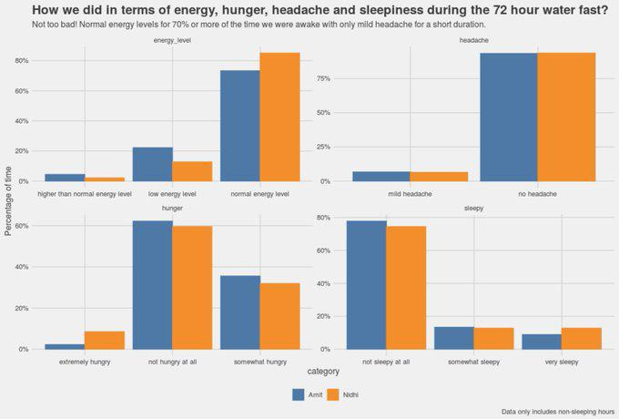
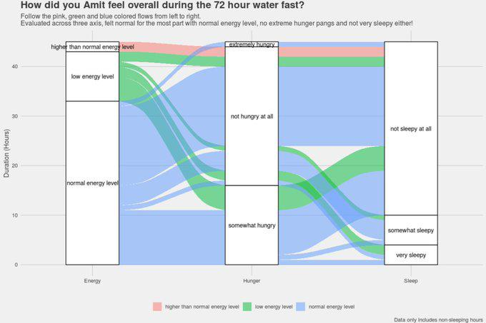
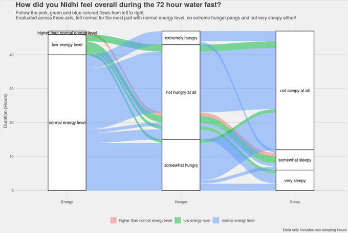
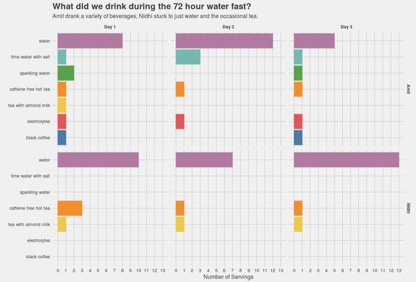

# Fasting for overall health and longevity

Growing up, fasting for religious reasons on special days was very normal. We did it several times a year as a family. The focus was not so much on the health benefits but more on the spiritual side of it (abstinence from food helps brings the focus inwards, maybe). As I grew older, I started looking at these fasts more and more as an opportunity to test self-control, with work, travel and other day to day life situations it was always some what of a challenge. Even though the fasts themselves did not involve going without food for long hours (certainly not days), you could always eat something from the allowed set of food items. It was still a challenge nonetheless.

One thing that my fasting experience growing up taught me that "hunger comes and goes, and it always gets better" especially with the multi-day fasts (again, there were always some allowed food items such as fruits, nuts, certain vegetables), I knew the first day was the most difficult and by the 3rd day while the mind certainly wanted certain food, the body was not missing anything and in fact felt better than it did before fasting.

Different cultures around the world have since times immemorial have had traditions for fasting, so in that sense the modern day interest in fasting is not something brand new, although what is new is looking at fasting through the lens of science, specifically that of clinical trials. Fasting has profound effects on the body and the mind. While we did not go beyond a 4-day fast, but even that I would liken at least somewhat to a dopamine fast where you are surrounded by abundance (of food in this context) but you deprive yourself of it and in doing so reset the brain's reward circuitry. After the fast any food that you get to eat is experienced as the most satisfying food you have ever eaten!

I am going to discuss two types of fasting routines in this chapter, first is "Time Restricted Feeding" or the so called "intermittent fasting" and second is extended multi-day fasts (such as a 48 hour or 72 hour fasts).

## Time Restricted Feeding

Chances are that you have heard about Time Restricted Feeding (TRF) or as everyone likes to call it "Intermittent Fasting". As the name suggests you define a feeding window in which you eat all your food for the day and try to stick to it both for the duration and the time of day. So for example a 12:12 TRF could be eat between 8am to 8pm or said another way do not eat anything between 8pm to 8am. You could also change it to 9am to 9pm while still maintaining the 12 hour fasting and feeding window but shifting the time of day when that window occurs. Usually it is advisable to stop eating 2 (preferably 3) hours before bed time so a 8am to 8pm window is convenient. The feeding window could also be 8 hours instead of 12 in which case it becomes a 16:8 fasting and feeding cycle. In a 16:8 TRF one could wait till noon before eating anything and thus the feeding window is from 12pm to 8pm. Some people also do the 22:2 which only leaves time for "one meal a day" or OMAD as it is commonly called. Finally, there is also a 5:2 routine in which people eat regularly for 5 days and then eat very little for 2 days.

My own experiments with TRF have been that I started with 12:12 and then have graduated to 16:8 and feel very good doing it. The thing that drew me towards intermittent fasting was that it just seemed natural and tied to conventional wisdom I grew up with i.e. stop eating well before bed time and do not eat within an hour or two of waking up. So 2 hours before bedtime and 2 hours after waking up combined with 8 hours of sleep translates to 12:12 intermittent fasting. Easy. Not quite. Over the years, I had become very used to grabbing an after dinner snack while working late nights, I now believe that the late night snack and the lack of sleep were probably the root cause of me putting on so much weight. It took a little bit of effort to avoid the post dinner snack, sometimes I had a protein bar if I really felt like eating something or half a cup of almond milk, slowly but surely, my body adapted and I no longer needed that snack. In fact, now it is the opposite, if I eat a late dinner, sometimes I wake up in the night feeling extremely hungry, even though I had just eaten a few hours ago.

In early 2021, I had somewhat of an epiphany. I was dealing with multiple work related crisis and it just so happened that I ended up skipping breakfast several times during a two month period. Since the workouts were with the trainer so I could not skip those (also they were in the morning, although I did skip one or two) but I could skip breakfast, simply because I did not want an interruption. What I realized later on, was that on those days when I had skipped breakfast but did my workouts as planned, my focus was razor sharp, I could concentrate for longer duration and overall just felt better. I decided to continue the experiment even when there was no crisis and it was just a normal day and realized I indeed functioned better and had more energy if I did not eat until noon or 1pm. I decided to formally switch to 16:8 where I have my first meal of the day (which would technically be my break-fast but is actually lunch) between 1pm to 2pm and then have my dinner between 7 to 8pm (occasionally 8.30pm). I will admit that when I first started this extended experiment, I used to think after finishing my dinner that "Oh my God, am not going to be able to eat anything until lunch time tomorrow, really???" but as I realized it was actually not that difficult. I have been doing the 16:8 for most of 2021, and I find it suits my lifestyle perfectly.

While there are studies that document results from clinical trials (in both rats and humans) showing benefits of TRF both in terms of weight loss and overall health but to me it was just something that intuitively made sense. I thought why would I want to snack every now and then and keep spiking my insulin levels, feel lethargic and then as a result want to snack more and then the cycle just continues. The best part for me was that if done in accordance with our natural circadian clock it just seemed natural and not an add on activity that I had to think about doing.

I also tried the 22:2 a few times, it was fine but not something I enjoyed. Having said that, I never tried it long enough, just a day here or a couple of day there. Admittedly, I did use the 22:2 as some form of a damage control mechanism after say a weekend of eating out and late nights and it did work, but I felt it did not come naturally to me like the 16:8 so I did not pursue it. I never tried that 5:2, because it made no sense to me.

I cannot end this section without saying please read this excellent book called "The Circadian Code" by Dr Satchin Panda, it will provide you evidence based reasoning you need to try out TRF.

## Multiple day fasting

It was probably through some YouTube recommendations that I stumbled upon the topic of longer multi-day fasts, more specifically, "multi-day water fasts". These fasts could be anywhere between 1 day to several days where you eat no food and only water (+ electrolytes) was allowed. Both me and Nidhi were very keen on trying this. I had fasted for multiple days before (not water fast though and certainly not for multiple days) but she had not. So we met with a naturopathic doctor and asked her about it, she said she wanted to get some bloodwork done to make sure she did not see anything which would make her so no. Long story short, everything turned out ok in the bloodwork and she really encouraged us to do a multi-day water fast. We could drink tea, coffee and electrolytes but no milk (no dairy, but a little bit of almond milk was OK) and of course no sugar. Basically anything that had calories was out.

I had not heard about this word called "autophagy" which literally means "self-eating" before I stumbled upon videos, podcasts and articles about multi-day fasting and it being a means to trigger autophagy. Google "autophagy and noble prize" and you will find a detailed presentation on autophagy. As I understand it, multi-day fast are one of the means of triggering autophagy which allows the body to remove and recycle damaged cellular material and thus providing multiple health benefits such as longevity and improved mental health. Fasting is not the only way of triggering autophagy, good sleep, exercise, certain foods, would all trigger autophagy. Fasting though, is one of the most effective way of triggering autophagy as supported by multiple studies ([this](https://www.ncbi.nlm.nih.gov/pmc/articles/PMC6627766/), [this](https://www.ncbi.nlm.nih.gov/pmc/articles/PMC3106288/)).

We started with a 2-day water fast, and then gradually increased it to 3-days and finally to 4-days. While it is not easy, but it is certainly not as difficult as it might sound. To anyone wanting to try it, I would suggest to ease into it, if you have never fasted before you will be miserable on the first day of the fast. Some amount of metabolic flexibility is required for a multi-day fast, in other words the body should have some experience in producing energy by burning something other than carbohydrates, namely fat. Start with intermittent fasting, a 12 hour fasting and feeding window, after a couple of weeks on 12:12 change it to a 16:8 routine where you fast for 16 hours, stay there for a few weeks, then try a few days of 22:2 and having done that you will be in a mental frame where the idea of skipping food for a whole day and going to sleep empty stomach would not appear daunting. It is always a moment of self-realization to find out for the first time that you can actually survive without eating for a whole day and feel just fine the next morning. If someone is used to eating 3 meals a day with snacks in between, they cannot just decide and start a multi-day fast, you do not want it to be a test of will power, you want to work with your body and gradually ease into it. We have been doing multi-day fasts every month since April 2021 (it is November 2021 as I write this).

To be clear, when I mention a 2-day fast I mean a 48 hour period without food, so if we are fasting Monday and Tuesday, the fast begins at say 8pm on a Sunday and then we do not eat anything until 8pm on Tuesday. Now technically, we are still not fasted when we sleep on Sunday night and so should we count the 48 hours from say Monday morning, maybe? Autophagy gets triggered by anywhere between 18 hours to 4 days, so I guess somewhere during those 48 hours we would have started getting the benefits.

**_NOTE:_**: Please consult with your doctor before doing any type of fasting, we certainly did.

Here is a quick primer on how to go about a multi-day and what to expect during the fast.

### How to prepare for the fast?

The most important thing to do is somewhat counter intuitive and that is not to eat too much during the last meal before the fast. One would think that I am going to be without food for the next 48 to 72 hours so let me stock up, while the thought might be correct, but in reality the body is already stocked up which is what all the stored body fat is. The body is going to use that body fat for energy when it is does not get food, that is what we want. Also, we try to be very diligent about reducing our carbohydrate intake a day before the fast starts, helps us feel less hungry on the first day of the fast (hunger is only a first day problem, no really).

In terms of what liquids other than just plain water that you can consume during the fast, make sure you have tea, coffee, sparking water, electrolytes (make sure 0gm of sugar, of any kind, some brands don't mention sugar but say sucralose, you don't want that). Also lemons for lemon juice if you like that and most importantly salt. No cocont water please, because it is naturally sweet and we want to have no carbohydrates at all. I did have some (maybe a teaspoon) of almond milk during some of my fasts but I do not do that any more.

Finally, remember, hunger comes and goes and your body has enough stored fat to survive a few days without food.

###  Day 1 of a 72-hour fast

Day 1 is the hardest! By the afternoon, you start feeling hungry, late afternoon could be really difficult, if this is your first time might experience with some mild headaches. Then the hunger subsides and goes away. Drinking electrolytes really helps (again, make sure no sugar because otherwise it could make you feel even worse), it would reduce hunger and help with the headache becaue of all the salts content (sodium, magnesium, potassium).

Make sure you drink water, tea, coffee, it all helps. It is important to continue with your regular life style, we did. Unless your regular lifestyle involves strenuous physical activity, you should be fine. I had some instances where I had to do a lot of talking (work, meetings) and that does take a lot of energy, so just have to keep that in mind while scheduling the fast.

I do my regular workouts on day 1 and day 2 of the fasts, maybe at somewhat reduced intensity but I do not skip my workouts. In fact, I feel better (more energetic) after the workouts.

By evening, I am feeling really sleepy and want to go to bed early. This is a good idea because when you are sleeping, you are not thinking about food. More than hunger, it is the act of preparing food for the family, the aroma of food that makes you think "tell me again why am I not eating this?". To be honest, the first day is tough.

### Day 2 of a 72-hour fast

When you wake up the second morning, you would be feel refreshed after the sleep and surprisingly not hungry. You can then go about your day as normal, as long as there is no strenuous physical activity involved and not a lot of talking, you would feel fine, certainly much better than day 1 and maybe even before than when you were not fasting.

The afternoon would probably bring some hunger, but now you know how this plays out, the hunger will subside in an hour or so. Electrolytes, tea and coffee should all help.

A different feeling we had on day 2 was a strange feeling of emptiness in the stomach, it was not hunger but a strange but entirely expected feeling of missing food. Energy levels are fine, you are not hungry but you miss the act of eating because that is an intrinsic life activity. That feeling, of just missing food even when not hungry, is probably would would cause you to say "ok I don't want to do this any longer". If you are doing a 48-hour fast and you started counting the hours since dinner two days ago then day 2 is not hard because you know that in a few hours you are going to be eating. If you are going to continue for another day or two, then yes, you want to keep yourself busy with regular work and go to sleep early at night, that is what we do.

An interesting thing that happens (and for some this might happen earlier on day 1 itself) is that you start feeling cold. This is because there is no metabolic activity going to digest food, so there is less heat produced and therefore you would feel the palms of your hand to be cold.

### Day 3 of a 72-hour fast

If this is your final day of fasting then Day 3 is easy because your destination is in sight. If this is not your final day then day 3 is very much like day 2 i.e. you have to contend with "boredom of not being able to eat" and random thoughts of "Ok enough, I just want to pick up this banana and eat".

By day 3, you get used to not feeling hungry, no headaches, probably a little bit low on energy levels but nothing extraordinary.

Day 3 often comes with questions such as "remind me again why am I doing this?" and at that time it is just a question of seeing through the hours.

### How to open a fast?

The first food item, rather the first meal, after a multi-day fast feels like heaven. You realize what does food mean to the soul, not just to the body because you now know the body can do just fine for a few days without food. The fast brings about such a big reset to the idea of "good food" that it is difficult to describe, whatever you eat as part of your first meal <i>is</i> good food.

We usually open our fast with a soup, something light such as a vegetable soup made from beets, spinach and tomato served with a little bit of butter. Followed by some nuts and dried fruits and then a light dinner. It is difficult to eat too much after a fast. You do not want to give another shock to your digestive system which is just getting used to not having to digest any external food by suddenly eating a whole lot of carbs.

### The morning after

The weighing scale does show us lighter by several pounds (anything between 4 to 7 pounds) but this weight loss is not permanent and water fasts are not meant to be a weight loss protocol. Said a different way, water fasting is not meant to be a detox after a vacation that added a few extra pounds.

We generally feel great with no residual impact from the fasting..

### Our 72-hour fasting experience

During one of our fasts I decided to meticulously record all the data on a per hour basis so that we had actual data recorded in real time to reflect what we were experiencing: were we hungry, sleepy, had headaches and also what did we drink. Here is a link to the Google sheet I created to track this, you can download it [from here](https://docs.google.com/spreadsheets/d/1qGM7gJ8zdBPTngD0HHkutP83-kCZx_erLRIak5hs5Lk/edit?usp=sharing) and use it to track your own fasting experience.

We mostly had normal energy levels, sometimes mild headache and almost no extreme hunger pangs. About a third of those hours were spent sleeping! I should note that this data was probably from our 3rd attempt at multi-day fasting, I believe we have gotten better at it and do not experience any headaches (not even mild ones) at all now. 

 

A multivariate analysis examining a combination of energy level, hunger and sleepiness is more interesting. Did we feel low energy, very hungry and very sleepy at the same time? Surprisingly, no! The high energy levels correspond to the hour just after a workout. 

 

Same for Nidhi as well, no case of hunger pangs combined with low energy and feeling very sleepy. While a 72 hour water fast is no walk in the park, it was definitely not the case that we felt we would collapse going without food for a few hours. 

 

Our fast was not a water only fast. While I drank a variety of beverages other than just water, Nidhi mostly stuck to water and tea. 

 

## Closing thoughts on fasting

We would like to do a longer fast, something like a 5 to 10 day fast but we also have work to do and kids to attend to and friends to meet (and eat with) all of which make it difficult to sustain a fast for a longer duration (4 days is the maximum that Nidhi tried, I did not try more than 3 days). We get our bloodwork done every few months and several biomarkers show marked improvements but then it is hard for us to say how much of it is due to fasting and how much is due to overall lifestyle changes. Tests for autophagy are not yet common and we certainly have not got one done, an objective quantitative measure would certainly help provide an impetus for an extended multi-day fast.

Some of our friends also tried out a 48 hour fast (I hope at least in part based on our experience) and they also had similar experience as us, once the first day was over, it was not that hard.

I will close this chapter by citing an anecdote of my own. I believe that the multi-day fasting helped to completely clean up a painful skin condition that had developed in the sole of my foot. While I have no scientific proof that it was indeed the fasting that cured it but I can say for sure that it got better after every fast and was healed after a few fasting iterations. All this while the podiatrist was not having much success in treating my condition and the next step in that line of treatment was to get an MRI done (I had already got an ultrasound done which revealed nothing), which I did not get done and thankfully did not need ultimately. The body knows how to heal itself, we just need to give it some help. Just so that I do not come across as promoting quackery, please always consult your doctor for all medical conditions and before starting on any fasting or dietary regimen.

## Chapter 8: At a glance

***
1. Revisting the traditions of fasting through modern science offers new insights into how fasting helps heal our body and mind.

2. Intermittent fasting or time restrictive feeding has benefits in terms of weight loss as well as improvements in general health. A 12:12 fast that allows with the body's circadian clock should be within reach for most people.

3. A multi-day fast triggers autophagy which is a process by which the body removes and recycle damaged cellular material thereby improving health and promoting longevity.

4. When done with proper preparation a 2 to 4 day water fast (that we did) was not as difficult to do as it might appear at first thought. It is natural to think that such a fast would involve a lot of hunger pangs, headaches and lack of energy, but as we discovered, that was not the case for us.

