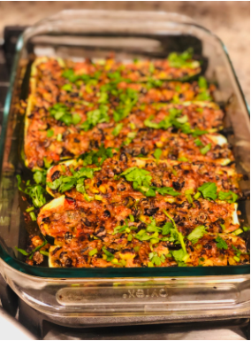

# Recipes

One of the most frequent feedback that we got on the first edition was: "how can we try some of the delicious foods that we see in the book?". While a lot of our friends have since been to our home to try some of the salads but for those whom we have not yet had the pleasure of hosting, here a few recipes that you can try out. Goes without saying, I am just the scribe here, this is all (like a lot of good things) credit to Nidhi.

## Seasame Garlic Tofu

  
<i>Ready in 20 minutes. Serves 4 people</i>

###  Ingredients

1. Tofu 28 oz
2. Sesame oil 2 tbsp
3. Arrowroot Starch 2 tsp
4. Spring onions 5 to 6 (sliced with white and greens separated)
5. Garlic 2 flakes grated
6. Sesame seeds for garnish 1/2 tsp

### Preparation

Pre-preps for tofu:

1. This recipe tastes best with the crispy texture of tofu. To get the crispy effect tofu must be dried from outside.

2. Tofu comes submerged in water, drain the water in the sink and wash and pat dry the tofu. Then place it on a flat base with a slight angle (I did it in my kitchen sink only), sandwiched between kitchen towels and put some weight on the top of the tofu. Make sure the weight is not so much that the tofu gets crushed, however, just enough to squeeze the extra water from tofu. I used an iron skillet as the weight.
If possible, leave it like this before you go to the office and let it stay for a few hours. Or speed up the process by changing the kitchen towels frequently. This will take at-least 30 minutes.

3. Cut the tofu in about 1-inch cubes. Add the cut tofu in a platter and sprinkle cornflour. Toss the cubes to evenly coat with cornflour.

Cooking instructions:

1. Take an iron skillet and heat it before adding oil. Once hot, add oil, place the prepared tofu, do not overlap.

2. Do not turn till one side is completely done, brown all the edges. This will take around 15 minutes. (I had to do two rounds as all the tofu could not fit in one round).
3. In a bowl add all the ingredients of sauce and whisk them together. Once all sides of all tofu cubes are browned, add garlic in the skillet and saute for 30 seconds.

4. Then add all part white and half part greens of spring onion, saute for another 30 seconds. And pour the sauce on top.

5. Quickly stir and evenly quote all the tofu with the sauce. You need to cook till you get the shiny looking texture. That means the cornstarch is cooked completely. This will take 3-4 minutes.

6. Transfer them in a serving dish garnish with spring onion greens and sesame seeds.

#### Preparing Gravy:
1. In the same skillet add some water and some chili garlic sauce. Mix it well and take out all the sauce left behind in the skillet. This will make a thin gravy which I used to drizzle on my plated sesame tofu and stir-fried broccoli.

Tip: 
Arrowroot Starch can be replaced with cornstarch. To make it a complete meal for my kids, I added some rice with a gravy drizzle we ate with Cauliflower rice.

## Egg Wraps

  
<i>Ready in 15 Mins. Serves 1. </i>

### Ingredients

1. Eggs whole 2
2. Mushroom 1/4 cup diced
3. Green peppers 1/4 cup diced
4. Onions 1/4 cup diced
5. Coriander 1/4 cup diced
6. Green chili finely chopped (optional)
7. Ham diced 1 tbsp
8. Cajun Spice 1/8 tsp (optional)
9. Salt 1/4 tsp
10. Black pepper powder 1 pinch
11. Ginger powder 1 pinch
12. Olive oil 1/2 tsp

### Preparation

1. In a bowl crack open the eggs and beat them well add 2 pinches of salt.

2. Heat a big flat pan, spray some oil and spread the egg and let it cook, when one side is cooked flip and both sides. Do not make it crisp, it should be easy to fold.

3. While the eggs are cooking at the same time in a separate pan add olive oil, all the vegetables and all the spices. You need to cook till mushrooms reduce their size and start getting roasted.

4. Now place the cooked vegetables in the center of the egg and wrap the egg around it as shown in the picture.

5. Serve it hot with sriracha sauce.

## Spinach Soup

  
<i>Ready in 20 minutes. Serves 3 people.</i>

### Ingredients

1. Spinach 1 bunch cleaned and roughly chopped

2. Tomato 1 roughly chopped

3. Carrot 1 small

4. Zucchini 1 cup (in my case I used the scrapes left from zucchini boats)

5. Green chili 2 (optional)

6. Ginger root 1/4 inch

7. Salt 1 tsp (or to taste)

8. Black pepper powder 1/4 tsp

9. 3 cups of water

### Preparation

1. Add all the vegetables with salt and 2 cups of water in a pressure cooker and cook up to two whistles. 

2. Leave it for 10-15 minutes for the pressure to subside by itself.

3. Blend them in a blender and pour it in a pot. Now use 1 cup of water to rinse the blender and add to the pot, boil for 2 minutes. Add pepper powder, mix and taste to adjust salt.

4. Serve it hot.

Tip:
Add butter before eating, Butter will make the soup’s texture creamier.

## Egg Drop Soup

<i>Ready in 30 minutes. Serves 4 people.</i>

### Ingredients

1. Eggs 3 whole whisked

2. Chicken 7 oz (one chicken breast) cut into 1 cm cubes

3. Sweet peas 2 tbsp

4. Carrot 1 small cut into 1 cm cubes

5. Cabbage ½ cup cut into 1 cm cubes

6. Spring onion 2 cut into thin slices, separate the whites and greens

7. Ginger julienne half tbsp

8. Garlic 1 tsp finely chopped

9. Butter half tsp

10. Chicken stock 32 oz

11. Water 2 cups

12. Salt 1.5 tsp

13. Black pepper powder half tsp

14. Soy Sauce 1 tbsp

## Preparation

1. In a deep pan add butter and add garlic and then spring whites, cabbage and then add chicken stock and water.

2. When the chicken stock is almost boiling add soy sauce salt, black pepper powder, carrot, ginger julienne and peas.

3. When it starts boiling add chicken and cook for 3 mins, keep stirring so the chicken cubes do not stick together.

4. Add beaten eggs with a tablespoon, one spoon at a time. Stir lightly and not so frequently as we don’t want to break the noodles made by dropping eggs. Taste for salt and soy sauce and adjust accordingly.

5. In the serving bowl add spring greens and pour the hot soup on it. Enjoy it hot.

Tip:
If you want to thicken the soup you can add 1 tbsp of cornflour mixed in water (add it before adding chicken). 

## Zucchini Burrito Boat

<i>Ready in 45 minutes. Serves 4-5 people.</i>

### Ingredients

1. Zucchini 4

2. Kidney beans 14 oz can, drained and rinsed

3. Tomato 1 diced

4. Coriander 1/4 cup

5. Onion diced 1 cup

6. Boiled sweet corns 1/2 cup

7. Grated cheese Mexican blend 1/2 cup

8. Mixed colored peppers 1 cup

9. Jalapenos 1 deseeded and finely chopped (optional)

10. Salsa spicy

11. Salsa medium.

12. Lemon juice 1 tbsp

13. Salt 1 tsp

14. Cumin powder 2 tsp

15. Paprika 1 tsp

16. Taco seasoning 2 tsp

17. Olive oil 2 tbsp

### Preparation

1. Preheat the oven at 400 °C. Cut zucchini in half lengthwise and scrape out the center part, leaving a shell of almost 1/4 inch thick.

2. Sprinkle the taco seasoning generously on them, drizzle olive oil and bake them for 15 minutes.

3. In the meantime, in a big bowl add drained and washed kidney beans, tomato, coriander, onions, sweet corn, colored peppers, jalapenos, cumin powder, salt, paprika, half of the cheese and lemon juice. Toss all the ingredients to mix well and get evenly seasoned.

4. Take the zucchini shells out of the oven. With a help of a spoon fill the zucchini shells with the above mixture. Sprinkle some cheese on the top.

5. Place them again in the oven for 15-20 minutes. Change the setting to broil (High Mode) and broil it for 3 to 5 minutes to get the golden browned top.

6. Serve them hot, before serving garnish them with spicy and medium salsa and some finely chopped coriander.

Tip:
Looking for some low carb sides? You can also serve them as appetizers at your holiday get-together. Though this is low carb, it can still take you out of ketosis. Use the leftover scraps of zucchini to make a soup or other dish.

## Protein Gelato

<i>Ready in 15 minutes. Serves 5 people. Rest time 3 hours.</i>

### Ingredients

1. 2 of Premier Protein Chocolate Shake or any other ready to drink Chocolate shake.

2. 1 Sugar free Jell-O Chocolate (4 1/2 cups of servings pack)

3. Chocolate chips (for garnishing)

### Preparation

1. In a big bowl empty both the chocolate drinks, add Jell-O and whisk it well for 2 mins. Let it rest for 5 mins and then whisk again.

2. Let it stay in the freezer for 1 hour and then take it out and whisk again. Repeat this again after one hour, this time blend it in a blender for creamier texture. You can repeat this one more time for extra creamy texture.

3. You can make this in advance and serve it the day of your dinner. When you want to serve, let it stay out of the freezer for 5 mins before serving. For best results, churn it just before serving. Serve it with some chocolate chips sprinkled on the top.

## Baked Brussel Sprouts

<i>Ready in 25 minutes. Serves 2 people.</i>

### Ingredients

1. Brussel Sprouts 4 cups cut in half (Stem side)

2. Kosher Salt 1/3 tsp

3. Black Pepper 1/4 tsp

4. Olive oil 1 tsp

### Preparation

1. Heat the oven at 400 ° F.  In a bowl add the cut Brussel sprouts and sprinkle salt and pepper. Drizzle the oil and toss them well so it gets well coated with the seasoning.

2. Place them on a baking tray with all face down (with cut side down) and bake them for 10 minutes.

3. Flip them and bake further for 10 minutes.

4. Serve them hot with your choice of protein.

## Garden Fresh Omelette

<i>Ready in 20 minutes. Serves 1.</i> 
 

### Ingredients

1. Eggs 2

2. Spinach 1/4 cup

3. Peppers (multi-color) 1/4 cup

4. Coriander finely chopped 1 tbsp

5. Diced Mushroom 1/4 cup

6. Salt 1/4 tsp

7. Black pepper powder 1/4 tsp

8. Feta Cheese 1 1/2 tsp (optional)
 
### Preparation

1. Break the eggs in a bowl, add salt pepper powder and beat it well.

2. Heat a pan and spray some oil, add all the cut vegetables and stir them for 3 to 4 mins. The spinach will reduce in size.

3. Now add the beaten egg on top and cover the pan with a lid.

4. Add cheese and flip it in half. Cook it through and serve hot with sriracha sauce.
