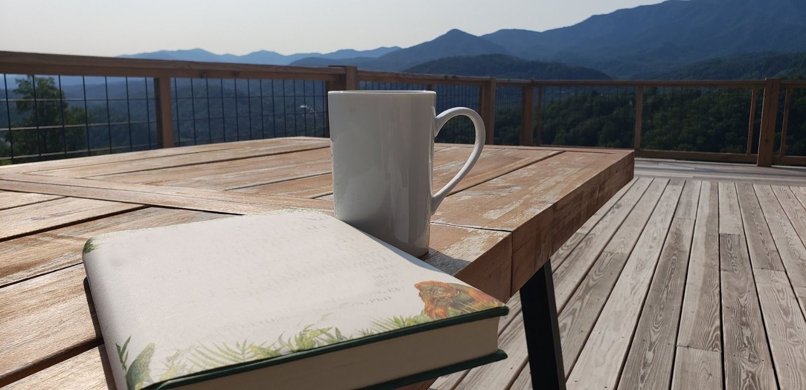

# Stream of Consciousness

Here is a collection of some "stream of consciousness" topics that I wanted to convey but did not fit into any of the other chapters so here they are all in a chapter of their own.

## The "Murph" Challenge

In May of 2020, during one of our Zoom workouts, our trainer just casually mentioned that they were doing this challenge in a couple of weeks where they would do a "1 mile run, 100 pull-ups, 200 push-ups, 300 air-squats and then bookend it with another 1 mile run". I had just managed to do like 3 push-ups in a row and I almost fell to the ground doing my 4th push-up and blurted out "in how many days...?". While this question might seem funny at this time, hand to the heart, it was a serious question when I asked it. Remember this was coming from a person who thought doing 3 straight push-ups was an achievement. I was being told, in a matter of fact tone, that there are regular people who would be able to do what seemed like a test of endurance and strength to me.

The answer to my question, was "um, some people take an hour and half, but mostly it is done in under an hour, and then we can do modified push-ups also", so no it was not an event spread out over multiple days. I did not ask further and that topic did not come up again and until about a year later.

By April of 2021, I could do 4 sets of 8 push-ups relatively easily, I had also done 50 push-ups spread over 4 sets with each set going up to failure (so like 15 in the first one, 13 in the second, 10 in the third, 12 in the fourth just to make it to 50). At this time, I could at least comprehend that yes it would be possible for regular folks who had been training for a few years or had trained earlier when they were much younger that doing this kind of a routine would be challenging for sure but not as impossible as it had seemed to me a year ago. When we talked about this challenge again, then I looked up the history behind it and I thought this year both Nidhi and I should be able to do this (see [https://themurphchallenge.com/](https://themurphchallenge.com/)).

I decided to prepare for the challenge, the last thing I wanted was to show up there and then not be able to complete it. So once a week until the challenge day (Memorial Day) I trained to do a mini murph at home, which included a mile on the rower, followed by 5 sets of 6 pull-ups, 6 push-ups and 6 air-squats (or sit-ups) and then a mile on the rower again. I took 30 seconds break between each set. When I did it the first time, I had no idea how hard it would be, fortunately, it seemed manageable. Why the number 6? Because by that I could only do 6 "assisted" pull-ups in a row, doing 8 push-ups seemed hard after the first 2 sets so I wanted to pace myself and so 6 seemed like a nice comfortable number. While I managed to complete the 5 sets that I wanted to, but I also realized that at this pace I would be at it for a very long time. Next week, increased the push-ups to 8, and air-squats to 10 per set. Still Manageable. Reaching up to the challenge day, I was settled into 5 pull-ups, 10 push-ups and 15 air-squats per set, just had to complete 20 sets of this and we would be done.

A few friends of ours were planning a trip to the beach on that Memorial day weekend and that would have meant that we reach home late evening on Saturday and then just show up Sunday morning without a good night's rest. We decided against it, instead  had a relaxed Saturday, ate  simple carb rich dinner, a mile long post dinner walk, and then went to bed around 9:30pm. Woke up next morning, quick 5 minute morning walk and then showed up in the local park where the rest of the folks from our gym were gathering.

Memorial day 2021 in Clarksburg, MD was a bright sunny day, temperature in the early 50s if I remember correctly. A near perfect day for being outside. We started with the 1-mile run; I had not run a mile before, at least not that I could remember. It was challenging, I think completed it nine and a half minutes. Started with the 5 pull-ups (to be clear, we did jumping pull-ups, I know, not the same thing but hey, even this wasn't a cake either), 10 push-ups and 15 air-squats routine. The energy of seeing people around you doing the same workout rubs on you. I took 10 to 15 seconds breaks between sets, slowly the breaks increased to 20 to 30 seconds and towards the end 45 seconds. Finally managed to finish the 20 sets. The hardest part was the push-ups, 200 push-ups are a lot of push-ups. By the time we finished, most people were already done with their second 1-mile run. I ran half of the last mile and walked the other half. Finally, when I finished, it was a few seconds shy of 60 minutes. I was the last person to finish the challenge, but that part was irrelevant, I was overjoyed that I finished the challenge. A year ago, I was thinking this was a multi-day activity, and here I was drenched in sweat, all done in under an hour!

Next year, I aim to complete the challenge in less than 45 minutes, maybe even 35 minutes, I guess we will find out. Here is a picture of Nidhi and me just after completing the challenge.  


## My first 5K run

Running is not one of my favorite activities, probably because growing up I was never fit enough to run for more than a few hundred meters. As I progressed in my fitness journey, I wanted to explore things I did not think were possible for me and running was one of those things for sure. I wanted to see what all the calories burnt, and minutes spent on the assault bike translate into on a trail. I had run the 1 + 1 mile during the Murph but nothing after that. 

We had just returned from an early morning shopping trip on the Friday after Thanksgiving and I happen to notice an Instagram post from our trainer about a 5k run in a park nearby. 5k or 3.1 miles should be manageable, I thought to myself, and if I cannot run all the way then I could always walk. I had started enjoying spending time outdoors and there wasn't really any reason to not do this, so I signed up. The run was next morning.

It was extremely cold and windy the next morning and we were all gathered at the Rachel Carson trail in Brentwood, MD. It was a 5k loop, start from the parking lot, run the loop and finish the run at the same spot. We started together divided into two groups, a group that wanted to run, a group that wanted to walk and enjoy the scenery and then there was me who wanted to start with a run and then fall back to the walker's group if needed. I wanted to run/walk the whole 5k without having to breathe through my mouth and that would also mean run at a comfortable pace so that I did not run out of air and just had to breathe through the mouth. About 800 meters in, I had to slow down and walk, it was not a flat trail and more importantly I had forgotten to do my pre-workout breathwork and I think it was making its absence felt. After walking for a couple of minutes, I started running again and this time, it felt easy, I could run without having to stop. Had to slow down and stop to tie my shoelaces, and the group ahead of me was waiting for the rest of the folks to catch up. Back to running again, then walking a little bit, then running again and before I knew it, I could see the road again and suddenly I could see the parking lot from where we started, I sprinted the last couple of hundred meters. 

Took me 30 minutes for the 5k. Not too bad, I thought. I really enjoyed it and I am looking forward to making these short 5k runs a monthly family activity. Here is some data from my watch, for some reason it got the time and duration a little bit wrong but overall it was good to see this data and use it as a baseline for future runs.  


## Carbohydrates are not your enemy and protein not your only friend

Like me you might have friends who lost a significant amount of weight by switching to a high protein and low carb diet, you might be thinking, should I do that too?

Well, I can say this from personal experience, a high protein low carb diet would almost certainly make you lose weight (all standard disclaimers apply, I am not recommending any diet here, nor offering any medical advice, please consult your doctor for that). Protein will satiate your appetite and fewer carbs would usually means you would be running a calorie deficit and thus would lose weight. Having said that, this is probably a good choice only for a short period of time (say a few months) so that you can lose weight and then you should get back to balanced diet (see CDC recommendations on healthy eating).

There is a good chance that we are already eating more protein than we need, and this can increase the activity of the IGF-1 system leading to accelerated aging and other even more harmful effects. I transitioned from a high protein, high fiber (I ate lots of cruciferous vegetables such as cauliflower, cabbage, kale, broccoli, Brussels sprouts etc. with my protein) and low carb diet to a lower protein, high fiber and higher than before level of carbs. I have been much happier since. I sleep better, I have more energy for my workouts and makes me feel better knowing that by reducing my animal protein consumption I am doing my (howsoever minuscule) part towards helping the environment. It is quite possible that soon I might transition completely to a whole food plant-based diet. I certainly want to experiment with a completely plant-based diet for 6 months and see how I feel, something tells me that I would feel much better.

I would highly recommend anyone interested in nutrition (that would be all of us) to read this excellent book [Eat Like the Animals](https://www.eatliketheanimals.com/).

## Consistency Vs Intensity

Given enough motivation and means most people can summon up enough intensity to do something they want to, be it a new diet or a fitness routine, learning a new skill, a new technology or anything else. That is not hard, what eventually differentiates those who achieve transformational results and those who give up after a while is consistency, the ability to have the discipline to stick to a routine for days, week, months and years. Doing the same thing, preferably at the same time daily, rewires the neurological pathways and the practice becomes a habit.

Most people would be able to stick to a fitness routine, for a while, then life catches up and once you negotiate with yourself that it is OK to let go this one time, before long you are able to justify to let go completely and convince yourself that at least you tried. The trick is to stick to a routine for long enough until it becomes a habit, something that just happens at a subconscious level. Until you reach that point, you just need to tell yourself “trust the process”, “do this consistently”, “I am in this for the long haul”, whatever it is that helps you stay the course until you start seeing results and the routine becomes a habit. An important point here is that being consistent should not translate into a permanent test of will power, because that is a test we will certainly lose in the long run. The idea is that to begin with sure, we would have to power through the urge to not put our bodies through the stress of waking up early and working out but slowly it should get easier, the rewards that we get along the way in terms of feeling stronger and overall health improvements should provide the fuel to continue.

I started with my workout routine with two workouts a week, then three a week, then four a week, and now it has been five times a week for more than a year (whether it is the at home workouts in the basement, in a hotel's fitness center while on vacation or with our trainer in the gym)! Similar story with my eating habits. A quote often ascribed to Bill Gates "Most people overestimate what they can achieve in a year and underestimate what they can achieve in ten years" is very relevant here. Cumulative gains that build on past progress can only be made by consistency rather than intensity (most of the time if not always).

When you achieve something after years of consistent, focused effort, whether it is a fitness goal or anything else it becomes a tremendous source of pride. The happiness that you derive from such an achievement is not short lived, it is more satisfying and more complete as compared to something achieved with a burst of intensity. More importantly it brings with itself a realization that you can do hard things and that realization is a powerful tool that you can use in any aspect of your life.    

  

## The choice between "work" and "workouts" is a false binary

When I started working out, the priority order between work and workouts was very clear, in fact it was not even a question, it was always work first and workout later. Said another way, if there was a choice between workout and what pays for the workout then I would always choose what pays for the workout i.e. my work. I realize now that this is a false binary.

I have had several instances where I rescheduled my workouts just because there was a crisis at work, a meeting that was too close to my workout time (allowing very little time to do some pre-meeting prep work) or even for some not so pressing reasons, so much so that it was more of an excuse rather than an actual requirement. As time passed, I realized that the benefits of the workouts translated directly into my work, my focus improved, I became more efficient because I had this thing in my life that I did not want to short shrift so I had to finish the work in the time I had, and in general I just felt good after a workout. 


The number of times I have felt "oh, maybe I would have been better off not working out and taking care of this other <i>distraction-of-the-day</i>" is exactly zero. Whereas the number of times I have felt "oh, I am so glad that I did not negotiate with myself and just did the workout" is too many to count. Life happens, competing priorities exist all the time, we just need to know that workout is also a high priority.


As I moved my workouts to the morning before the start of my workday, the benefits became much more tangible. I could feel it during my meetings that I was much more engaged and just had a sense of "oh, I got this" (maybe my brain was thinking I just deadlifted 300 pounds, compared to that this is easy). It has come to a point now that I feel, how will I even operate if I do not start my workday riding a post-workout high? Workouts do result in better performance at work, in my experience at least. Someone said to me at work the other day, "Amit, you have a lot of responsibility on your shoulders", and my response right off the bat was "yes, that is why I work out regularly to broaden those shoulders..." and that brought a smile to everyone's face. While this was a comment made in jest, but to me it is a true statement, my workouts do indeed provide the fuel for work (and vice-versa, after all my work does pay the bill for my workouts).

If any CEOs out there are reading this book, I implore you to incentivize workouts and an 8-hour sleep schedule for your employees, the benefits to the bottom line are real.  

## The right time to start was yesterday, but the best time to start is today!

Do not procrastinate, look ahead and start today. We often procrastinate to start. Often it is because of a thought in our head that says, "it is probably too late, you should have started yesterday or better still, 10 years ago". While it is probably true that an early start would have helped, but that should not stop us from starting now and improving the future, should it?

An advantage we have now is the realization that it was the right thing to do, whether it was taking charge of our health by starting on a fitness routine, switching jobs for that non-linear growth or anything else. Your unique life circumstance is now telling you to begin, take charge and start now, yesterday is gone and the future is yet to come.

I did not set foot in a gym until I was 41 years old and now almost 2 years later, I workout 5 days a week. I am leaner and stronger at 42 than I was at 22. **The best time to start is today!**

## Read, read, read...

As they say, one good habit begets another, out of my interest to learn more about nutrition and fitness and initiated but a birthday gift from a friend I started reading books again. Unlike in the past, when I would buy books out of a genuine intent to read but then put them down after reading a few chapters, this time I followed through. After all, I have been working out consistently five times a week and could surely put the same power to good use elsewhere as well (at least that is what I told myself)! I have tried to weave reading into my morning routine, could be just a few pages, a few times a week but no week should go by with me not reading anything. I try to reserve 10 minutes in the morning, right before I go to the gym, for reading a book along with a good coffee.

Here is a picture from one of the more perfect mornings, made up of a good book, a good cup of coffee and a breathtaking view. Taken at an Airbnb in Smoky Mountains, Tennessee, in the summer of 2021.



I read almost 12 books this year, all non-fiction, all related to health & fitness or motivation and personal growth. Reading is now a part of my life priorities almost as much as fitness is and the more I read and enrich my mind the more I realize how much there is that I don't know. I would attribute rediscovering reading also to the gains I made while working out, it was as if the workouts flipped a switch in my head and I realized that just like I could find time for working out, I could also find time for reading (which meant less time for television). Truly, one good habit begets another.

At the start of the year I thought I should read at least a book a month, turned out it was more ambitious a target than I initially thought. The books I read in 2021 can be divided into three categories:

- Perspective on how we can make life more productive and rewarding: Atomic Habits, The infinite game, Think Again, Deep Work

- Health & Fitness: Why we sleep, Eat like the animals, Breath: the new science of a lost art, Breathing for warriors, The biology of belief

- Personal stories for inspiration: Finding Ultra, Can't hurt me, The code breaker

I gained so much from reading [these books](https://www.instagram.com/p/CW1yGyBsvLk/). 

## What about supplements?

We did take supplements for micro-nutrients (vitamins and minerals). To be clear, the intention was not to take supplements for muscle building but for general health, more like an insurance against missing out key micro-nutrients from the food. Even with the previous protein-based diet program that I followed earlier there was a recommendation for different vitamin and minerals supplements so when we started exercising more, the topics of supplements came up organically. We discussed with our trainer and as I started reading more and more, I got more convinced that we should take some micro-nutrient supplements to augment what we were eating. I did my own research, which is a fancy way of saying I looked up supplements and their effects on [labdoor.com](labdoor.com) and [examine.com](examine.com) and discussed with my trainer as to which supplements were required and which brands had ingredients which were minimal and safe. 

Here is my list:

- Vitamin D
- Vitamin C
- Zinc
- Multi Vitamins
- Fish Oil
- Probiotics
- Amino Acids
- Creatine Monohydrate

Did not start taking these supplements from day 1, this happened over a 6-month period. **Do not start any supplements without first consulting with your doctor.**

## Small knobs & big knobs

Exercise and nutrition are the big knobs by which we can control weight and general health. As we progressed through our journey, we realized that there are small knobs as well which are needed to fine tune the body's response during the proverbial last mile. Losing first few pounds is easy, as most people would say, maybe even losing the first 5 pounds is easy, losing the last 5 pounds is insanely hard. That is where the small knobs become extremely important. The small knobs are

- Sleep: I have noticed this several times, not having a good sleep shows up unfavorably on the weighing scale the next morning. With my level of exercise now my body demands a good 7-hour sleep.

- Making sure you are not taking less calories than what your body needs: if the body is not getting enough calories it will fight to keep whatever fat it has and therefore weight loss will become difficult. I have certainly experienced this.

- Stress: we all live extremely busy lives, the demands of work, family and social engagements does cause stress and too much stress is bad for weight loss in the same way it is bad for anything else.

## For the love of charts

Here are some more charts that I could not fit anywhere else.

### How many days did it take to lose every single pound?

Sometimes we get anxious, about being stuck at a specific weight or oscillating within a few pounds. As enough data got collected, we could see empirically how many days we spent at each weight level so that before we start getting anxious we know if we really need to or is it still within an observed range.

```{r  echo=FALSE, warnings=FALSE, message=FALSE, fig.height=10, fig.width=14}
 # number of days spent at each weight, these could be in any order, we are just counting
  # the total number of days at a weight.
  df_days_at_a_weight <- df_tidy %>%
    filter(metric=='Weight') %>%
    select(-metric, -Date) %>%
    mutate(value = as.integer((value))) %>%
    group_by(name, value) %>%
    count(value)
  
  # median number of days each person stays at a weight
  df_days_at_a_weight_median <- df_days_at_a_weight %>%
    ungroup() %>%
    group_by(name) %>%
    summarize(median_num_of_days_at_weight = as.integer(median(n)))
  
  number_of_days_at_wt_p1 <- df_days_at_a_weight_median %>% filter(name == P1_NAME) %>% pull(median_num_of_days_at_weight)
  number_of_days_at_wt_p2 <- df_days_at_a_weight_median %>% filter(name == P2_NAME) %>% pull(median_num_of_days_at_weight)
  df_tidy %>%
    filter(metric=='Weight') %>%
    select(-metric, -Date) %>%
    mutate(value = as.integer((value))) %>%
    group_by(name, value) %>%
    count(value) %>%
    arrange(value) %>%
    ggplot(aes(x=reorder(value, -value), y=n, col=name, fill=name)) +
    geom_bar(stat="identity") +
    facet_wrap(~name, ncol=1, scales = "free") +
    theme_fivethirtyeight() +
    xlab("Weight (lb)") +
    labs(title=glue(HOW_EACH_POUND_WAS_LOST_TITLE),
         subtitle=glue("{P1_NAME} spends {number_of_days_at_wt_p1} days at a weight, {P2_NAME} spends {number_of_days_at_wt_p2} days."),
         caption=CAPTION) + 
    theme(text = element_text(size=CHART_ELEMENT_TEXT_SIZE-5), legend.position = "none") + 
    scale_color_tableau() + 
    scale_fill_tableau() + 
    theme(axis.text.x = element_text(angle = 90, vjust = 0.5, hjust=1)) +
    theme(axis.title = element_text()) +  ylab("Number of days at this weight")

```

```{r  echo=FALSE, warnings=FALSE, message=FALSE, fig.height=10, fig.width=14}
 # number of days spent at each weight, these could be in any order, we are just counting
  # the total number of days at a weight.
  df_days_at_a_weight <- df_tidy %>%
    filter(metric=='Weight') %>%
    select(-metric, -Date) %>%
    mutate(value = as.integer((value))) %>%
    group_by(name, value) %>%
    count(value)
  
  # median number of days each person stays at a weight
  df_days_at_a_weight_median <- df_days_at_a_weight %>%
    ungroup() %>%
    group_by(name) %>%
    summarize(median_num_of_days_at_weight = as.integer(median(n)))
  
  number_of_days_at_wt_p1 <- df_days_at_a_weight_median %>% filter(name == P1_NAME) %>% pull(median_num_of_days_at_weight)
  number_of_days_at_wt_p2 <- df_days_at_a_weight_median %>% filter(name == P2_NAME) %>% pull(median_num_of_days_at_weight)
  df_tidy %>%
    filter(metric=='Weight' & name == P2_NAME) %>%
    select(-metric, -Date) %>%
    mutate(value = as.integer((value))) %>%
    group_by(name, value) %>%
    count(value) %>%
    arrange(value) %>%
    mutate(bar_color = ifelse(value < 210, "more", "less" )) %>%
    ggplot(aes(x=reorder(value, -value), y=n, col=bar_color, fill=bar_color)) +
    geom_bar(stat="identity") +
    #facet_wrap(~name, ncol=1, scales = "free") +
    theme_fivethirtyeight() +
    xlab("Weight (lb)") +
    labs(title=glue(HOW_EACH_POUND_WAS_LOST_TITLE),
         subtitle=glue("Used to take {number_of_days_at_wt_p2} days to lose a pound, but all that changed after 210 pounds."),
         caption=CAPTION) + 
    theme(text = element_text(size=CHART_ELEMENT_TEXT_SIZE-5), legend.position = "none") + 
    scale_color_tableau() + 
    scale_fill_tableau() + 
    theme(axis.text.x = element_text(angle = 90, vjust = 0.5, hjust=1)) +
    theme(axis.title = element_text()) +  ylab("Number of days at this weight")

```

## Breakup of the days

We know we lost weight on more days than we gained weight (otherwise this book would not exist), but a good visualization is always welcome.

```{r echo=FALSE, warnings=FALSE, message=FALSE, fig.height=10, fig.width=14}
waffle(
  p2_days_counts_as_list, rows = 7, size = 0.5, legend_pos = "bottom",
  colors = c("#c7d4b6", "#a3aabd", "#a0d0de"),
  title = glue("Breakup of {P2_NAME}'s {p2_days_total} days"),
) + 
theme(text = element_text(size=CHART_ELEMENT_TEXT_SIZE-5))

waffle(
  p1_days_counts_as_list, rows = 7, size = 0.5, legend_pos = "bottom",
  colors = c("#c7d4b6", "#a3aabd", "#a0d0de"),
  title = glue("Breakup of {P1_NAME}'s {p1_days_total} days"),
) + 
theme(text = element_text(size=CHART_ELEMENT_TEXT_SIZE-5))

```

## Chapter 10: At a glance

***
1. The benefits of consistent workouts go far beyond benefits to the body, they transcend into better habits all around, better cognition and a better life.

2. There are no quick fixes, no silver bullet, no one diet to fix it all. Consistency with a relatively clean eating regimen (avoid processed foods), regular workouts and good sleep is the answer.

