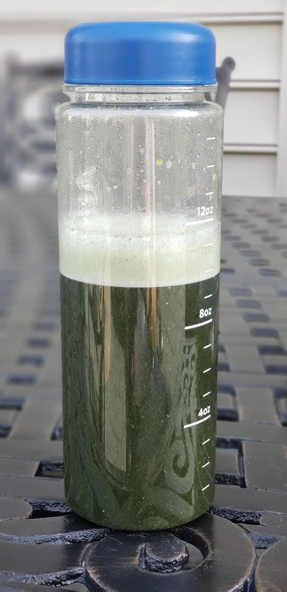

# Our Diet Now

Towards the end of 2020, we had an outdoor get together with some very close friends and as we were sitting around the fire pit chatting and laughing one of friends said "bring the brinjals, lets grill them so that you can make a [baingan ka bharta](https://en.wikipedia.org/wiki/Baingan_bharta) tomorrow!". the "Baingan ka bharta" is a delicacy made with grilled minced eggplant. So we got two brinjals, they were grilled and the next day we did make the "bharta", ate it with crisp tawa rotis and green chillies. It tasted divine. The reason I mention this is that after about 8 months of eating what was essentially a high protein, high fiber and low carb diet, we were slowly but surely wanting to get back to traditional food that we had eaten most of our adult lives and our parents and grand-parents had eaten most of their lives. Eating the bharta that day reminded us that we missed our traditional Indian food more than we realized. Our younger son likes [Idli](https://en.wikipedia.org/wiki/Idli) very much, so do we, but he could eat Idli three times a day seven days a week, it is a running joke in our house that he is a South Indian who is accidentally born in a North Indian family. Idli which is rice cake (oversimplification) is a traditional South Indian food which is popular across India and clearly in our household as well. It is heartening to see our children also enjoy foods we grew up eating.

As more months went by, roti, rice, pulses cooked in a pressure cooker and cooked vegetable curries became more and more a part of our dinners like they had always been. We still love our grilled veggies and chicken though, and eat it multiple times a week. The lunch for us is still one of our favorite salads on most days. The breakfast, however, is what is the most different because the "lunch" is the "breakfast". Allow me to explain.

## The breakfast that isn't

When we started training, and our trainer mentioned the 30 day challenge, she also mentioned something that we simply ignored (one of the rare things that she said and we just ignored). It was that she did not eat breakfast or said another way her first meal of the day with which she broke her overnight fast (break-fast) was lunch.

It did not even occur to me that it was something to consider, I did not pay much attention to it at all. As I became more interested in nutrition and in particular ageing and longevity, I started hearing more and more about intermittent fasting. There are two schools of thoughts, one that says you should keep eating small meals multiple times a day and another one which says you should eat two or three full meals a day and no snacks. I am putting some links to papers that talk about these approaches in the appendix chapter. Without going into details, since I am not qualified to comment on their technical correctness, I can only speak from what I experienced. Just to state it again, *whatever I am writing here is not medical advice, please consult your doctor before starting any new diet or exercise and confirm that it is appropriate for your specific situation and life circumstance. Children should not skip breakfast, my kids eat a healthy breakfast*.

By intermittent fasting, I mean a 12 hour fast and a 12 hour eating window OR a 14 hour fast and a 10 hour eating window OR a 16 hour fast and an 8 hour eating window. Depriving oneself of any and all foods that one likes during the week and then gorging on all sorts of unhealthy foods over the weekend is not my idea of intermittent fasting. I started with a 12-12 fasting and eating window and have now comfortably settled into a steady 16 hour fasting and 8 hour eating window and it works great for my body and mind. While experiments done on mice show that during intermittent fasting mice (put link in appendix) that ate whatever they fancied during their eating window still saw benefits from the fasting, but certainly we can do better than mice. I prefer intermittent fasting over the eating 6 meals a day routine for several reasons that I list below.

- Eating clean and healthy 3 times a day is difficult as is in a modern city based lifestyle, eating clean and healthy 6 times a day is almost impossible unless you are an athlete or a movie star and have someone on your staff whose job is to take care of your nutrition. I just don't trust myself to make the correct choice for food 6 times a day, every day.

- All weight loss is ultimately a game of keeping the insulin levels in your blood within a narrow range. Eating multiple times a day means blood sugar levels will increase in response to the carbs being broken down into glucose and that means the pancreas will produce insulin. 

- I feel bad while writing this, but I cannot deny that not having to prepare and eat breakfast is a decent 30 minutes of time saved at the start of the day. While this should not be a factor but the reality is that it is. I like to use those 30 minutes for my morning walk, for reading a book and sometimes for replying to some quick work related emails.

All my adult life I had eaten three full meals a day, the idea there is no breakfast was so much out there that even until a few months ago I used to think that if you do not eat breakfast how do you even function! Not any more. I feel fantastic with my 16-8 routine. I realized that often times when due to some work related crisis in the morning I could not eat breakfast until noon, my mind actually worked much better, now it could simply be a result of being very focused on the problem but it was definitely something I considered when trying intermittent fasting.

While I do not eat breakfast, but I do take my morning coffee (no cream or sugar), sometimes with 10 to 15ml of MCT oil added to it to make it the so called **Bulletproof Coffee**. The MCT oil provides the fat which they say gives you energy, clears brain fog and has other benefits. I am not so sold on the benefits, I do take it every now and then. Recently though, instead of the morning coffee I have started taking microgreens, available as powder that you can just mix in cold water and drink and then take my coffee an hour or so later at the start of my work day. This arrangement works much better for me. The microgreens help provide several essential pre and post-biotics, vitamins and minerals. I have seen several nutritionists recommending not to take coffee (or tea) right after walking up. Drinking coffee on an empty stomach could cause gut health issue, increase or changes the Cortisol production cycle, so I am happy that have shifted my coffee intake to about two hours (or sometimes even more) after waking up. While on the topic of caffeine, I don't drink coffee after 3pm and rarely if ever after 4pm. Here is a picture of the microgreens drink, first thing in the morning.

## The lunch

One thing that has relatively stayed the same, and which also explains the unchanged name of this book, is the lunch salad, of course with blueberries. It is still something we greatly enjoy eating. The fact that it is something that is healthy and tastes good means that there isn't any need to change it. I mean why fix something that ain't broken? Our lunch is usually around 1pm.

The salad still consists of a healthy dose of cruciferous vegetables such as a kale, broccoli stalks, cabbage, arugula, brussels sprouts. The benefits cruciferous vegetables are well documented in terms of their anti-oxidant and anti-inflammatory effects. These vegetables are also good source of fiber and vitamins. There is some research to study relationship between cruciferous vegetables and different types of cancers, I am putting the link the paper in the References chapter.

We have had two additions to our salad: Broccoli sprouts and Hemp seeds. I learnt about the benefits of brocolli sprouts in a Podcast that I listen to and when I saw them in a local supermarket I immediately decided to try them out. So now our salads often contain a few grams of Broccoli sprouts (they have a very small (fridge) shelf life). These wonderful sprouts contain glucoraphanin which our bodies convert into a compound called sulforaphane that helps in fighting cancers, ulcers and even supposed to have mental health benefits. Hemp seeds are a great source of plant based protein, essential fatty acids and some vitamins and minerals. We use it off and on in our salads. More discerning readers would know that hemp seeds contain trace amounts of THC (< 0.3%), the active compound in marijuana. I suppose the jury is still out on the inclusion of hemp seeds into functional foods.

There is a growing interest in using plant based chemical compounds for improving cellular defense mechanism and we just feel happy about making the good choices wherever we can.

Eating salads, so consistently has been a very distinct shift from our eating habits growing up. While we always were aware of the idea that eating raw uncooked vegetables is beneficial but then how much of raw vegetables could you consume. Growing up, my lunch used to have cucumber, radish, cabbage and onion as salad but it was an adjunct and that too not everyday and slowly as I went for higher studies, entered professional life, the amount of raw uncooked vegetables I consciously consumed just kept on reducing. Whereas now, a hearty salad, rich in fiber, proteins and good fats, that completely fills us up *is our lunch* at least five days a week. The lunch salad is probably the most fundamental and probably the most beneficial change in our diet.

Well, as it turns out, the salad is not the end of our lunch. To top it off, I usually take a protein bar (we choose one of the bars that has minimal ingredients) or sometimes a spoonful of Moringa powder with water after the salad. It does not taste good, but boy is it beneficial! *Moringa Olifera* is a widely grow in Asia and Africa and is native to North Western India, the exact part of the Indian subcontinent from where my grandparents came. It is interesting that when I was describing Moringa to my mother, she mentioned to me that my grandfather used to get that plant often as a vegetable to be had as part of lunch. Moringa is called *Sehjan* in Hindi. It has several documented health benefits such as being good for digestion, helps with medical conditions such as high blood pressure, diabetes, obesity etc. But the one health benefit that I noticed right from the first day was that it helps keeps my insulin levels constant and energy levels up. Now, I do not have a continuous glucose monitor (CGM), not yet anyway, to be able to prove it with data but I certainly think that is the case.

On days when I don't have Moringa powder after lunch, I take a black coffee along with my protein bar. This is my last cup of coffee for the day.

## The 4pm snack

As you might have guessed, I no longer feel the need for it. The fiber, proteins and good fats from the lunch keep me full. I do take a caffeine free tea anytime between 3.30pm to 5pm. Sipping a hot beverage helps me focus better, although the documented benefits of sipping hot water (I would like to consider the caffeine free tea to just be flavored hot water) are that helps with digestion, triggers the endocrine system, even helps the muscles relax, but I will go with "it helps me focus better post lunch".

## Dinner

I get back home from work around 6.30pm (I started going back to work soon after I got my second Covid vaccine shot) and at that time I am really hungry.

