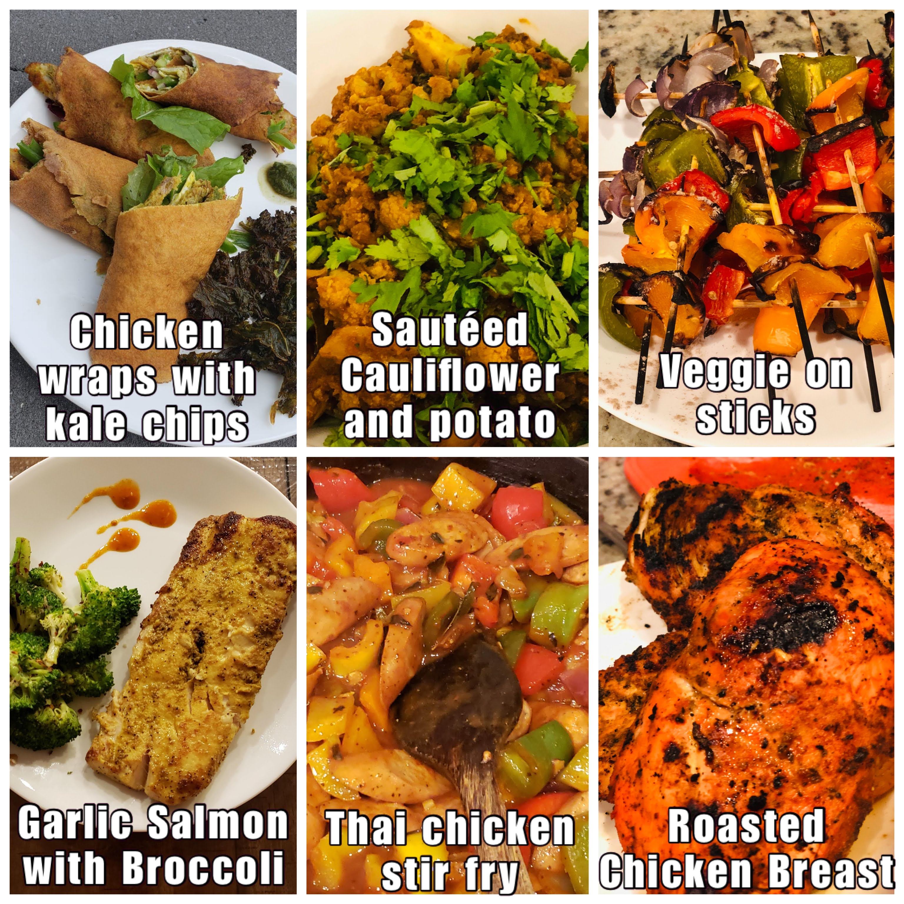
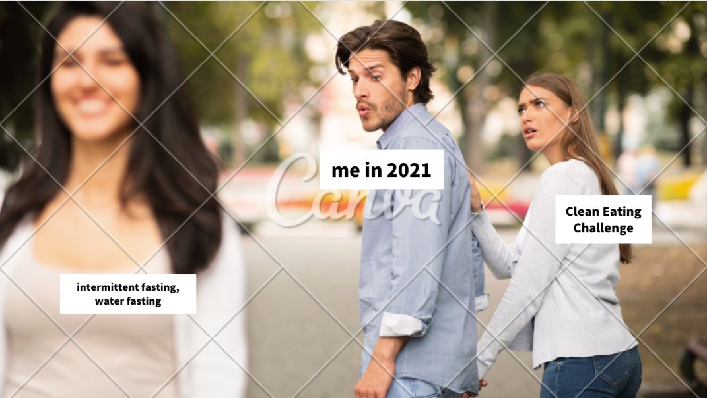

--- 
title: "Blueberries in My Salad"
author: "Amit Arora"
date: "`r format(Sys.time(), '%B %Y')`"
site: bookdown::bookdown_site
output: bookdown::gitbook
documentclass: book
link-citations: yes
always_allow_html: true
description: "This book describes a journey of clean eating and regular workouts that I undertook with my wife from being fat to fit. Like a salad, life may not be the most appealing lunch option but if you can keep finding the blueberries every now and again, it is both rewarding and fulfilling."
classoption: oneside
cover-image: "introduction/blueberries-in-my-salad.png"
github-repo: aarora79/from-fat-to-fit
linestretch: 1.15
linkcolor: NavyBlue
links-as-notes: true
url: 'https\://aarora79.github.io/from-fat-to-fit/'
twitter-handle: aarora79
header-includes:
  - \pagenumbering{gobble}
  - \usepackage{setspace}
  - \doublespacing
  - \usepackage{float} 
  - \usepackage{caption} # Insert the package used by gt
  - \usepackage{titlepic}
  - \titlepic{\includegraphics[width=\textwidth]{introduction/blueberries-in-my-salad.pdf}}
bibliography: references.bib
---

```{r include = FALSE}
if(!knitr:::is_html_output())
{
  options("width"=56)
  knitr::opts_chunk$set(tidy.opts=list(width.cutoff=56, indent = 2), tidy = TRUE)
  knitr::opts_chunk$set(fig.pos = 'H')
  knitr::opts_chunk$set(fig.width = 14)
  knitr::opts_chunk$set(fig.height = 10)
}
```

```{r setup=TRUE, echo=FALSE, warning=FALSE, message=FALSE}
library(gt)
library(xts)
library(zoo)
library(glue)
library(dplyr)
library(tidyr)
library(ggplot2)
library(stringr)
library(waffle)
library(ggthemes)
library(kableExtra)
library(lubridate)
library(tidyverse)
library(futile.logger)

source("globals.R")

# read the data, this comes from the biomettracker repo
# sometimes due to a bug in the weight measurement machine
# the lean mass and weight come as the same value, this is not 
# correct so we set the lean mass to NA in that case.
df_P1 <- read_csv(P1_DATA_URL) %>%
  mutate(Date=ymd(Date)) %>%
  mutate(`Lean Mass` = ifelse(`Lean Mass` == Weight, NA, Weight))
df_P2 <- read_csv(P2_DATA_URL) %>%
  mutate(Date=ymd(Date))%>%
  mutate(`Lean Mass` = ifelse(`Lean Mass` == Weight, NA, Weight))

df_p1_starting_weight <- df_P1 %>% filter(Date == min(Date, na.rm=TRUE)) %>% pull(Weight)
df_p2_starting_weight <- df_P2 %>% filter(Date == min(Date, na.rm=TRUE)) %>% pull(Weight)

df_starting_and_target_weights <- data.frame(name=c(P1_NAME, P2_NAME),
                                             Starting=c(df_p1_starting_weight, df_p2_starting_weight),
                                             Target=c(P1_TARGET_WEIGHT, P2_TARGET_WEIGHT),
                                             Ideal=c(P1_IDEAL_WEIGHT, P2_IDEAL_WEIGHT))

df_starting_and_target_weights <- df_starting_and_target_weights %>% 
  gather(metric, value, -name) %>%
  mutate(metric = paste0(metric, " Weight"),
         value = as.numeric(value))

# in this section of the code we will do all our data reading, cleaning, wrangling...basically
# everything except the timeseries forecasting bit so that the rest of the sections simply display the 
# charts based on the data analysis done here. The forecasting is left to its own section later in the code
# because it is based on user input and so it needs to be done redone whenever the input changes.

# read the raw data for person 1, print basic summary and metadata
df_P1 <- read_csv(P1_DATA_URL) %>%
  mutate(name=P1_NAME) %>%
  arrange(Date) %>%
  mutate(Date=ymd(Date)) %>%
  filter(Date >= START_DATE) %>%
  mutate(`Lean Mass` = ifelse(`Lean Mass` == Weight, NA, Weight))
# read the raw data for person 2, ultimately we want to have this dashboard work the same way
# even if there was only person 1 so put the following in an if checl
if(!is.na(P2_NAME)) {
  df_P2 <- read_csv(P2_DATA_URL) %>%
    mutate(name=P2_NAME) %>%
    arrange(Date) %>%
    mutate(Date=ymd(Date)) %>%
    filter(Date >= START_DATE) %>%
    mutate(`Lean Mass` = ifelse(`Lean Mass` == Weight, NA, Weight))
}
# read the important dates csv file. This is needed because we would like to annotate this journey
# so that we can say oh right there was an increase in weight for these days and it followed a birthday party, for example...
if(!is.na(IMPORTANT_DATES_FPATH)) {
  important_dates <- read_csv(IMPORTANT_DATES_FPATH)
}
# combine the dataframes, we want to do a side by side analysis for both people
if(!is.na(df_P2)) {
  df <- bind_rows(df_P1, df_P2)
} else {
  df <- df_P1
}
# get the data in tidy format i.e. Each variable must have its own column.
# Each observation must have its own row.
# Each value must have its own cell.
# see https://r4ds.had.co.nz/tidy-data.html
df_tidy <- df %>%
  gather(metric, value, -Date, -name) %>%
  mutate(value=as.numeric(value))

# determine the per day weight loss dataframe by
# calculating loss as weight - the one previous value of weight
# this is done by first grouping the dataframe by name since it has
# data for two people and then arranging by date while maintaining
# the grouping (NOTE: .by_group=TRUE)
df_wt_loss <- df_tidy %>%
  filter(metric=="Weight") %>%
  select(name, Date, value) %>%
  group_by(name) %>%
  arrange(Date, .by_group=TRUE) %>%
  mutate(loss_per_day = -1*(value-lag(value, 1)))  %>%
  mutate(loss_per_day_7_day_ma=rollapply(loss_per_day, 7, mean,align='right',fill=NA))
# is the curse of the weekend real? Assign the day to each date so that we can determine
# if say the weight loss eventually after the weekend was very less or maybe not even there...
df_wt_loss <- df_wt_loss %>%
  mutate(day = weekdays(as.Date(Date)))
# determine how much of theweight loss target has been achieved, this is done by finding the starting
# weight (configured), target weight (configured) and seeing how far each person has reached based on
# what their current weight is. This percentage is used to display a gauge (like the needle of a speedometer)
p1_starting_weight <- df_tidy %>% filter(name==P1_NAME & metric=="Weight") %>% head(1) %>% pull(value)
p1_latest_weight <- df_tidy %>% filter(name==P1_NAME & metric=="Weight") %>% tail(1) %>% pull(value)
# weight loss would be negative when calculated so multiply by -1
p1_wt_lost_as_pct <- -1*100*((p1_latest_weight-p1_starting_weight)/p1_starting_weight)
p2_starting_weight <- df_tidy %>% filter(name==P2_NAME & metric=="Weight") %>% head(1) %>% pull(value)
p2_latest_weight <- df_tidy %>% filter(name==P2_NAME & metric=="Weight") %>% tail(1) %>% pull(value)
p2_wt_lost_as_pct <- -1*100*((p2_latest_weight-p2_starting_weight)/p2_starting_weight)
p1_target_achieved_pct <- (p1_starting_weight-p1_latest_weight)/(p1_starting_weight-P1_TARGET_WEIGHT)*100
p2_target_achieved_pct <- (p2_starting_weight-p2_latest_weight)/(p2_starting_weight-P2_TARGET_WEIGHT)*100
# daily weight loss, this is important for a lot of charts and tables
# not the use of group by (name) and then lag. The dataframe is already sorted
# in asc order of time, so if the weight is reducing the daily_wt_loss would be a 
# -ve number, for several charts and tables this is multiplied with -1 so provide
# the absolute loss
df_daily_wt_loss <- df_tidy %>%
  filter(metric == "Weight") %>%
  group_by(name) %>%
  mutate(daily_wt_loss = value - lag(value))
# how many days did it take for each pound to drop? This is found by finding the max date i.e. the last date
# on which each weight (as a whole number, so 230, 229 etc) was seen and then subtracting that date from
# the last date of the previous highest weight. So if 230 was say the 20th pound to drop (if we started from 250 say)
# then the number of days between 231 and 230 becomes the number of days it took to lose the 20th pound.
df_days_to_next_drop <- df_daily_wt_loss %>%
  mutate(value = floor(value)) %>%
  ungroup() %>%
  group_by(name, value) %>%
  summarize(Date=max(Date)) %>%
  arrange(desc(Date)) %>%
  mutate(value_diff=value-lag(value), days=abs(as.numeric(Date-lag(Date)))) %>%
  replace_na(list(value_diff = 0, days = 0)) %>%
  mutate(value=value-min(value)) %>%
  filter(value != 0)
# read the precalculated forecasts and target achievement data 
# this is needed because shinyapps.io does not support Prophet (in the sense there are errors in installing it)
df_forecast_p1 <- read_csv(P1_FORECAST_FPATH) %>%
            select(y, yhat, yhat_lower, yhat_upper, ds) %>%
            mutate(ds=as.Date(ds)) %>%
            left_join(df_tidy %>%
                        select(Date, metric, value, name) %>%
                        filter(name==P1_NAME & metric == "Weight") %>%
                        group_by(Date) %>%
                        filter(value==min(value)) %>%
                        ungroup(),
                      by = c("ds"="Date")) %>%
            mutate(y = value, ds=ymd(ds)) %>%
            select(-metric, -value, -name)


df_target_achieved_p1 <- read_csv(P1_TARGET_ACHIEVED_FPATH)
df_forecast_p2 <- read_csv(P2_FORECAST_FPATH) %>%
            select(y, yhat, yhat_lower, yhat_upper, ds) %>%
            mutate(ds=as.Date(ds)) %>%
            left_join(df_tidy %>% 
                        select(Date, metric, value, name) %>% 
                        filter(name==P2_NAME & metric == "Weight") %>%
                        group_by(Date) %>%
                        filter(value==min(value)) %>%
                        ungroup(),
                      by = c("ds"="Date")) %>%
            mutate(y = value, ds=ymd(ds)) %>%
            select(-metric, -value, -name)


df_target_achieved_p2 <- read_csv(P2_TARGET_ACHIEVED_FPATH)
# read body measurements file
df_measurements <- read_csv(MEASUREMENTS_FPATH)
df_measurements <- df_measurements %>%
  filter(measurement %in% MEASUREMENTS_TO_KEEP)

# table for different types of exercises
df_exercises <- read_csv(EXERCISES_URL) 

# exercise dates for calendar plot
df_exercise_dates <- read_csv(EXERCISE_DATES_URL)  %>%
  mutate(date=ymd(date)) 
df_deadlifts <- read_csv(P2_DEADLIFT_URL)

# references
df_references <- read_csv(REFERENCES_URL)


# clean eating list
df_clean_eating_list <- read_csv(CLEAN_EATING_URL) %>%
  replace_na(list(`(Optional) Notes` = ""))

# break up of days, how many days did we lose wieght, gain weight, no change
p1_days_counts <- df_wt_loss %>%
  filter(name == P1_NAME) %>%
  ungroup() %>%
  select(Date, loss_per_day) %>%
  drop_na() %>%
  mutate(category = case_when(
    loss_per_day > 0 ~ "Weight Loss",
    loss_per_day < 0 ~ "Weight Gain",
    loss_per_day == 0 ~ "No Change"
  )) %>%
  count(category, sort=FALSE) %>%
  mutate(category_label = glue("{category} ({n} days)")) %>%
  select(-category)

p1_days_total <- sum(p1_days_counts$n)
p1_days_counts_as_list <- unlist(p1_days_counts$n)
names(p1_days_counts_as_list) <- p1_days_counts$category_label

p2_days_counts <- df_wt_loss %>%
  filter(name == P2_NAME) %>%
  ungroup() %>%
  select(Date, loss_per_day) %>%
  drop_na() %>%
  mutate(category = case_when(
    loss_per_day > 0 ~ "Weight Loss",
    loss_per_day < 0 ~ "Weight Gain",
    loss_per_day == 0 ~ "No Change"
  )) %>%
  count(category, sort=FALSE) %>%
  mutate(category_label = glue("{category} ({n} days)")) %>%
  select(-category)

p2_days_total <- sum(p2_days_counts$n)
p2_days_counts_as_list <- unlist(p2_days_counts$n)
names(p2_days_counts_as_list) <- p2_days_counts$category_label
```

# Preface to the updated 2nd edition

```{r, echo=FALSE}
if (knitr:::is_html_output())
{
  knitr::include_graphics("introduction/blueberries-in-my-salad.png")
}
```

I would not say that I wrote the first edition of this book (also, my first book) on a whim, but even so, it wasn't something that was a part of new years resolutions either. Well, it was the year of our Lord 2020 after all, between Amazon running out of podcast mikes and peacocks being sighted in the streets, anything was possible. A person like me who had been overweight and unfit most of their adult life suddenly writing a book on health and fitness, why not?

Since the 9 months or so that have elapsed between the first edition getting (self-)published and me starting work on the second edition, a few things happened. Firstly, I met several people, some close friends, some acquaintances and some complete strangers who told me how much they enjoyed reading the book, that it was useful for them in their own fitness journey and also they were curious if we eventually did reach our fitness goals (the first edition ends with me and my wife being about three quarters of the way there). I did reach my fitness goals both in terms of my body weight and deadlift target, so right there, there was a sequel to the first book waiting to be written. Secondly, I realized what a great learning and personal growth it was for me to actually put down all our experiences on paper and understand that it is one thing to hold your own in a conversation at a dinner party and a totally different thing to string together cogent and coherent sentences in a book. Finally, I learn and remember by writing (or typing). As they say one good habit begets another, I started reading and learning more and more, incorporating in my own life what I could about overall wellness, aging and longevity, nutrition and other aspects of human health. I felt I should write what I learnt.

I am far from being an expert and certainly would not suggest to anyone to begin on this journey without proper guidance, but it is, after all, a voyage of self-discovery. This book is a travelogue of my midlife journey through the hills and valleys of health and fitness, discovering new (to me) vistas and realizing truths that now appear self-evident. Perhaps the most important truth that I learnt was that a choice between work and workout is a false binary. There is no work (as in a job, business, studies) without a workout. While it is mind over matter, always, but our physical body is also a tool to control the mind. A good workout does more for the mind than for the body, having experienced that over and over again, I just cannot stress that enough. A good session of strength training is about as perfect a start to a day that you can ask for, it sets you up for success, give it a chance!

This edition of the book covers several new topics, such as "water fasting", "proteins are not your only friend and carbs are not your enemy", "strength training or cardio", and also a topic that has applicability even outside of fitness and strength: "consistency rather than intensity, the power of showing up every day".

When I started my journey, I was not sure of how long would it last. Actually, I never thought about it in terms of a start and a finish, I did not think much of anything except that this was a good road to travel. Until then, most people I knew thought about good health in terms of a single metric: **body weight**. People spoke in terms of "oh, I need to lose 10 pounds", "I need to get rid of belly fat" and so on, no one and I mean no one that I knew of spoke in terms of "I want to have more energy", "I want to sleep better", "I want better physical fitness that helps me become better at whatever I do". So when I started, my focus was also, not surprisingly, body weight, but over time I realized, body weight was just one metric, an important one, but still one of several. A healthy mind lives in a healthy body, and a healthy body takes persistent effort, day after day, week after week, month after month. Unless you have hit a genetic lottery and are just born with great metabolism, there is a lot of work to put in (I would in fact argue that if you have hit the genetic lottery you have an obligation to maintain it). But a healthy lifestyle does not have to be a chore, people often get disappointed to hear that health is not a quick fix, the 10 pounds that they want to lose will come back once they go back to their old eating habits. Life long changes require life long efforts, and I would question, why should it be any other way? There is a great amount of satisfaction and feeling of self worth to be derived from looking back and reflecting "Yes, I really did this, not as a one time quick fix solution, but consistently!". What drives me is not just some goal that I decided to set up for myself but the experience, the blood, sweat and tears (metaphorically speaking) in the pursuit of the goal. I do have goals (a 400 lb deadlift, completing the [murph challenge](https://themurphchallenge.com/) in under 35 minutes) but those are more like milestones on a highway rather than a destination to get to. As long as I am making progress, howsoever small, even if it is two steps forward and one step backwards, it is all good. Fitness is an infinite game, the objective is to play the game for as long as possible and that can only happen by enjoying the journey and being proud of the effort. 

For most of 2020 and early part of 2021, social interactions were severely curtailed because of Covid. As we started seeing people, it was interesting and encouraging to see that the reactions I got from people changed from "how are you losing so much weight?" to "you look athletic!" or "you look strong!". When someone praises you, it invariably creates a dopamine rush that drives you to keep up the good work. Whether it is an Instagram like or a complement on your physical fitness, the physiological processes involved are the same, but I would argue getting the dopamine rush via someone saying nice things because you are a transformed person is probably not so bad! Just to be clear, I don't mind the Instagram likes at all. I put a lot of fitness content on my Instagram @ilivethedata primarily to chronicle my workout progress but also to maybe give hope to some random person scrolling through their Instagram feed and thinking "if he can, then why can't I?". It is always nice to see how far down that road I have traveled from being the clumsy person who could barely do a squat to someone who now regularly does a 110lb barbell squat.

A word about data, we kept up with the practice of collecting weight and other biometrics every day and that has been invaluable. I would have liked to have better tracking for all of our exercises, but did not find an app which did quite what I wanted. Started creating my own app for tracking workouts, but between my day job, working on the app or writing this book, I choose this book :). Hopefully, the app will also be available in the not too distant future. The charts and tables in this book are all generated using R and gpplot2, please see this [github repo](https://github.com/aarora79/biomettracker) to find the latest data. This book is rendered using the wonderful [bookdown package](https://bookdown.org/), very thankful for it.

As all good books should, this book too has a website now. Please see [blueberriesinmysalad.com](blueberriesinmysalad.com). The website tracks our journey as it continues, has updates on what are the latest topics in health and fitness that I am currently learning about and maybe a monthly newsletter as well in the future. 

Finally, to the one person who sent me screenshots of underlined passages of my book with questions written on the margin, thank you for the encouragement :), please look for a signed copy of this new edition in the mail!


Amit Arora  
Clarksburg, Maryland  

PS: I never thought that people would read my book by borrowing it from a friend, who in turn borrowed it from another friend :), but it did happen. To those friends, I say, I see you :) and this time please have at least two friends buy the book and I will be happy to sign a copy for you.


# Preface to the 1st edition

This is neither a book on salads, nor a commentary on life. What it is, is a journal of experiences that my wife and me had in our journey towards being fit and strong.  Like a salad, day to day life may not be the most appealing lunch option, but just like a good salad if you can keep finding the blueberries every now and again, it is both rewarding and fulfilling. The small and big milestones we achieved during our journey kept us going, just like the blueberries in our salad.

Initially, I wanted to write a book documenting our journey towards fitness and strength on a day to day or at least a week by week basis. As things progressed, I realized that we were not the only ones on this journey and the Internet was filled with blogs and YouTube videos that document in great detail, very successful, inspiring and transformational stories. Why was I wanting to reinvent the wheel by writing our story on the same lines? I thought that while a daily or weekly journal was not something I could do but definitely there were "topics" on which I would like to pen down my thoughts. For example, the most often asked question, "What diet did we follow?", "Do I really need a trainer?", "Just tell me how long would it take to lose 10 pounds" and so on. Therefore I decided to write this book as a collection of essays on these and other related topics.

It has been more than 9 months since we started this journey and I feel that we have learnt so much that it is important to document this first and foremost for our own selves and then also for anyone who might be interested (I hope someone is). After all, it is one thing to see someone famous transform and another thing to see someone you know or could relate to (middle aged Punjabi NRI couple anyone?) do the same and then realize "If they could do it, so can I".

We took daily measurements for our weight and other biometrics and they were automatically synced via an app on our phone. This is huge, daily tracking enables, even forces, conversations around progress (or lack thereof) towards your targets. It keeps you honest and on track. What it also enables is to see the big picture over time, such as are you slowing down, do you need to make adjustments to your routine, how much that elaborate weekend dinner set you back? For me personally, as a data scientist it was fascinating to collect the raw data, find patterns, gain insights and also get some forecasts done (when would we reach our target weight?).

Over time I understood that while the desire for weight loss was what got me here, but what I was really gaining was good health and strength. One can lose weight by falling sick, we know that is not healthy. Weight loss should not be the only goal. To reduce the benefits of what we were doing to just burning calories and losing tens of pounds now seems like a terrible underselling of the idea of fitness. The human body is a fascinating machine capable of wonderful things, good health is a state of both mind and body. Exercise and healthy eating habits help both mind and body. If you do not have any serious health issues there isn't really any excuse for not exercising regularly and eating healthy. As it is said  loosely translated it means that the body is the source of all good deeds.

Finally, nothing in this book should be interpreted as me recommending anything, a written version of my musings is what this is. An experiment with a sample size of N=2, in other words statistically irrelevant! **Do not take anything that you read in this book as medical advice. Always consult your doctor before starting any diet or exercise program.**

## Acknowledgements

Besides improving our quality of life, clean eating and exercises also provided me the impetus to finally take up something that I have wanted to do for a long time, writing a book.

This would not have been possible without my dear wife Nidhi, who was not only an equal partner in this journey but was also the head chef to prepare all the tasty & nutritious food (all the photographs including the book cover are courtesy her), the assistant coach who kept an eagle eye on my forms during the exercise and also the one who kept on encouraging me to write. She is also the proofreader for this book, although, any mistakes and omissions are mine alone.

A huge thank you is due to our wonderful trainer and friend, Dawn Kirk. Thank you Dawn for persisting and persevering with us. I wish everyone has the good fortune to have a trainer like you.  

Finally, this book is dedicated to my grand parents, my guardian angels. I know they watch over me.

Amit Arora  
Clarksburg, Maryland  


<!--chapter:end:index.Rmd-->

# How it began...

I remember the first time some 15 years ago when a colleague at work introduced me to the burrito,  and delicious as it was, I barely managed to finish it. Same with the foot-long. It was just too much food, more than what I needed to eat for lunch. Over the years I got more used to it and what used to be a huge portion size once, was just very normal now. What was almost a culture shock many years ago, was just routine now. It should not have been.

About 3 years ago i.e. in the spring of 2017, I decided to go to the doctor and ask why do I wake up with a severe case of dry mouth every morning? I knew I was grossly over-weight and the dry mouth had started happening a few years ago and the two could be related. I kept ignoring it for years, but it had become bad enough that I sometimes used to wake up very early in the morning because of it and had to rinse my mouth to go back to sleep. The doctor's visit was an eye opener, he said it is most certainly because you are grossly over-weight (I weighed 273 pounds) but asked a few more questions which led him to believe I had all the symptoms of sleep apnea.

TL;DR I did a home sleep apnea test and the results were very alarming. The doctor said it was so bad that I could be at the stage of starting to lose short term memory i.e. because the sleep is so disrupted because of lack of oxygen that the brain is not able to make new neural connections that it usually does when we are sleeping. This was happening when I had just joined a masters program in data science at Georgetown University and was now part time at school, 16 years after having completed my engineering degree. With my day job and school homework, my sleep time was anyway much reduced and not getting quality sleep was just bad in so many different ways.

## My tryst with a protein based diet

Something had to be done. I got on a medically supervised weight loss program that used a ketogenic/protein meal replacement diet and I started sleeping with a CPAP (Continuous positive airway pressure therapy). I count those two decisions among the top 5 best decisions of all time I ever took in my life. I followed the diet very strictly, of course my dear wife Nidhi was with me in this and she did the diet as well. I started losing weight immediately, sleeping with the CPAP machine was what I would call a life changing experience. I no longer felt like dozing off while driving to college, even if I slept 5 hours (which was 4 days a week) I still woke up refreshed and did not experience the mid afternoon crash in energy. In a couple of months the weight loss, for both me and my wife, was very noticeable and friends and family started asking what were doing that was causing this transformation. Everyone is interested in the new diet that their friends are into (especially if they are getting thinner:)). Expected case of FOMO, I would say. In about 8 to 9 months, I had lost close to 70 pounds and my wife had lost close to 40 pounds, that is pretty drastic by any measure. It was effective, expensive and un-sustainable.

For about 10 months or so till I followed the diet, we were pretty strict about no or as little carbohydrates as possible, and ate a lot of those protein supplements (bars, shakes, snacks etc.). Then came the holiday season, new year parties and there it was, the dreaded phase where I thought ok we can get off this horse for a little bit and then get back on when this season is over. No prizes for guessing, it never happened. I still remember my weight had gone down to 202 pounds and I could see it rising back up, day after day. I thought OK, this is still less than 210, I can pull it back, no problem. Well, not really, soon it was past 210. I told myself, OK but it is not 220 yet, I can pull this back. Once it crossed the 230 pounds mark, I gave up trying.

I was able to graduate two years later (in 2019), my weight at 240 pounds and the CPAP machine by my bed every night. I did not even go for a weekend getaway without it. The dry mouth was getting back, not as bad though, but it was back, there was no missing it. The sleep was not as good. By end of 2019, I was 250 pounds, the CPAP machine was broken, my wardrobe almost completely redone because none of the clothes fit me anymore and I had given away all the clothes from 2017.

## A new beginning

Cliched as it is, I made a new year resolution in Jan 2020, "I need to fix myself, this cannot continue". Nidhi had also gained weight, not as much as me, but she gained 20 pounds out of the 40 she had lost. She had mentioned to me in December 2019 that there was this personal trainer who had dropped in to the Doctor's office (I conveniently skipped to mention that Nidhi became a health coach and started volunteering in the Doctor's office) and left her card if someone coming in for fitness training wanted to come for a trial class at her gym.

It is said, good things happen when the time is right (no one says that, I just made that one up :)). Nidhi left the trainer a message, and we did not hear back from her until a few days later when she said sure we could stop by her gym for a free class. There we were, on January 17th, 2020, in her gym, for what I did not know at the time would be the start of a new chapter in our life.

The gym itself was pretty unassuming, in an extended but disjoint part of her house. I did not think much of it, but little did I know what we were getting into. It needs to be said that prior to this I had never seen the inside of a gym in real life and my only window into how fitness equipment looks like and what trainers do was through films and TV, in other words, what I knew was far from reality. I remember asking before the training "So what do you think, how many calories would we burn during the workout today?" and the answer I got was "Oh I don't know, we don't count calories here :)". "Ok, then" I remember saying to myself. The trainer seemed to be a pleasant person with an infectious smile, the training was good, tiring but not hard and I was like "OK, this isn't too bad". Later that evening, I felt a sharp pain in my neck, but I thought it is nothing. As the evening progressed, the pain increased. I barely got any sleep that night, even after putting some pain reliving ointments, the pain did not subside. It was the most physical pain I had endured in a long time. I even thought to myself, maybe I would need to put in a collar around my neck (I didn't need to). It took a couple of days for the pain to go away completely. Thankfully, that was the only time I felt such pain in all the months now that we have been exercising. Was a good lesson for me right at the start, never be under any false sense of bravado while working out in the gym (or even otherwise :)).

We decided to enroll for two classes a week. Since we were just starting out and I needed individual attention, we decided why don't we do a couples package where we would have classes for a month for just the two of us together. She also asked us to fill out a detailed log, as detailed as we could get, of everything we ate or drank for 3 consecutive days. It was not convenient but we scribbled something and gave it to her in the next class. The trainer had a small book that she and her husband had written about her journey with what they called (don't know it might be a standard term) "clean eating". There is a 30 day clean eating challenge in which you eat no processed food, no dairy, no pulses, no legumes, no hard drinks and no soft drinks either, only vegetables, fruits and meats are allowed. We decided to do the challenge and made a list of everything we thought we could eat during the challenge and got her to say Yay or Nay on each of those items. The list is in appendix A of this book. It had things commonly found in Indian kitchens like "spices", "herbs", different fruits etc. Now that I think about it, I am not sure what made me do the challenge, I just decided to do it just like I decided to workout in the gym twice a week, something that I had never done in almost my 41 years of life. When thoughts become deep, intentions become weak. So there we were, working out twice a week in the gym and decided to go for clean eating in a few weeks time.

What endeared me to the workout sessions was that after a few weeks I noticed both in myself and my wife there was an unmistakable feeling of joy/elation/happiness as we completed a hard training session in the gym. We did loose some pounds but nothing very noticeable. What attracted me to the clean eating was that I could identify with it, it did not claim any magic results, did not ask to give up on the basics i.e. vegetables/fruits/meat in fact it embraced these and only said do not eat processed food. This was the same guidance I had grown up with during my childhood, this was what my grandmother used to say as well, surely this could not go wrong. Surely nothing bad could happen by not eating cakes and cookies, not drinking soft drinks or hard drinks and just basically saying good bye to processed sugar. Made total sense.

So here we were, ready to start and reminding ourselves **that the only way to reach the finish line is to start...**. My target was simple i.e. "not to be obese" as per the [NIH guidelines](https://www.nhlbi.nih.gov/health/educational/healthdisp/pdf/tipsheets/Are-You-at-a-Healthy-Weight.pdf), provided. I do not remember the time I was at 158 pounds, I just wanted to be 190 or less so that I would not be adding to the "obese" population of the planet. Nidhi on the other hand was reasonably fit and her goal was pretty close to the NIH guidelines. I had the motivation, the means and had made up my mind.


```{r echo=FALSE, fig.height=10, fig.width=14}
df_starting_and_target_weights %>%
  group_by(name) %>%
  mutate(position = rank(-value)) %>%
  ggplot(aes(x=name, y=value, fill=metric, col=metric, group=position)) +
  geom_bar(stat="identity", position="dodge") +
  geom_text(aes(x=name, y=value+10, label = paste0("(", value, ")")),
            position = position_dodge(width = 1),
            #nudge_y = 0.015*df_starting_and_target_weights$value,
            show.legend = FALSE, size=8) + 
  labs(title="How things stood the day we started",
       subtitle=glue("All weights in pounds. Starting date: {min(df_P2$Date, na.rm=TRUE)}."),
       caption="Note: Ideal weight as per NIH guidelines.") +
  theme_fivethirtyeight() + 
  scale_fill_tableau() + 
  scale_color_tableau() +
  theme(legend.title = element_blank(), text=element_text(size=CHART_ELEMENT_TEXT_SIZE))
```


<!--chapter:end:02-how-it-began.Rmd-->

# Clean Eating

*Disclaimer: this is my interpretation of what I understood and did as part of clean eating. I am not aware if there is a standard definition for this and if there is one I do not wish to challenge whatever it is.*

Clean eating is not a diet. This is the number one thing I find myself explaining to people when they say "you have lost so much, what diet are you following". It is simply a decision of saying I am going to keep processed foods and sugars out of my body. Strictly speaking, only if you are eating something you have grown or you have hunted are you eating clean, but then let's be real here, unless you are living on a farm, this is not feasible. The next best thing we could do is to keep processed food and especially processed sugars out of our body. I don't need to say more on this except that there is tonnes of research available proving why processed food and refined sugars are just plain bad, do yourself a favor stay away from these.

Appendix A contains a checklist of what we confirmed with our trainer was allowed during clean eating. This is pretty exhaustive list. Before I get into the details of exactly what we ate, I would like to address something upfront. Is clean eating hard? Yes it is hard, but only to the extent of saying that nothing that is worthwhile is ever easy. Not being able to eat ice-creams (substitute with your favorite unhealthy snack) is hard, I am not going to lie, but then it is for a fixed period of time and also, nobody ever became unhealthy because they did not eat ice-cream. At the same time, clean eating is also not that hard when I compare it to other diets. The key difference is that you are not counting calories, counting calories is not sustainable, you cannot survive on a 1000 calories a day for long (several months maybe, can you do it for your whole life). Think of it, if counting calories was the solution then some food company would have figured it out and the shelves would be full of some magic food.

The intent of clean eating is to reset your system, calibrate your taste buds so that they begin to appreciate the natural tastes of different foods. I would know because I am the person who back in India would go (every now and then) for a late evening after dinner ice-cream (a fruit salad Sunday to be precise) and then as if that was not sweet enough, go to a [Kulfi](https://en.wikipedia.org/wiki/Kulfi) place right after that to top it off! 3 weeks into clean eating I found a papaya to be sweet, grapes to be just too sweet and eating an orange or two as a 4pm snack seemed just delightful.

Indulge me a little bit before we get into the details of breakfast/lunch/dinner. When we got married, we went to Europe for our honeymoon and one of the places we visited was the city of Nice in the south of France. Absolutely beautiful place, however, we did not quite develop an appreciation for the French food. We were looking for some Indian food or anything that had some spices and was not cold and bland (my apologies to anyone reading and thinking these folks don't know the first thing about French food). We found this Pakistani restaurant by the beach and were delighted to eat some Butter Chicken there. It was not hard to notice that we were from India because Nidhi was still wearing some distinctly Indian jewelry. The owner of the restaurant stopped by to talk to us and seeing we were Indian sat down for a conversation. He said, "you know, the French food is the best food in the world", we were listening but not quite agreeing, the butter chicken would not allow us. He continued "back home, we put so much spices in our food, cook it for so long that we never get to know what the ingredients actually tasted like...". Months of eating relatively clean (not strictly, I mean I do eat my ice-cream sometimes, I have had a pizza a few times), has made me realize that while I still cannot compare the taste of the Indian cooking with anything else, I do see the point of the natural taste of food. Our elder son likes a green chilly with his dinner, but the younger refuses to even recognize that "bitter" can also be a taste.

## A clean breakfast

Breakfast was mostly eggs, in any form. Egg fry (cooked in Ghee or Kerrygold butter), omelette (sometimes with tiny pieces of bacon thrown in), boiled eggs, scrambled eggs, egg wrap or any other variation one can think of. Along with coffee (for me, I am a coffee person) or tea (Nidhi is a tea person) with almond milk or an almond and coconut milk creamer. We used to think that removing dairy from our diet would be almost impossible, but surprisingly, that was one of the easiest things to do. Swapping whole milk with almond milk worked like a charm. I personally find the almond milk so light and have developed such a liking for it that I no longer feel like drinking regular milk at all. For the days we did not consume eggs, we had bananas or almond flour pan cakes. Another thing we really enjoyed for breakfast was frozen Acai bowl (you can get them at Costco, just don't eat the granola that comes along with it).

Here are some pictures. I would note that everyday the omelette may not have looked as good but was pretty close. It is real hard work to make breakfast this good everyday and the credit for this is one person's and one person's alone i.e. Nidhi :).


\pagebreak

## A lunch we really love

For lunch we used to have salads. I don't know about you but when I think of salads, i have two contrasting pictures in my head as reference (this is all prior to clean eating), one is a cold salad with raw vegetables and boiled eggs, along with some beans and chickpeas, maybe mushrooms as well and the other image is from a salad place like the one I visited often at Georgetown university, exquisite salads with all sorts of "woke" ingredients. The first one was something I just did not find palatable at all and the second one was what I would wait for the whole week so that I could eat it whenever I was at Georgetown for a class. Surely there was some middle ground here, I would think, and there is.  

Costco has a bunch of good salad mixtures in their frozen section and they are all very good. We particularly liked the sweet kale salad. So we mixed the sweet kale, with additional ingredients such as spinach or other mixed greens and topped it with sunflower seeds, chia seeds, walnuts (sometimes cashews), some cranberries and my favorite, "blueberries". Used a home made dressing made of olive oil, lemon juice and herbs. Add a boiled egg, half an avocado and then either some grilled chicken or tuna. Some days we substituted chicken/tuna with grilled tofu. I am still surprised that even after more than 6 months of eating variants of it (keeping the base recipe the same) 4 to 5 times a week, we are still not bored of it, in fact we seem to like it as much as we liked it before. Each day, the salad tastes a little different and that was keeps it interesting.


One of thoughts I had and I believe many people would have is that salad does not satiate me, it does not full me up. That is actually not true, or was not certainly true for me as I found out. Eating a bowl and a half of salad does indeed fill you up. As before, I still like a cup of hot coffee after lunch. What does happen is that after 2 to 3 hours I felt the need for a mid afternoon snack. Previously this could have been any unhealthy options like chips, cookies, a diet soda, even a chocolate bar, basically anything you would typically find in a vending machine. That had to go, for good.

## The 4pm snack

A couple of small oranges at 4pm felt delightful. They tasted good, and the sugar content provides the boost the brain needs to shake off any mid afternoon lethargy or drowsiness. At times I also ate maybe 4 to 5 apricots, maybe an apple, or even some nuts such as walnuts/cashew nuts/almonds (not those packaged snack pouches please, we want to stay away from any processed food, as much as possible).

I did not try this as much, but sometimes I did have a "tea" such as a earl gray or English Breakfast, just a dip tea with hot water, no milk of any kind. It was nice, but me not being a tea person did not pursue it that much but it is certainly an option.


\pagebreak

## The grand finale a.k.a the dinner

If you try to stick to this routine, you would naturally find that you want to have your dinner early. What is early? For me, growing up, dinner was never before 7.30pm and then later in life as I got caught up with studies and then later at work and other things, it could be at 8 or 9pm or even later. That is not good, in fact, I would now say that is just absolutely unacceptable.

Now we really make an effort to wrap up dinner by 7.30pm, maybe 8pm at the latest. I start feeling hungry around 6pm, so a dinner around 7pm seems like the perfect fit. Eating dinner early helps to naturally avoid the urge for mindless snacking. As one of the people I happen to meet over the years who was into eating healthy said "You are not a goat, you don't have to keep munching all the time!". One way to avoid munching all the time is to eat at fixed times and eat full meals so that you don't feel hungry anymore. Instead of trying to eat just a little bit and continue what you are doing (whether it is work or anything else around the house) and wait for dinner, which inevitably leads to repeated snacking while waiting for the full meal, it is much easier to just tell your brain, wait for the full meal and then make sure you don't push off that meal to 2 hours later.

So, what did we have for dinner, lots of different types of food and I would happily say lots of tasty food. There is a lot of grilled food as you would notice. I did not realize this until I wrote this, a lot of our dinner is grilled either outside or in the oven. There are vegetarian options also and the vegetarian options are as tasty as the meats.




\pagebreak

## The results

The following charts show our progress in terms of weight loss, with the clean eating periods highlighted. We did a clean eating in February-March and then another in July-August.

We saw very good results in both the iterations. The first iteration produced much better results because obviously there was just too much weight to lose, but surprisingly the second iteration was also very effective. The way we see this now is that if we ever hit a really long plateau in the journey to achieve the desired weight we could just toughen our minds and do this again. It cannot hurt.

```{r echo=FALSE, fig.height=10, fig.width=14}
df_clean_eating_dates <- important_dates %>%
  select(-include)

df_iter1 <- df_clean_eating_dates %>%
  filter(str_detect(label, "Clean Eating")) %>%
  filter(str_detect(label, "Iteration 1")) %>%
  mutate(label = str_replace(label, "Clean Eating Iteration 1 ", "")) %>%
  spread(label, Date) 

df_iter2 <- df_clean_eating_dates %>%
  filter(str_detect(label, "Clean Eating")) %>%
  filter(str_detect(label, "Iteration 2")) %>%
  mutate(label = str_replace(label, "Clean Eating Iteration 2 ", "")) %>%
  spread(label, Date) 
  
df_clean_eating_dates <- bind_rows(df_iter1, df_iter2) 

df_tidy %>%
  filter(metric=="Weight") %>%
  ggplot(aes(x=Date, y=value, col=name)) +
  geom_line() +
  geom_rect(data=df_clean_eating_dates, aes(x = NULL,y = NULL,xmin=Start, xmax=End, 
                                  ymin=-Inf, ymax=Inf, 
                                  alpha=0.05, fill=name, col=name), show.legend = FALSE) +
  facet_wrap(~name, scales = "free_y") + 
  scale_x_date(date_breaks = "1 month", date_labels = "%b") +
  theme_fivethirtyeight() +
  theme(axis.title = element_text()) + ylab('Weight (lb)') +
  xlab("") +
  labs(title="How we lost the weight...",
       subtitle=glue("Shaded area represent clean eating iterations"),
       caption=CAPTION) + 
  theme(text = element_text(size=CHART_ELEMENT_TEXT_SIZE), legend.title = element_blank()) + 
  scale_color_tableau() + 
  scale_fill_tableau()
```

Here is another chart that compares the weight loss during clean eating and non-clean eating days. Note that even when we were not doing clean eating we were still careful about what we were eating (in other words we were not gorging on Pizzas and butter chicken, soft and hard drinks were still completely off limits).

The chart shows a boxplot representing the spread of the weight loss per day during clean eating periods and non-clean eating periods. The horizontal line inside the box represents the median value of the distribution. For example, I lost at least 0.435 lb per day on 50% of the days during clean eating whereas I only lost at least 0.005 lb on 50% of the days during non-clean eating period. The data for this chart includes both clean eating periods over a timespan from `r {min(df_tidy$Date)}` to `r {max(df_tidy$Date)}`.

```{r  echo=FALSE, fig.height=10, fig.width=14}
df_wt_loss2 <- df_wt_loss %>%
  mutate(clean_eating = ifelse(between(Date, df_iter1$Start, df_iter1$End) | 
                                 between(Date, df_iter2$Start, df_iter2$End),
                               "clean",
                               "careful-but-not-clean")) 
df_wt_loss_medians <- df_wt_loss2 %>%
  group_by(name, clean_eating) %>%
  summarize(med=round(median(loss_per_day, na.rm=TRUE), 4), .groups="keep")

df_wt_loss2 %>%
  drop_na() %>%
  ggplot(aes(x=name, y=loss_per_day, col=clean_eating)) + 
  geom_boxplot(show.legend = TRUE) +
  geom_text(data = df_wt_loss_medians,
            position=position_dodge(width=.75),
            aes(y = med, label = glue("{med} lb"), col=clean_eating), 
            size = 7, vjust = -.5, show.legend = FALSE) +
  scale_y_continuous(breaks = seq(-5, 5, by = 1)) + 
  theme_fivethirtyeight() +
  xlab("") +
  theme(axis.title = element_text()) + ylab('Weight Loss (lb)/Day') +
  labs(title="Clean eating days Vs Others",
       subtitle=glue("Clean eating days clearly have a higher median per day weight loss."),
       caption=CAPTION) + 
  theme(text = element_text(size=CHART_ELEMENT_TEXT_SIZE), legend.title = element_blank()) + 
  scale_color_tableau() + 
  scale_fill_tableau()
  
```

## Is the 30 day challenge hard? 

It is not very hard, certainly I did not feel it was, BUT tedious and tiresome is how I would describe it. It has to be said though, it is hard for the chef for sure, our food menus did change. The fact that there isn't a restriction on eating vegetables or fruits makes it easier than other diet programs that I know of. It is a given that you are not eating potato fries everyday for lunch or a mango as an after dinner dessert every night. What makes it hard is that after the first few days the enthusiasm begins to wane and the new eating habits take some time to become friendly. Once you adjust, both body and mind, to the new eating regimen then it does not feel like a diet at all. It certainly helps to have a goal in mind and keep reminding yourself why are you doing this.

For me, I think after two weeks or so, I could certainly start feeling the benefits, I felt lighter, more energetic (no mid afternoon energy crashes), better quality of sleep, just overall lot of positives. While all this is happening, an interesting incident occurred. We had to be at a friend's place for a birthday dinner, the host was gracious enough to prepare some salads for us and we also took our own food with us. Midway through the party, I suddenly started feeling uncomfortable. The smell (aromas) of all the food and more so the alcoholic drinks made me feel nauseous, I felt like throwing up. Fortunately I did not throw up and we had a very enjoyable evening other than those 30 minutes. I was totally fine when we were back home, totally fine the next day as well. It must be that 3 weeks into clean eating the internal circuitry in my body had maybe begun to rewire itself, or so I thought.

Another thought that often came to my mind was that good food is a source of happiness, of joy. The sweet gulps of the [mango lassi](https://en.wikipedia.org/wiki/Lassi#Mango_lassi) soothe the soul, the tangy and crisp [Gol Gappe](https://en.wikipedia.org/wiki/Panipuri) tickle the brain, a [raddish or carrot or onion paratha](https://en.wikipedia.org/wiki/Paratha) satiate the stomach like nothing else, and what even comes close to a [butter chicken](https://en.wikipedia.org/wiki/Butter_chicken)? This is all true, however, food does not have to be the "only" source of happiness. There is happiness to be derived from good health, from feeling light, awake and agile throughout the day. A round of vigorous exercise resulting in a body drenched in sweat and a rush of endorphins is also happiness. Give it a chance, it will not disappoint you.

## What happens after the 30 day challenge?

Several people have asked me, "like other diets, do you go back to your old weight after you stop clean eating?". My answer is "yes, most certainly" and this should not be a surprise. While I would not call clean eating a "diet", it is certainly accurate to say that there is no such thing as a "one time fix". If you want the effects to be permanent then the lifestyle changes also have to be permanent, there are no quick fixes. I have often heard in other contexts that being fit/healthy/strong requires a lifestyle change. It certainly does. Does it mean we can never eat unhealthy food, no it does not mean that, it means that you first become healthy enough to allow your body the occasional indiscretions and then the morning after you go back to eating healthy and doing exercise.

As our 30 day challenge was coming towards an end I was very much looking forward to eating a lot of Indian delicacies, all in one meal. I did that, probably having deprived myself a lot, I went overboard. The results were not pleasant. After about an hour, I started feeling miserable. I felt bloated, tired, lethargic and sleepy. For a moment I could not understand what was happening, sounds like an exaggeration but I had almost forgotten what it felt like to overeat. Nidhi then pointed out it was probably because of all the food I ate, that made total sense. I felt so full, I did not eat anything in the afternoon, nothing in the evening for dinner either. Next morning I felt much better. This was my body's way of telling me that you do this again and I am going to react to this as if there is an alien invasion and the planet is in danger. Make no mistake, I have not stopped eating that food, I just eat smaller portions of it because I realize that what follows after the 30 minutes of pleasure is 24 hours of unpleasantness.


## A post 2020 update

We did not repeat the clean eating challenge again in 2021. Not because it was not useful anymore but because, it is a tool in the toolkit for attaining a healthy body weight, but it is not the only tool. Like all useful tools, it needs to be used judiciously. By the end of 2020 we understood to a good extent what kinds of food suited us, how are bodies reacted to certain food and so did not have the need to do the challenge, which at it's very core, is an exercise in finding out the relationship our body has with various kinds of foods by the process of elimination.

What we were now figuring out was something that can be described as "infinitely sustainable". Chapter 11 of this book discusses this in detail. Also, as 2020 was ending and the festival season was approaching, clean eating challenge was no longer on our minds and then in 2021 we started experimenting with other things such as water fasting. So while we still eat reasonably clean (no soft drinks, minimal processed foods and sugars) the clean eating challenge did not happen.




<!--chapter:end:03-clean-eating.Rmd-->

# Exercise: Putting in the hard yards

You would have probably heard that managing weight is 70% about nutrition and 30% about exercise. I think this correct. Having said that, we should not downplay the 30% i.e the exercise. As I have mentioned earlier in the book, a few years back I tried a purely diet based plan and achieved good results. The problem with it, like with all diet based plans, was that it was not sustainable. There is another aspect to this as well, when I tried losing weight purely via the diet route (could also call it calorie counting) my overall appearance became thinner or I would even say weaker. While I do not recall feeling lack of energy but the appearance was as if I had just lost a lot of weight from sickness and it did not look healthy. Several people asked me out of genuine concern if I was sick and when I told them that I was doing this diet their reactions were on the lines of "ok, but don't do more of it". This time however, things are different, both me and my wife look leaner and fitter. Our body structure has become "denser" if that is the right word to use here and it is because of that we look thinner and fit into much smaller clothes. Appearance wise we do not have the starved look that I suppose comes from severe calorie restricted diets. Without a doubt, this is the result of the rather intensive exercise routine that we now have.

## There is always a 1st time

When I went to the gym for the first time this year, it was not just the first time for me in the year 2020 but it was for the first time in my entire life of 41 years. I had no illusions of how supremely unfit I was and how difficult this was going to be. Sometimes, I used to see people exiting after their class and I used to tell myself "OK, that person looked great, but that is probably because he has been working out since forever". Of course, this may or may not have been true, but my goal was to keep telling myself that if I was disciplined enough to show up rain or shine and do the exercises as told then I would get better, that is just how it works (at least that is what I told myself anyway). 

I look at some old videos now of me doing exercises like planks or air-squats when I started and I compare them with the more recent ones of me doing the same exercise. My movements used to be very clumsy, almost hilarious, and it is to the credit of the trainer that she did not give up on me. Nidhi on the other hand, being a dancer, her movements had a natural rhythm, she had flexibility and having done some exercises while growing up, she was much more comfortable with the whole setup. My objective was not to be as good as her but to simply by better than me from four weeks ago.

We started with working out twice a week, and then went to thrice, and then four times and now I work out five times a week. Nidhi tried the four times a week routine but is now nicely settled into three times a week. In 8 months I have come from having to push myself to workout twice a week to now seems like my body cannot have enough of it. Of course, it helps that because of Corona, we are all working from home so we have a little more flexibility with our schedules. If there is one silver lining that I can see in this otherwise disaster of an year, it is this.

One day a couple of months into training, I stumbled upon a YouTube video of the training routine of an actress who played the role of a superhero in one of her movies. Her trainer said when she came to the gym and looked at people doing pullups and deadlifts, her reaction was that "Oh yeah this is cool and all but I can't do that", and a few months later she was deadlifting 235 pounds. When I saw the video, I had a similar reaction. I thought sure, a Hollywood actress with a celebrity trainer can of course do this, I cannot. I WAS WRONG. I recently deadlifted 265 pounds, and while I have just started doing assisted pullups, I can at least visualize myself doing some real pullups by myself, not easy, but definitely possible. I will end this section by saying I am hugely inspired by how much work actors and actresses put in these days to be fit and to look the part that they are playing (the references section has a link to some videos).

## Our workout routine

I am clearly not qualified to talk about the technical details about what makes a good workout but I can certainly state what we did and loved. 

Our workout sessions were an hour long and were mostly divided into five parts:

- Warm up (about 5 minutes)
- Strength (about 10 to 15 minutes)
- Strength & Conditioning (15 to 20 minutes)
- Core (5 minutes)
- Stretches (2 to 3 minutes)

With some rest time and setting up equipment for different exercises the above routines added upto an hour (give or take 5 minutes). From mid January when we started to about the end of March we were working out twice of week in our trainer's gym and since then we have been working out at home and our home gym has slowly metamorphosed from being your amateur home gym to a souped up version with lots of weights, barbell, deadlift equipment, resistance bands, boxes, pull up bars, rowing machine etc. Some of the stuff we bought, some our trainer was kind enough to lend us for a while (because Corona). Here are a couple of pictures.


For a long time, and even today, I tell myself before the workout, that warmups are easy, the strength portion is just 10 minutes so it will be over quickly before I realize and then the conditioning is the only part that I have to push through and then by the time I am half way through the conditioning it would be almost over and then core is super easy (it is not). This kind of mental setup helps me get through the hour. Of course once I am in the middle of it, unless the workout on the day absolutely pulverizes me, my mind goes almost totally blank, no thoughts at all. I have experienced this many times, going into the workout from a crisis at work is a huge mental shift. Once the workout is over, I realize that maybe the work problems are not that insurmountable as they appeared an hour back. It could be the exercise, or just the fact that I have had the opportunity to (forcibly) extricate myself from the crisis situation and now after an hour I am able to think more clearly. I do not know what is the reason, but I do know that I experience mental clarity after the workout.

The following tables show the different exercises we did, over time, as part of the warmups, strength, conditioning and core. These are over a period of time, with the more difficult ones such as the Turkish getup added much later and for the ones which we did from the start we kept on increasing the weights or the numbers of sets and reps over time. Not a comprehensive list, just a random selection.    

```{r echo=FALSE, warning=FALSE, message=FALSE}
if (!knitr:::is_html_output()) {
  kable(df_exercises, format="latex", booktabs=TRUE) %>% 
  kable_styling(latex_options="scale_down")
  
} else {
      df_exercises %>%
    gt::gt(groupname_col = 'Routine') %>%
    tab_header(
      title = md("**Exercise Routine**"),
      subtitle = md("Not a comprehensive list, just a random selection.")
    )
}

```

  
The conditioning part of the routine usually consisted of either a 12 minute AMRAP (as many rounds as possible) or a 12 minute EMOM (every minute on the minute) or sometimes a HIIT (high intensity interval training) such as Tabata or on some days just a combination of exercises.

## Our calendar so far

The following chart shows the calendar for the year 2020 with the days we exercised marked with an [E] and the amount of weight lost/gained reflected by the color. Red indicates weight loss and green indicates weight gain. More "red" than "green" in a month means overall we lost weight in that month. I like this chart a lot because it brings out very clearly that weight loss is never a straight line, you gain some (days) and you lose some (days), except in this case, losing is better.

```{r echo=FALSE, fig.height=10, fig.width=14}
df_exercise_dates <- df_exercise_dates %>%
  gather(name, exercise, -date) %>%
  rename(Date=date)

df <- df %>%
  left_join(df_exercise_dates, by=c("Date", "name")) %>%
  mutate(exercise = ifelse(is.na(exercise), 0, exercise))

df <- df %>%
  left_join(df_wt_loss %>%
              select(Date, name, loss_per_day) %>%
              group_by(Date, name) %>% 
              filter(loss_per_day==max(loss_per_day)), by=c("Date", "name")) %>%
  rename(DateCol=Date, ValueCol=loss_per_day) %>%
  mutate(ValueCol = ifelse(is.na(ValueCol), 0, ValueCol))


#View(df_wt_loss %>% filter(name == P2_NAME))
dfPlot <- df %>% 
  mutate(weekday = wday(DateCol, label = T, week_start = 7), # can put week_start = 1 to start week on Monday
         month = month(DateCol, label = T),
         date = yday(DateCol),
         week = epiweek(DateCol))

# isoweek makes the last week of the year as week 1, so need to change that to week 53 for the plot
dfPlot$week[dfPlot$month=="Dec" & dfPlot$week ==1] = 53 

dfPlot <- dfPlot %>% 
  group_by(month) %>% 
  mutate(monthweek = 1 + week - min(week))

#View(dfPlot %>% filter(name == P2_NAME))
dfPlot %>%
  filter(name == P2_NAME) %>%
  ggplot(aes(weekday,-week, fill = ValueCol)) +
  geom_tile(colour = "white")  + 
  # geom_point(data=dfPlot %>% filter(exercise==1), aes(weekday, -week), position="dodge2") + 
  geom_text(aes(label = ifelse(exercise == 1, glue("{day(DateCol)} [E]"), day(DateCol))), size = 4, color = "black") + # day(DateCol)
  #geom_text(aes(label = ifelse(exercise == 1, glue("{round(ValueCol, 2)} [I]"), round(ValueCol, 2))), size = 2.5, color = "black") + # day(DateCol)
  theme(aspect.ratio = 1/2,
        legend.position = "top",
        legend.key.width = unit(3, "cm"),
        axis.title.x = element_blank(),
        axis.title.y = element_blank(),
        axis.text.y = element_blank(),
        panel.grid = element_blank(),
        axis.ticks = element_blank(),
        panel.background = element_blank(),
        legend.title.align = 0.5,
        strip.background = element_blank(),
        strip.text = element_text(face = "bold", size = 20),
        panel.border = element_rect(colour = "grey", fill=NA, size=1),
        plot.title = element_text(hjust = 0.5, size = 30, face = "bold",
                                  margin = margin(0,0,0.5,0, unit = "cm"))) +
  scale_fill_gradientn(colours = c("#6b9235", "white", "red"),
                       values = scales::rescale(c(-1, -0.05, 0, 0.05, 1)), 
                       name = "Weight Change (lb), red = weight loss, green = weight gain",
                       guide = guide_colorbar(title.position = "top", 
                                              direction = "horizontal")) +
  facet_wrap(~month, nrow = 4, ncol = 3, scales = "free") +
  labs(title = "Daily Weight Change Tracker", subtitle="Daily weight tracking started Feb 17, 2020. Exercise days marked as [E].") +
  theme(plot.subtitle = element_text(size=15, face = "bold"))

```

You can notice in the charts the number of days marked as [E] (for exercise) has increased over the months. This is something that happened organically. As we exercised more and ate right, the body became stronger and it could take on more work and so we exercised even more, it became a self driving cycle. Exercise also gives you a "high", a feeling of euphoria, you cannot miss it. Stated differently, this increased number of workouts, doing more sets and reps, this was only partially driven by just the motivation to lose weight, the rest of it was because A) the body became strong enough that the current load became easier and so a step up was needed and B) the desire for that "high", it makes you want to get more of the stuff that got you here in the first place. If this book ever gets into the hands of someone who has exercised for any length of time, I would like to add that what I have written here may seem routine and totally on expected lines to you but to me this was unlike anything I had experienced before, it was a joyous discovery.


## That which does not kill us makes us stronger*

<i>*Quote from Friedrich Nietzsche</i>

Deadlifts are my favorite. They are a full body exercise, our trainer says deadlifts are a game changer. I have watched a lot of celebrity trainers on YouTube and heard them echo the same sentiments. While we did several different variants of the deadlift such as the single leg stiff leg deadlift, the sumo stance deadlift etc. but my personal favorite and something that I religiously tracked was the deadlift with a hexbar. Maybe it had to do something with the visual imagery I had in my head of this being a strong man's exercise. I remember that when I first saw the hexbar in the gym I asked our trainer when are we doing that and she said, you will get there in a couple of weeks (this was sometime in mid to late February). The hexbar weighed 55 pounds, it was the heaviest they had.

The first day I tried it, I recall that the trainer was very cautious, I don't know if she thought I could even do it (I was fat and never been to the gym until last 2 months remember, this was February). To this day, when I have graduated from lifting the hexbar with no weights to lifting the same hexbar with 100 pound weights on either side, she is still extremely cautious and correctly so. I have heard from her that it is possible to deadlift 3 times your body weight, while that is not my target, I do want to get to deadlifting 400 pounds eventually, maybe sometime in 2021.

Here is a picture of my favorite hexbar with total weight 265 pounds (which includes 55 pounds of the bar itself).  


The following chart puts all this in perspective. You can see a boxplot of the deadlifts I did over time along with a line chart showing my weight. As my body weight is going down, I am lifting more and more. In late August, I reached a point where I was deadlifting more than my body weight. The target for 2020 is to be able to deadlift 300 pounds.

```{r echo=FALSE, warning=FALSE, message=FALSE, fig.height=10, fig.width=14}
df_dl <- df_deadlifts %>%
  filter(excercise == "deadlift") %>%
  select(-set)
df_dl <- as.data.frame(lapply(df_dl, rep, df_dl$reps)) %>%
  mutate(date=as.Date(date)) %>%
  group_by(date) %>%
  mutate(median_deadlift_wt = median(weight))
df_dl_median <- as.data.frame(lapply(df_dl, rep, df_dl$reps)) %>%
  mutate(date=as.Date(date)) %>%
  group_by(date) %>%
  summarize(median_deadlift_wt = median(weight))
time_duration_in_weeks <- ceiling(as.numeric(difftime(max(df_dl$date), min(df_dl$date), units="weeks")))
df2 <- df_wt_loss %>% ungroup() %>% filter(name==P2_NAME) %>% select(Date, value) %>% rename(date=Date) %>% mutate(median_deadlift_wt=200)
df2 <- df2 %>%
  mutate(label=ifelse(date==min(date), glue("Body weight. (lb)"), NA)) %>%
  rename(weight=value)
# Body weight at start: 
p <- df_dl %>%
  ggplot(aes(x=date, group=date, weight, fill=median_deadlift_wt)) +
  geom_boxplot() +
  geom_point(data=df2, aes(x=date, y=weight, col=I("purple")), size=0.7, show.legend = TRUE) + 
  # geom_point(data=df_dl_median, aes(x=date, y=median_deadlift_wt), size=0.7, show.legend = TRUE) + 
  geom_text(data=df2, aes(label = label, size=2),
                   nudge_y = 1.25*NUDGE_Y,
                   nudge_x=2*NUDGE_X,
                   na.rm = TRUE, col=I("black")) +
  geom_hline(yintercept = P2_DEADLIFT_TARGET_WEIGHT, colour="#990000", linetype="dashed") +
  geom_label(aes(min(df_dl$date) + 15, P2_DEADLIFT_TARGET_WEIGHT-2,
                 label = glue("{P2_DEADLIFT_TARGET_WEIGHT} lb, deadlift target for 2020"),
                 vjust = -0.75), size=4) +
  
    geom_hline(yintercept = P2_DEADLIFT_TARGET_WEIGHT+100, colour="#990000", linetype="dashed") +
  geom_label(aes(min(df_dl$date) + 15, P2_DEADLIFT_TARGET_WEIGHT+100-2,
                 label = glue("{P2_DEADLIFT_TARGET_WEIGHT+100} lb, deadlift target for 2021"),
                 vjust = -0.75), size=4) +
  
  geom_hline(yintercept = P2_TARGET_WEIGHT, colour="#990000", linetype="dashed") +
  geom_label(aes(min(df_dl$date) + 20, P2_TARGET_WEIGHT-2,
                 label = glue("{P2_TARGET_WEIGHT} lb, body weight target"),
                 vjust = -0.75), size=4) +
  scale_y_continuous(breaks = seq(0, P2_DEADLIFT_TARGET_WEIGHT+25, by = 50)) + 
  scale_x_date(date_breaks = "1 month", date_labels = "%b") +
  labs(title="That which does not kill us makes us stronger",
       subtitle=glue("Journey from deadlifting {min(df_dl$weight)} lb to {max(df_dl$weight)} lb in {time_duration_in_weeks} weeks"),
       caption="Note: Line in the middle of the each box is the median weight deadlifted that day.") +
  theme_fivethirtyeight() + 
  scale_fill_gradient_tableau(palette="Blue") + 
  theme(legend.title = element_blank(), legend.position = "none",
        text = element_text(size=CHART_ELEMENT_TEXT_SIZE-5))
p
```


## Do I really need a trainer?

Short answer: **Yes**. Longer answer: **Yes, please**.

We were very fortunate and I certainly count it as a blessing that we were able to simply meet a wonderful trainer without actually having to find one. A kind hearted, good natured person who also happens to be a fitness trainer, who just walked into our lives when we decided to set sail on this journey. Maybe if we worked with someone else our experience would have been different. Given what we did experience, I would certainly recommend finding a good trainer. A good trainer is one who not only is an expert but more importantly makes you feel that they are personally invested in your success. With that being said, there are other more technical reasons as well for why you should get a personal trainer.

DIY workouts are great but they could also be limited. You can buy an exercise cycle, maybe a rowing machine, an elliptical, or any of those one stop shop kind of machines and start working out on your own. Good for you. What I realized is that there is a lot more to workouts than just calorie counts. If your goal is something beyond just burning calories but to gain overall strength and build muscle (not to be confused with becoming a body builder) then you need to do a lot of different kind of exercises which work on different body parts and different muscle groups. This requires knowledge and expertise, it is not DIY. It is important that these exercises are done under expert supervision where a trainer is watching your posture, giving feedback and correcting you in real time. If you do not feel good with a particular exercise then a good trainer will suggest an alternate, there are just so many different things that come into play here as we experienced over the last several months. This idea that just because all knowledge is now simply a Google search away so everything is DIY does not apply here (or anywhere, in my opinion) and could even be dangerous in my opinion.

A good trainer will keep your long term goals in mind and keep on evolving your workout to help achieve those goals. Goals here are not just in terms of weight but also in terms of let's say your cardio vascular strength. As your body starts getting stronger, the workouts need to adapt. For example, if you could do 3 rounds of 4 exercises in a 12 minute AMRAP today, then maybe in two months you should expect to do 4 or 5 rounds of the same (or an even harder) routine in the same time. A trainer would be able to gauge that and work with you to help achieve that. For myself, I have a goal of being able to deadlift 300 pounds, going from 200 to 300 pounds requires paying extreme attention to minute detail such as a specific breathing pattern while doing the deadlift, achieving that requires doing another different exercise which helps perfect the breathing pattern and once that is mastered only then do you go beyond a particular weight. Needless to say, this level of detail is beyond what most people could figure out themselves. Even if I could figure all this out, question is, should I? Am I better off spending my time doing what I do best and leave this to the expert? I certainly believe in having an expert guide me and work with me rather than me spending the time and energy to figure it out on my own.


There is another benefit of having a trainer, it obligates you to show up. I don't have the numbers but I don't think the odds are too high that I would have dragged myself to a gym to workout 30 minutes on a treadmill (or an elliptical or a cycle) 5 times a week on my own. Let's face it, this is probably also true for most people. It changes things altogether if you have have a trainer who you know would be there on time expecting you to show up and the fact that you have spent a lot of money for it also helps :). It would be remiss if I do not mention that the fact that my wife and I started working out together was very helpful, two is better than one. We had each other to share our experiences of every workout we did together. A lot of our conversations this year have been about health and fitness. Couple goals, anyone?

In the age of Instagram & YouTube celebrities, it is easy to be carried away by all the fluff, and say I will try this at home on my own, do yourself a favor, get a trainer IRL (in real life). 

I am reminded of a story that I read when I was a kid, there was a small boy who wanted to acquire all knowledge without having to go through the rigors of learning from a Guru, so he decided to do extreme penance for it. One day he saw a man putting handfuls of sand into a river, he asked the man what was he trying to do, the man said "I am trying to make a bridge of sand, if I throw enough sand surely I would be able to build the bridge". The boy laughed, what a foolish idea. The man replied if this is foolish than what would you say about trying to acquire all knowledge yourself without a teacher. I think that story sums up my thoughts about the "do I need a trainer?" question almost perfectly.

Having said all this, if your goal is to burn calories to lose a few pounds, then yes, any form of exercise is good. Walking, running, working out on a treadmill or any other machine, any physical activity that helps you move is good. You don't need a trainer for that.

## Why my workouts suck sometimes

All days are not the same, all workouts are not the same as well. I have had some days where I felt, "Oh, my God, why does this workout feel so difficult?", "I can't do this anymore", "Remind me again why am I subjecting myself to all this?". It happens and if you workout consistently, you will experience this as well. Good news is, as I learnt, this is normal and even expected.

Here are some reasons I could think of why sometimes workouts are just plain awful.

- **Lack of sleep**: If you are working out first thing in the morning and have not had a good night sleep the previous night then chances are you would probably not have the best workout. I have had days where I was working late into the night and then next morning just woke up 20 minutes before the workout. This is not good. For the kind of workout we did, small things matter, not sleeping enough is absolutely bad and a good sleep is non-negotiable.

- **Not drinking enough water**: Just bad for so many reasons. This is not that hard to fix, I started keeping a water bottle with me in my office and that makes it easy to consume 2 liters of water a day.

- **Expecting progress in a linear path is wrong**: I think I was wrong in expecting that I can keep on working the same pace and I can keep on getting results at the same pace. That is not how the body works. One should expect progress as a zig-zag line, ups and downs are not bad, they are expected and when they happen it indicates the body is responding to the demands of the workout. What feels difficult on one day seems do able on another day and vice-versa. This is totally how it is supposed to be. As long as we keep on making changes in the workout to adjust for the adjustments the body is making so that there is always a little challenge but not too much of it, things will be fine.

- **How much to train**: While I firmly believe it is mind over matter so one should keep on pushing oneself but then there has to be a method to the madness. Each and every workout does not have to be insanely hard, a light workout on some days is good and even warranted to allow the body some rest. The key is to push yourself very close to the edge but not to try going over the edge every single time. Over time the edge will automatically push itself forward and you will automatically be able to do more. Do not try to go one up on your body in every workout session, the aim is not to fight the body, it is to respect the body and work with it. Working out too much produces more cortisol than needed, and that is bad, just do enough but don't go overboard.

## Sleep, Sweet Sleep!

When was the last time you felt like sleeping because you were physically tired? If someone asked me this question last year, I would certainly have to jog my memory. I have a sedentary job and my work does not provide me any natural opportunities to get up and move. 

Now however, on days I have a very good workout, by 8pm or so I start feeling like dozing off. By the time I get to bed and lay down, the mind, body and soul everything wants to immerse itself in deep sleep to rest and recuperate. The only words that come to mind to describe that feeling are "sweet sleep". Doesn't happen very often, but on days that it does, the feeling is hard to miss. A good workout begets good sleep.


<!--chapter:end:04-exercise.Rmd-->

# What did we accomplish?

I have said this earlier in this book, my initial goal for meeting with a trainer and going to the gym was to lose weight, but as we started sweating it out I realized that we were getting a lot more out of this exercise and clean eating regimen than just a lighter body. Even so, weight loss and overall getting the body in a better shape are important goals, so how did we fare on these?


```{r echo=FALSE, warning=FALSE, message=FALSE}
# we want to create a dataframe which contain multiple different metrics which can all
  # be displayed in one single table. We do this by creating a single row dataframe for each
  # metric of interest and then row binding (concatenating) each of these individual dataframes.
    
  # starting weight. Since the weight loss dataframe is sorted
  # in asc order of the date so the first date for each group (name in this case)
  # is automatically the row that contains the starting weight. This way
  # we have a two row dataframe which we can spread to convert to a single row dataframe
  # such that the group i.e. name of person becomes a column name and then we add a new column
  # saying this is the metric that this single row dataframe is tracking. This same strategy
  # of using spread and adding a metric column is followed for all individual dataframes.
  df_starting_wt <- df_wt_loss %>%
    mutate(rn=row_number()) %>%
    filter(rn==1) %>%
    mutate(value=as.character(value)) %>%
    select(name, value) %>%
    spread(name, value) %>%
    mutate(Metric="Starting Weight (lb)") %>%
    select(Metric, everything())
  
  # current weight dataframe  
  df_curr_wt <- df_wt_loss %>%
    mutate(rn=row_number()) %>%
    filter(rn==max(rn)) %>%
    mutate(value=as.character(value)) %>%
    select(name, value) %>%
    spread(name, value) %>%
    mutate(Metric="Current Weight (lb)") %>%
    select(Metric, everything())
  
  # weight loss summary i.e. how much have we lost  
  df_wt_loss_summary <- df_wt_loss %>%
    mutate(rn=row_number()) %>%
    filter(rn==1 | rn==max(rn)) %>%
    mutate(total_wt_loss = as.character(-1*(value-lag(value)))) %>%
    drop_na() %>%
    select(name, total_wt_loss) %>%
    spread(name, total_wt_loss) %>%
    mutate(Metric="Total weight loss (lb)") %>%
    select(Metric, everything())
  
  # total duration  
  df_duration_summary <- df_wt_loss %>%
    mutate(rn=row_number()) %>%
    filter(rn==1 | rn==max(rn)) %>%
    mutate(days_since_start = as.character((Date-lag(Date)))) %>%
    drop_na() %>%
    select(name, days_since_start) %>%
    spread(name, days_since_start) %>%
    mutate(Metric="Days since start") %>%
    select(Metric, everything())
  
  # duration for losing the last 10 pounds
  # this is a tricky one, trying to do everythingin a single dplyr pipeline
  # what we do is as follows: calc the cumulative loss from the latest date
  # and then assign a row number, the rn==1 corresponds to latest date so we
  # want that entry, then we want to find the first entry for which cumul loss >= (say) 10 pounds
  # so we use filter to keep either rn==1 or cumul_loss >= 10, but we only want to keep
  # the first entry where cumul loss beame >=10 so we assign another
  # row number and now we want to the first two rows and then take a diff of the two
  # rows to get number of days. Best to run this outside of shiny to understand.
  df_days_for_last_n_pounds <- df_tidy %>%
    filter(metric=="Weight") %>%
    select(name, Date, value) %>%
    group_by(name) %>%
    arrange(desc(Date), .by_group=TRUE) %>%
    mutate(loss_per_day = value-lag(value, 1)) %>%
    drop_na() %>%
    mutate(cumul_loss = cumsum(loss_per_day)) %>%
    arrange(desc(Date)) %>%
    mutate(rn=row_number()) %>%
    filter(cumul_loss >= N_FOR_LAST_N_POUNDS_OF_INTREST | rn==1) %>%
    mutate(rn2=row_number()) %>%
    filter(rn==1 | rn2==2) %>%
    select(name, Date) %>%
    mutate(days_taken_to_lost_last_n_pounds = as.character(-1*(Date-lag(Date)))) %>%
    drop_na() %>%
    select(name, days_taken_to_lost_last_n_pounds) %>%
    ungroup() %>%
    spread(name, days_taken_to_lost_last_n_pounds) %>%
    mutate(Metric=glue("Days taken to lose last {N_FOR_LAST_N_POUNDS_OF_INTREST} pounds")) %>%
    select(Metric, everything())
  
  # which month did we have the max weight loss (remember weight loss has already been converted to a positive value
  # so loss is +ve and gain is -ve at this point)
  df_best_wt_loss_month <- df_wt_loss %>%
    mutate(m = MONTH_ABB[month(Date)]) %>%
    group_by(name, m) %>%
    summarize(total_wt_loss = sum(loss_per_day)) %>%
    filter(total_wt_loss == max(total_wt_loss, na.rm=TRUE)) %>%
    mutate(best_wt_loss_month = paste0(m, ", ", round(total_wt_loss, 2), " lb")) %>%
    select(name, best_wt_loss_month) %>%
    ungroup() %>%
    spread(name,best_wt_loss_month) %>%
    mutate(Metric="Best Weight loss month") %>%
    select(Metric, everything())
  
  
  # join all the dataframes and display them in the table
  df_imp_metrics <- bind_rows(df_duration_summary,
            df_days_for_last_n_pounds,
            df_starting_wt,
            df_curr_wt,
            df_wt_loss_summary,
            df_best_wt_loss_month)

  gt(df_imp_metrics) %>%
    tab_header(
      title = md("**Important Metrics**"),
      subtitle = md("Key data points that describe the journey")
    )  %>%
    tab_source_note(
      source_note = md(CAPTION)
    ) %>%
    tab_footnote(
      footnote = md(glue("{round(p2_wt_lost_as_pct, 2)}% of the starting body weight.")),
      locations = cells_body(columns = (P2_NAME), rows = 5
    )) %>%
    tab_footnote(
      footnote = md(glue("{round(p1_wt_lost_as_pct, 2)}% of the starting body weight.")),
      locations = cells_body(columns = (P1_NAME), rows = 5
    ))
```

One thing that we realized along the way is that men and women respond to exercise and diet differently. While it is true that I had a lot of weight to lose as compared to Nidhi, but it is also true that she was losing weight at a much slower pace and had several phases where her weight loss just stalled. Both of us did the same workouts (until the last two months) and ate pretty much the same food, but I could lose weight and she found it very hard. Important to have realistic expectations and continuously work with your trainer to evaluate what could be tweaked.

## Percentages are revealing

So net-net in about 7 months, I lost about 20% of my body weight and Nidhi lost about 15%. Not too bad. In terms of how far we have progressed compared to the goals we started with, I have some more miles to go while Nidhi is almost there.

```{r echo=FALSE,fig.height=10, fig.width=14}
df2 <- data.frame(name = c(P1_NAME, P2_NAME),
                  title = c(P1_NAME, P2_NAME),
                  group = c(ifelse(p1_target_achieved_pct >= 75, "green", "orange"),
                            ifelse(p2_target_achieved_pct >= 75, "green", "orange")),
                  percentage = c(p1_target_achieved_pct/100, p2_target_achieved_pct/100),
                  label = c(glue("{round(p1_target_achieved_pct, 2)}%"),
                            glue("{round(p2_target_achieved_pct, 2)}%")))
                  
ggplot(df2, aes(fill = group, ymax = percentage, ymin = 0, xmax = 2, xmin = 1)) +
  geom_rect(aes(ymax=1, ymin=0, xmax=2, xmin=1), fill ="#ece8bd") +
  geom_rect() + 
  coord_polar(theta = "y",start=-pi/2) + xlim(c(0, 2)) + ylim(c(0,2)) +
  geom_text(aes(x = 0, y = 0, label = label, colour=group), size=6.5) +
  geom_text(aes(x=1.5, y=1.5, label=title), size=6.5) + 
  facet_wrap(~title, ncol = 5) +
  theme_void() +
  scale_fill_tableau() + 
  theme(strip.background = element_blank(),
        strip.text.x = element_blank()) +
  theme(plot.title = element_text(size=20)) +
  guides(fill=FALSE) +
  guides(colour=FALSE) + 
  labs(title=glue("How much of the weight loss goal has been accomplished as of {max(df_tidy$Date, na.rm=TRUE)}?"))

```

## Changes in other biometrics

Along with the body weight, other metrics also saw significant change. This is seen in the following charts. BMI is widely used (I suppose accepted as well) measurement to determine if someone is healthy, obese or overweight. We saw reduction in BMI as well which as expected is correlated to the reduction in weight. NIH guidelines for BMI are available [here](https://www.nhlbi.nih.gov/health/educational/healthdisp/pdf/tipsheets/Are-You-at-a-Healthy-Weight.pdf) for reference.

All measurements in the charts below were done automatically as part of the daily metrics measured by the scale and synched with our phone. This made it really easy to collect and analyze this data.

```{r echo=FALSE,fig.height=10, fig.width=14}
  df_tidy %>%
  ggplot(aes(x=Date, y=value, col=name)) +
  geom_line() +
  scale_x_date(date_breaks = "1 month", date_labels = "%b") +
  facet_wrap(~metric, scales = "free_y") + 
  theme_fivethirtyeight() +
  xlab("") +
  labs(title=glue(MAIN_PAGE_CHART_TITLE),
       subtitle=glue("Tracking weight and other biometrics, Timespan: {min(df_tidy$Date)} to {max(df_tidy$Date)}."),
       caption=CAPTION) + 
  theme(text = element_text(size=CHART_ELEMENT_TEXT_SIZE-5), legend.title = element_blank()) + 
  scale_color_tableau()
```

## Body measurements

Weight and BMI is not the only metric we tracked, these metrics are often times all we think in terms of measuring but there is more. Just as the proof of the pudding is in the eating, the proof of the weight loss is in the wearing (of clothes). As we kept on making progress in our journey, the clothes started fitting well at first, then getting loose and the finally it reached a point where most of our old clothes were just too big and this necessitated a wardrobe refresh. A happy problem to have.

We tracked this by doing body measurements once every few months. The charts below have a story to tell.

```{r echo=FALSE,fig.height=10, fig.width=14}
df_measurements %>%
    ggplot(aes(x=date, y=value, col=name)) +
    geom_line() + 
    geom_point(show.legend = FALSE) + 
    geom_text(aes(label = paste0("(", value, ")")), nudge_y = -0.015*df_measurements$value, show.legend = FALSE) + 
    labs(title="Changes in body measurements with diet & exercise",
         subtitle=glue("All measurements in inches. Timespan: {min(df_measurements$date)} to {max(df_measurements$date)}."),
         caption="Data Source: measurements done @home") +
    facet_wrap(~measurement, scales="free") +
    theme_fivethirtyeight() + 
    scale_color_tableau() + 
    theme(text = element_text(size=CHART_ELEMENT_TEXT_SIZE-5), legend.title = element_blank())
```


## Of slides and plateaus

Anyone who has embarked on a journey to lose more than say 10 pounds would identify with the fact that the weight loss trajectory is never a linear slide downwards, no matter how determined you are in your desire and dogged in your persuasion. It was the same for us, there were days and weeks which were very good, especially at the start and then their were periods where the weight loss yo-yoed. These periods were disappointing, disheartening even.

It is important to understand, as we discovered, that as we are subjecting the body to a different sort of eating regimen and making more and more demands of it by way of workouts in the gym, the body is also trying to recalibrate its response. It is figuring out how much fat to store as energy reserves, how much to burn to provide the fuel for the exercise. This means that sometimes the weight loss may completely stall or even go in the reverse. The key is to be patient and keep eating clean (relatively speaking) and putting in the hours in the gym without completely burning out.

The chart below shows the week by week distribution of the weight and as you can see there were at least a couple of streaks of plateaued weight loss. We persisted, and ultimately, we prevailed.

```{r echo=FALSE, warning=FALSE, message=FALSE,fig.height=10, fig.width=14}
df_weekly_weight <- df_daily_wt_loss %>%
  mutate(week=week(Date)-week(min(df_daily_wt_loss$Date))+1)
df_plateau2 <- read_csv(WT_LOSS_PLATEAUS_URL)

df_weekly_weight %>%
  ggplot(aes(x=as.factor(week), value, col=name)) +
  geom_boxplot() +
  geom_rect(data=df_plateau2, aes(x = NULL,y = NULL,xmin=week_start, xmax=week_end, 
                                  ymin=-Inf, ymax=Inf, 
                                  alpha=0.05,fill=name, col=name)) +
  labs(title="Boxplot for weekly weight trend",
       subtitle="Shaded regions represent weeks where weight loss plateaued. The line in the center of each box represents the median weight in that week.",
       caption="Data Source: data collected at home") +
  facet_wrap(~name, scales="free", ncol=1) +
  theme_fivethirtyeight() + 
  scale_color_tableau() +
  scale_fill_tableau() +
  theme(legend.title = element_blank(), legend.position = "none",
        text = element_text(size=CHART_ELEMENT_TEXT_SIZE-10)) +
  theme(axis.title = element_text()) + 
  xlab("Weeks since start of training") + 
  ylab("Weight (lb)")

```


## A forecast and a promise

As we were going through this journey, I was very eager to apply some forecasting and determine if we could project a reasonable date when we would be able to meet our weight loss target. As much as this book is not just about weight loss, there is no denying the fact that it was one of the most (if not the most) tangible outcome we were tracking towards.

Once we had collected a reasonable amount of data, I used standard timeseries forecasting techniques to determine how our weights would look say 30, 90 or 180 days from the current date. I used the [Prophet](https://facebook.github.io/prophet/#:~:text=Prophet%20is%20a%20procedure%20for,daily%20seasonality%2C%20plus%20holiday%20effects.&text=Prophet%20is%20robust%20to%20missing,and%20typically%20handles%20outliers%20well.) package from Facebook AI Research ([FAIR](https://github.com/facebookresearch)) to do the timeseries forecast. The results are presented below. This forecast was done on August 16, 2020 and as per this forecast we should be able to achieve our target weight (`r P1_TARGET_WEIGHT` lb) in early October for Nidhi and mid-December for me (`r P2_TARGET_WEIGHT` lb).

Once we had these forecasted date and the plots created, we started monitoring very closely if our daily weight measurements were within the range of errors as shown in these plots. Some days the weight did creep out of the error limits but then it served as a nice tool to keep us honest, so in a manner of speaking we knew how much we could deviate. So if an Indian takeout dinner one evening did set us back, we knew we had to make up for it in the next few days to come back within acceptable range. So far it seems the projects are holding up reasonably well. If nothing else, it provides certain guard rails to not let one go completely off track. The promise still is, if we keep doing what we have been diligently doing, we should be able to achieve our goals around, if not exactly on, the forecasted date. It is important to mention here that this simple forecast is considering the weight loss as a single variable timeseries, we know it is much more complicated than that. There are a lot of factors that would go into making a much more accurate weight loss forecast (if I could do that then maybe I would be writing a different book :)). This is just a simple attempt.


```{r echo=FALSE, warning=FALSE, message=FALSE,fig.height=10, fig.width=14}

df_forecast_p2 %>%
  rename(Actual=y, Forecast='yhat') %>%
  gather(category, value, -ds, -yhat_lower, -yhat_upper) %>%
  ggplot(aes(x=ds, y=value, col=category)) +
  geom_ribbon(aes(ymin=yhat_lower, ymax=yhat_upper), alpha=.0625, show.legend = FALSE, col=I("lightblue"), fill=I("lightblue")) +
  geom_line() + 
  annotate("point", x = df_target_achieved_p2$date, y = df_target_achieved_p2$target, colour = "darkgreen", size = 1.5, alpha=1) +
  annotate(
    geom = "curve", xend = df_target_achieved_p2$date, yend = df_target_achieved_p2$target+1, x = df_target_achieved_p2$date+2, y = df_target_achieved_p2$target+4, 
    curvature = .3, arrow = arrow(length = unit(2, "mm"))
  ) +
  annotate(geom = "text", x = df_target_achieved_p2$date-25, y = df_target_achieved_p2$target+7, label = glue("(Dt: {df_target_achieved_p2$date}, Wt: {df_target_achieved_p2$target} lb)"), size=6, hjust = "left") +
  scale_color_tableau() + 
  scale_fill_tableau() + 
  theme_fivethirtyeight() +
  scale_x_date(date_breaks = "3 month", date_labels = "%b %Y") +
  scale_y_continuous(breaks = seq(180, 260, by = 10)) + 
  xlab("") +
  labs(title=glue("When will Amit achieve his target weight?"),
       subtitle=glue("Forecast done on {FORECAST_DATE}."),
       caption="Light blue lines show the error range for the forecast.") +
  theme(text = element_text(size=CHART_ELEMENT_TEXT_SIZE-5), legend.title = element_blank()) +
  theme(axis.title = element_text()) + ylab('Weight (lb)')  


```
  
  
  
```{r echo=FALSE, warning=FALSE, message=FALSE,fig.height=10, fig.width=14}
df_forecast_p1 %>%
  rename(Actual=y, Forecast='yhat') %>%
  gather(category, value, -ds, -yhat_lower, -yhat_upper) %>%
  ggplot(aes(x=ds, y=value, col=category)) +
  geom_ribbon(aes(ymin=yhat_lower, ymax=yhat_upper), alpha=.0625, show.legend = FALSE, col=I("lightblue"), fill=I("lightblue")) +
  geom_line() + 
  annotate("point", x = df_target_achieved_p1$date, y = df_target_achieved_p1$target, colour = "darkgreen", size = 1.5, alpha=1) +
  annotate(
    geom = "curve", xend = df_target_achieved_p1$date, yend = df_target_achieved_p1$target, x = df_target_achieved_p1$date+2, y = df_target_achieved_p1$target+1, 
    curvature = .3, arrow = arrow(length = unit(2, "mm"))
  ) +
  annotate(geom = "text", x = df_target_achieved_p1$date+2, y = df_target_achieved_p1$target+2, label = glue("(Dt: {df_target_achieved_p1$date}, Wt: {df_target_achieved_p1$target} lb)"), size=7, hjust = "left") +
  scale_color_tableau() + 
  scale_fill_tableau() + 
  theme_fivethirtyeight() +
  scale_x_date(date_breaks = "3 month", date_labels = "%b %Y") +
  scale_y_continuous(breaks = seq(100, 160, by = 5)) + 
  xlab("") +
  labs(title=glue("When will Nidhi achieve her target weight?"),
       subtitle=glue("Forecast done on {FORECAST_DATE}."),
       caption="Light blue lines show the error range for the forecast.") +
  theme(text = element_text(size=CHART_ELEMENT_TEXT_SIZE-5), legend.title = element_blank()) +
  theme(axis.title = element_text()) + ylab('Weight (lb)')
```

<!--chapter:end:05-what-we-accomplished.Rmd-->

# Other Topics

This chapter covers miscellaneous topics which are quite important but I did not have enough material to give them a chapter of their own so I parked them all here.

## Time Restricted Eating

Time restricted eating (TRE) or as everyone likes to call it "intermittent fasting". I can end this section by simply saying please read this excellent book called "The Circadian Clock" by Dr Satchin Panda, it will provide you evidence based reasoning you need to try out TRE. I tried time restricted eating while doing exercise 4 to 5 days a week I personally found the results to be good (again, keep in mind this is with a sample size of 1, therefore statistically irrelevant).

As a matter of habit, I now eat within a 12 hour window and it helps me feel light and energetic. I try finishing up dinner by 7 - 7:30pm and usually sleep by 11.30pm. If I have not had dinner by 8pm, then I skip dinner that day and just take a glass of almond milk instead. Some days if I am working late into the night and if feel really hungry then I have half a cup of almond milk and that usually calms the rumblings in the stomach. If you think about it, a 12 hour fasting window may not be as hard to do as it maybe sounds at first. 6 to 8 hours of those 12 hours are hopefully spent in the night sleeping, then add another hour or two before sleeping at night and after waking up in the morning and you have a 12 hour fasting window.

I try doing a 14 hour fasting and 10 hour eating window every now and then, works fine. I have also tried a 22 hour fasting and 2 hour eating window once a week for a few weeks. Other than the fact that the brain says why are you not eating, I did not feel any discomfort. I even exercised on a 22-2 day, no problem at all.

What I have also experienced is that a day of 22-2 TRE does indeed help offset any indiscretions of the day before. I have tried this a couple of times, if I had gone overboard with a heavy dinner, ice-cream or other goodies during the day then doing a 22-2 the next day helps. For the 22-2 TRE, I usually take a coffee for breakfast, a plant based protein shake in the afternoon (just with water), another coffee around 4pm, and then finally dinner around 6.30pm. I have no scientific data on this except my own anecdotal evidence.

Looking for a contrarian view on this? Read this [tweet thread](https://twitter.com/ethanjweiss/status/1310595463452614656) about a clinical trial. For me personally, a 12 hour eating window just made sense as it was one of the things that matched conventional wisdom that I had grown up with about having my last meal about 3 to 4 hours before bedtime.


## What about supplements?

We did take supplements for micro-nutrients (vitamins and minerals). To be clear, the intention was not take supplements for muscle building but for general health. Even with the previous protein based diet program that I followed earlier there was a recommendation for different vitamin and minerals supplements so when we started exercising more, the topics of supplements came up organically. We discussed with our trainer and as I started reading more and more, I got more convinced that we should take some micronutrient supplements to augment what we were eating. I did my own research, discussed with my trainer as to which supplements were required and which brands had ingredients which were minimal and safe. I used labdoor.com as one of my starting points for finding out good supplements.

Here is my list:

- Vitamin D
- Vitamin C
- Zinc
- Multi Vitamins
- Fish Oil
- Probiotics
- Amino Acids
- Creatine Monohydrate

Did not start taking these supplements from day 1, this happened over a 6 month period. **Do not start any supplements without first consulting with your doctor.**

## Small knobs & big knobs

Exercise and nutrition are the big knobs by which we can control weight and general health. As we progressed through our journey, we realized that there are small knobs as well which are needed to fine tune the body's response during the proverbial last mile. Losing first few pounds is easy, as most people would say, maybe even losing the first 5 pounds is easy, losing the last 5 pounds is insanely hard. That is where the small knobs become extremely important. The small knobs are

- Sleep: I have noticed this several times, not having a good sleep shows up unfavorably on the weighing scale the next morning. With my level of exercise now my body demands a good 7 hour sleep.

- Making sure your are not getting less calories than what your body needs: if the body is not getting enough calories it will fight to keep whatever fat it has and therefore weight loss will become difficult. I have certainly experienced this.

- Stress: we all live extremely busy lives, the demands of work, family and social engagements does cause stress and too much stress is bad for weight loss in the same way it is bad for anything else. The Corona pandemic has helped maybe somewhat in that regards with social engagements much reduced, most of us working from home but of course it has has produced stress of its own.

## For the love of charts

Here are some more charts that I could not fit anywhere else.

### How many days did it take to lose every single pound?

Sometimes we get anxious about being stuck at a particular weight or oscillating within a few pounds. As enough data got collected, we could see empirically how many days did we spend at each weight level so that before we start getting anxious we know if we really need to or is it still within an observed range.

```{r  echo=FALSE, warnings=FALSE, message=FALSE, fig.height=10, fig.width=14}
 # number of days spent at each weight, these could be in any order, we are just counting
  # the total number of days at a weight.
  df_days_at_a_weight <- df_tidy %>%
    filter(metric=='Weight') %>%
    select(-metric, -Date) %>%
    mutate(value = as.integer((value))) %>%
    group_by(name, value) %>%
    count(value)
  
  # median number of days each person stays at a weight
  df_days_at_a_weight_median <- df_days_at_a_weight %>%
    ungroup() %>%
    group_by(name) %>%
    summarize(median_num_of_days_at_weight = as.integer(median(n)))
  
  number_of_days_at_wt_p1 <- df_days_at_a_weight_median %>% filter(name == P1_NAME) %>% pull(median_num_of_days_at_weight)
  number_of_days_at_wt_p2 <- df_days_at_a_weight_median %>% filter(name == P2_NAME) %>% pull(median_num_of_days_at_weight)
  df_tidy %>%
    filter(metric=='Weight') %>%
    select(-metric, -Date) %>%
    mutate(value = as.integer((value))) %>%
    group_by(name, value) %>%
    count(value) %>%
    arrange(value) %>%
    ggplot(aes(x=reorder(value, -value), y=n, col=name, fill=name)) +
    geom_bar(stat="identity") +
    facet_wrap(~name, ncol=1, scales = "free") +
    theme_fivethirtyeight() +
    xlab("Weight (lb)") +
    labs(title=glue(HOW_EACH_POUND_WAS_LOST_TITLE),
         subtitle=glue("{P1_NAME} spends {number_of_days_at_wt_p1} days at a weight, {P2_NAME} spends {number_of_days_at_wt_p2} days."),
         caption=CAPTION) + 
    theme(text = element_text(size=CHART_ELEMENT_TEXT_SIZE-5), legend.position = "none") + 
    scale_color_tableau() + 
    scale_fill_tableau() + 
    theme(axis.text.x = element_text(angle = 90, vjust = 0.5, hjust=1)) +
    theme(axis.title = element_text()) +  ylab("Number of days at this weight")

```

```{r  echo=FALSE, warnings=FALSE, message=FALSE, fig.height=10, fig.width=14}
 # number of days spent at each weight, these could be in any order, we are just counting
  # the total number of days at a weight.
  df_days_at_a_weight <- df_tidy %>%
    filter(metric=='Weight') %>%
    select(-metric, -Date) %>%
    mutate(value = as.integer((value))) %>%
    group_by(name, value) %>%
    count(value)
  
  # median number of days each person stays at a weight
  df_days_at_a_weight_median <- df_days_at_a_weight %>%
    ungroup() %>%
    group_by(name) %>%
    summarize(median_num_of_days_at_weight = as.integer(median(n)))
  
  number_of_days_at_wt_p1 <- df_days_at_a_weight_median %>% filter(name == P1_NAME) %>% pull(median_num_of_days_at_weight)
  number_of_days_at_wt_p2 <- df_days_at_a_weight_median %>% filter(name == P2_NAME) %>% pull(median_num_of_days_at_weight)
  df_tidy %>%
    filter(metric=='Weight' & name == P2_NAME) %>%
    select(-metric, -Date) %>%
    mutate(value = as.integer((value))) %>%
    group_by(name, value) %>%
    count(value) %>%
    arrange(value) %>%
    mutate(bar_color = ifelse(value < 210, "more", "less" )) %>%
    ggplot(aes(x=reorder(value, -value), y=n, col=bar_color, fill=bar_color)) +
    geom_bar(stat="identity") +
    #facet_wrap(~name, ncol=1, scales = "free") +
    theme_fivethirtyeight() +
    xlab("Weight (lb)") +
    labs(title=glue(HOW_EACH_POUND_WAS_LOST_TITLE),
         subtitle=glue("Used to take {number_of_days_at_wt_p2} days to lose a pound, but all that changed after 210 pounds."),
         caption=CAPTION) + 
    theme(text = element_text(size=CHART_ELEMENT_TEXT_SIZE-5), legend.position = "none") + 
    scale_color_tableau() + 
    scale_fill_tableau() + 
    theme(axis.text.x = element_text(angle = 90, vjust = 0.5, hjust=1)) +
    theme(axis.title = element_text()) +  ylab("Number of days at this weight")

```

## Breakup of the days

We know we lost weight on more days than we gained weight (otherwise this book would not exist), but a good visualization is always welcome.

```{r echo=FALSE, warnings=FALSE, message=FALSE, fig.height=10, fig.width=14}
waffle(
  p2_days_counts_as_list, rows = 7, size = 0.5, legend_pos = "bottom",
  colors = c("#c7d4b6", "#a3aabd", "#a0d0de"),
  title = glue("Breakup of {P2_NAME}'s {p2_days_total} days"),
) + 
theme(text = element_text(size=CHART_ELEMENT_TEXT_SIZE-5))

waffle(
  p1_days_counts_as_list, rows = 7, size = 0.5, legend_pos = "bottom",
  colors = c("#c7d4b6", "#a3aabd", "#a0d0de"),
  title = glue("Breakup of {P1_NAME}'s {p1_days_total} days"),
) + 
theme(text = element_text(size=CHART_ELEMENT_TEXT_SIZE-5))

```


<!--chapter:end:06-other-topics.Rmd-->

# From here, where?

```{r echo=FALSE}
library(jpeg)
library(grid)
img <- readJPEG("pictures/before_and_after.jpg")
grid.raster(img)
```

Here are the customary before and after pictures. I am not a particularly picture friendly person but I do think a picture here highlights the amount of change much more so than numbers ever can.

What do we do when our target is met? The proverbial last mile is extremely hard as we are finding out and you can see in the charts presented in the previous chapters. Going with the optimistic assumption that we will achieve our weight and strength targets in the next 2 to 3 months, what do we do next?

The natural answer is that sustaining ourselves at that level of health is going to be a challenge in itself and and a tough one at that. What I feel at this time is that this has been such a hard fought (not to mention expensive) battle that the very thought that this could all go away sends a chill down the spine. It is also true that I have been up this hill before and slided back.

What is going to help is to set a new target, that will change the problem from just being one of sustainence to one of achieving a new target. Setting your eyes on the next peak gives an aspirational goal to look up to. Aspirations make you wake up in the morning and get moving. When aspirations are standing on the legs of recent achievements, anything is possible.

My younger one wants to get into wrestling, he is 7 years old. Maybe he and I will train together some day! Let's see where this mid life "obsession" takes me.


<!--chapter:end:07-Where-do-we-go-from-here.Rmd-->

# For cultural enrichment

As one of my professors in graduate school used to say, read this for cultural enrichment, I am providing here a list of links from the Internet that I stumbled upon and found useful. Make what you will of it.

## General

**Found My Fitness by Dr Rhonda Patrick**

[https://www.foundmyfitness.com/](https://www.foundmyfitness.com/)

If you like an academic take on the latest research in health & fitness then you will love this.


## Supplements

**Dr Rhonda Patrick's supplement list (not endorsed by her)**

[https://fastlifehacks.com/dr-rhonda-patricks-supplements-list/](https://fastlifehacks.com/dr-rhonda-patricks-supplements-list/)

I found this page by literally doing a Google search one day thinking, I have watched so many of her videos, wonder what supplements does she take?


## Circadian Rhythm & TRE

**Dr Satchin Panda's TED Talk on Circadian Rhythm**

[https://www.youtube.com/watch?v=erBJuxVR7IE](https://www.youtube.com/watch?v=erBJuxVR7IE)

Health lies in healthy circadian habits.

**Dr Satchin Panda with Dr Rhonda Patrick on TRE and Circadian Rhythm**

[https://www.youtube.com/watch?v=-R-eqJDQ2nU](https://www.youtube.com/watch?v=-R-eqJDQ2nU)

90 minutes of extremely detailed discussion on Circadian Rhythm and TRE.

## Fasting Mimicking Diet

**Dr Valter Longo with Dr Rhonda Patrick on fasting mimicking diet and it's effect on longevity and serious diseases**

[https://www.youtube.com/watch?v=d6PyyatqJSE](https://www.youtube.com/watch?v=d6PyyatqJSE)

How fasting helps in ways you may not have thought of.

## Exercise

**Jason Walsh, how do actors get ready in shape for movies**

[https://www.youtube.com/watch?v=y5-R-TICKSw](https://www.youtube.com/watch?v=y5-R-TICKSw)

Inspirational!

**Aamir Khan, Dangal body transformation**

[https://www.youtube.com/watch?v=1aVw1gZ9Ncg](https://www.youtube.com/watch?v=1aVw1gZ9Ncg)

I watch this if I ever feel like skipping a workout!!

<!--chapter:end:08-For-cultural-enrichment.Rmd-->

# Appendix A 

## Food checklist for clean eating challenge

This table lists the food items we could think of (from what we generally eat) in each of the categories listed for the 30-day clean eating challenge. It also contains certain other categories that we added based on the food items in our pantry. The purpose here was to get a clear Yay or Nay listed alongside each food item so that we knew exactly what is allowed and did not end up with a day 0 crisis at our hands.

```{r echo=FALSE, warning=FALSE, message=FALSE}
if (!knitr:::is_html_output()) {
  df_clean_eating_list %>%
    mutate(`Allowed?` = ifelse(is.na(`(Optional) Notes`), `Allowed?`, paste0(`Allowed?`, '\n', `(Optional) Notes`))) %>%
    select(-`(Optional) Notes`) %>%
    kbl("latex", booktabs = TRUE,
          longtable = TRUE,
        table.attr = "style='width:30%;'") %>%
    kable_styling(latex_options = c("repeat_header", "scale_down"), full_width = FALSE)
  
} else {
    df_clean_eating_list %>%
    gt::gt(groupname_col = 'Food Category') %>%
    tab_header(
      title = md("**Food items we got reviewed for the clean eating challenge**"),
      subtitle = md("Tried to cover everything we could think of...")
    )
}
```

<!--chapter:end:09-Appendix-A.Rmd-->

# About the author

```{r fig.width=3, fig.height=5,echo=FALSE}
library(jpeg)
library(grid)
img <- readJPEG("pictures/amit.jpg")
grid.raster(img)
```

My name is Amit Arora. I live in Clarksburg, Maryland with my wife Nidhi and two sons Nabhit (11) and Aadit (7). I have a bachelors degree in engineering and a masters degree in data science. I love working with data, scrolling through political twitter and writing.

If you would like to reach out to me for comments or questions, please feel free to write to me at [amiarora@gmail.com](amiarora@gmail.com). You can find me on twitter at [aarora79](https://twitter.com/aarora79) and at linkedin at [https://www.linkedin.com/in/amit-arora-539120a/](https://www.linkedin.com/in/amit-arora-539120a/). Send your tweets about this book with the hashtag **#BlueberriesInMySalad**.

<!--chapter:end:10-about-the-author.Rmd-->

# Our Diet Now

Towards the end of 2020, we had an outdoor get together with some very close friends and as we were sitting around the fire pit chatting and laughing one of friends said "bring the brinjals, lets grill them so that you can make a [baingan ka bharta](https://en.wikipedia.org/wiki/Baingan_bharta) tomorrow!". the "Baingan ka bharta" is a delicacy made with grilled minced eggplant. So we got two brinjals, they were grilled and the next day we did make the "bharta", ate it with crisp tawa rotis and green chillies. It tasted divine. The reason I mention this is that after about 8 months of eating what was essentially a high protein, high fiber and low carb diet, we were slowly but surely wanting to get back to traditional food that we had eaten most of our adult lives and our parents and grand-parents had eaten most of their lives. Eating the bharta that day reminded us that we missed our traditional Indian food more than we realized. Our younger son likes [Idli](https://en.wikipedia.org/wiki/Idli) very much, so do we, but he could eat Idli three times a day seven days a week, it is a running joke in our house that he is a South Indian who is accidentally born in a North Indian family. Idli which is rice cake (oversimplification) is a traditional South Indian food which is popular across India and clearly in our household as well. It is heartening to see our children also enjoy foods we grew up eating.

As more months went by, roti, rice, pulses cooked in a pressure cooker and cooked vegetable curries became more and more a part of our dinners like they had always been. We still love our grilled veggies and chicken though, and eat it multiple times a week. The lunch for us is still one of our favorite salads on most days. The breakfast, however, is what is the most different because the "lunch" is the "breakfast". Allow me to explain.

## The breakfast that isn't

When we started training, and our trainer mentioned the 30 day challenge, she also mentioned something that we simply ignored (one of the rare things that she said and we just ignored). It was that she did not eat breakfast or said another way her first meal of the day with which she broke her overnight fast (break-fast) was lunch.

It did not even occur to me that it was something to consider, I did not pay much attention to it at all. As I became more interested in nutrition and in particular ageing and longevity, I started hearing more and more about intermittent fasting. There are two schools of thoughts, one that says you should keep eating small meals multiple times a day and another one which says you should eat two or three full meals a day and no snacks. I am putting some links to papers that talk about these approaches in the appendix chapter. Without going into details, since I am not qualified to comment on their technical correctness, I can only speak from what I experienced. Just to state it again, *whatever I am writing here is not medical advice, please consult your doctor before starting any new diet or exercise and confirm that it is appropriate for your specific situation and life circumstance. Children should not skip breakfast, my kids eat a healthy breakfast*.

By intermittent fasting, I mean a 12 hour fast and a 12 hour eating window OR a 14 hour fast and a 10 hour eating window OR a 16 hour fast and an 8 hour eating window. Depriving oneself of any and all foods that one likes during the week and then gorging on all sorts of unhealthy foods over the weekend is not my idea of intermittent fasting. I started with a 12-12 fasting and eating window and have now comfortably settled into a steady 16 hour fasting and 8 hour eating window and it works great for my body and mind. While experiments done on mice show that during intermittent fasting mice (put link in appendix) that ate whatever they fancied during their eating window still saw benefits from the fasting, but certainly we can do better than mice. I prefer intermittent fasting over the eating 6 meals a day routine for several reasons that I list below.

- Eating clean and healthy 3 times a day is difficult as is in a modern city based lifestyle, eating clean and healthy 6 times a day is almost impossible unless you are an athlete or a movie star and have someone on your staff whose job is to take care of your nutrition. I just don't trust myself to make the correct choice for food 6 times a day, every day.

- All weight loss is ultimately a game of keeping the insulin levels in your blood within a narrow range. Eating multiple times a day means blood sugar levels will increase in response to the carbs being broken down into glucose and that means the pancreas will produce insulin. 

- I feel bad while writing this, but I cannot deny that not having to prepare and eat breakfast is a decent 30 minutes of time saved at the start of the day. While this should not be a factor but the reality is that it is. I like to use those 30 minutes for my morning walk, for reading a book and sometimes for replying to some quick work related emails.

All my adult life I had eaten three full meals a day, the idea there is no breakfast was so much out there that even until a few months ago I used to think that if you do not eat breakfast how do you even function! Not any more. I feel fantastic with my 16-8 routine. I realized that often times when due to some work related crisis in the morning I could not eat breakfast until noon, my mind actually worked much better, now it could simply be a result of being very focused on the problem but it was definitely something I considered when trying intermittent fasting.

While I do not eat breakfast, but I do take my morning coffee (no cream or sugar), sometimes with 10 to 15ml of MCT oil added to it to make it the so called **Bulletproof Coffee**. The MCT oil provides the fat which they say gives you energy, clears brain fog and has other benefits. I am not so sold on the benefits, I do take it every now and then. Recently though, instead of the morning coffee I have started taking microgreens, available as powder that you can just mix in cold water and drink and then take my coffee an hour or so later at the start of my work day. This arrangement works much better for me. The microgreens help provide several essential pre and post-biotics, vitamins and minerals. I have seen several nutritionists recommending not to take coffee (or tea) right after walking up. Drinking coffee on an empty stomach could cause gut health issue, increase or changes the Cortisol production cycle, so I am happy that have shifted my coffee intake to about two hours (or sometimes even more) after waking up. While on the topic of caffeine, I don't drink coffee after 3pm and rarely if ever after 4pm. 


<!--chapter:end:11-our-diet-now.Rmd-->

# Further reading

As they say, one good habit begets another, out of my interest to learn more about nutrition and fitness and initiated but a birthday gift from a friend I started reading again. Unlike in the past, when I would buy books out of a genuine intent to read but then put them down after reading a few chapters, this time I actually followed through. After all, I have been working out consistently five times a week and could surely put the same power to good use elsewhere as well (that is what I told myself)! I have tried to weave reading into my morning routine, could be just a few pages, a few times a week but no week should go by with me not reading anything. Ten minutes with my morning coffee and a good book, and I have been able to finish five books in 2021 as of this writing.

Here is a picture from one of the more perfect mornings. Taken at an AirBnb in Smoky Mountains in the summer of 2021.


This chapter provides a listing and a short review of the books I read. I made meticulous notes while readings.

## Eat like the animals

## Think Again

## Atomic Habits

## Infinite Game

## The CodeBreaker

<!--chapter:end:12-further-reading.Rmd-->

# Links to Papers

During the course of writing this book, I looked up academic papers on topics I wanted to know more. While the book chronicles my personal journey, I did not want it to be just about my personal experiences. Life is too short and the ocean of knowledge is too vast, it would be foolish not to take advantage of existing literature.

Here is a chapter wise listing of papers I referred to.

## Chapter 11, Our diet now

- Caffeine stimulation of cortisol secretion across the waking hours in relation to caffeine intake levels


<!--chapter:end:13-links-to-papers.Rmd-->

