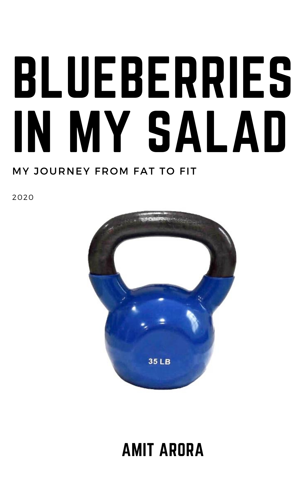

--- 
title: "Blueberries in My Salad"
author: "Amit Arora"
date: "`r format(Sys.time(), '%B %Y')`"
site: bookdown::bookdown_site
output: bookdown::gitbook
documentclass: book
link-citations: yes
always_allow_html: true
description: "This book describes a journey of clean eating and regular workouts that I undertook with my wife from being fat to fit. Like a salad, life may not be the most appealing lunch option but if you can keep finding the blueberries every now and again, it is both rewarding and fulfilling."
classoption: oneside
cover-image: "introduction/blueberries-in-my-salad.png"
github-repo: aarora79/from-fat-to-fit
linestretch: 1.15
linkcolor: NavyBlue
links-as-notes: true
url: 'https\://aarora79.github.io/from-fat-to-fit/'
twitter-handle: aarora79
header-includes:
  - \pagenumbering{gobble}
  - \usepackage{setspace}
  - \doublespacing
  - \usepackage{float} 
  - \usepackage{caption} # Insert the package used by gt
  - \usepackage{titlepic}
  - \titlepic{\includegraphics[width=\textwidth]{introduction/blueberries-in-my-salad.pdf}}
---


```{r include = FALSE}
if(!knitr:::is_html_output())
{
  options("width"=56)
  knitr::opts_chunk$set(tidy.opts=list(width.cutoff=56, indent = 2), tidy = TRUE)
  knitr::opts_chunk$set(fig.pos = 'H')
  knitr::opts_chunk$set(fig.width = 14)
  knitr::opts_chunk$set(fig.height = 10)
}
```

```{r setup=TRUE, echo=FALSE, warning=FALSE, message=FALSE}
library(gt)
library(xts)
library(zoo)
library(glue)
library(dplyr)
library(tidyr)
library(ggplot2)
library(stringr)
library(waffle)
library(ggthemes)
library(kableExtra)
library(lubridate)
library(tidyverse)
library(futile.logger)

source("globals.R")

# read the data, this comes from the biomettracker repo
# sometimes due to a bug in the weight measurement machine
# the lean mass and weight come as the same value, this is not 
# correct so we set the lean mass to NA in that case.
df_P1 <- read_csv(P1_DATA_URL) %>%
  mutate(Date=ymd(Date)) %>%
  mutate(`Lean Mass` = ifelse(`Lean Mass` == Weight, NA, Weight))
df_P2 <- read_csv(P2_DATA_URL) %>%
  mutate(Date=ymd(Date))%>%
  mutate(`Lean Mass` = ifelse(`Lean Mass` == Weight, NA, Weight))

df_p1_starting_weight <- df_P1 %>% filter(Date == min(Date, na.rm=TRUE)) %>% pull(Weight)
df_p2_starting_weight <- df_P2 %>% filter(Date == min(Date, na.rm=TRUE)) %>% pull(Weight)

df_starting_and_target_weights <- data.frame(name=c(P1_NAME, P2_NAME),
                                             Starting=c(df_p1_starting_weight, df_p2_starting_weight),
                                             Target=c(P1_TARGET_WEIGHT, P2_TARGET_WEIGHT),
                                             Ideal=c(P1_IDEAL_WEIGHT, P2_IDEAL_WEIGHT))

df_starting_and_target_weights <- df_starting_and_target_weights %>% 
  gather(metric, value, -name) %>%
  mutate(metric = paste0(metric, " Weight"),
         value = as.numeric(value))

# in this section of the code we will do all our data reading, cleaning, wrangling...basically
# everything except the timeseries forecasting bit so that the rest of the sections simply display the 
# charts based on the data analysis done here. The forecasting is left to its own section later in the code
# because it is based on user input and so it needs to be done redone whenever the input changes.

# read the raw data for person 1, print basic summary and metadata
df_P1 <- read_csv(P1_DATA_URL) %>%
  mutate(name=P1_NAME) %>%
  arrange(Date) %>%
  mutate(Date=ymd(Date)) %>%
  filter(Date >= START_DATE) %>%
  mutate(`Lean Mass` = ifelse(`Lean Mass` == Weight, NA, Weight))
# read the raw data for person 2, ultimately we want to have this dashboard work the same way
# even if there was only person 1 so put the following in an if checl
if(!is.na(P2_NAME)) {
  df_P2 <- read_csv(P2_DATA_URL) %>%
    mutate(name=P2_NAME) %>%
    arrange(Date) %>%
    mutate(Date=ymd(Date)) %>%
    filter(Date >= START_DATE) %>%
    mutate(`Lean Mass` = ifelse(`Lean Mass` == Weight, NA, Weight))
}
# read the important dates csv file. This is needed because we would like to annotate this journey
# so that we can say oh right there was an increase in weight for these days and it followed a birthday party, for example...
if(!is.na(IMPORTANT_DATES_FPATH)) {
  important_dates <- read_csv(IMPORTANT_DATES_FPATH)
}
# combine the dataframes, we want to do a side by side analysis for both people
if(!is.na(df_P2)) {
  df <- bind_rows(df_P1, df_P2)
} else {
  df <- df_P1
}
# get the data in tidy format i.e. Each variable must have its own column.
# Each observation must have its own row.
# Each value must have its own cell.
# see https://r4ds.had.co.nz/tidy-data.html
df_tidy <- df %>%
  gather(metric, value, -Date, -name) %>%
  mutate(value=as.numeric(value))

# determine the per day weight loss dataframe by
# calculating loss as weight - the one previous value of weight
# this is done by first grouping the dataframe by name since it has
# data for two people and then arranging by date while maintaining
# the grouping (NOTE: .by_group=TRUE)
df_wt_loss <- df_tidy %>%
  filter(metric=="Weight") %>%
  select(name, Date, value) %>%
  group_by(name) %>%
  arrange(Date, .by_group=TRUE) %>%
  mutate(loss_per_day = -1*(value-lag(value, 1)))  %>%
  mutate(loss_per_day_7_day_ma=rollapply(loss_per_day, 7, mean,align='right',fill=NA))
# is the curse of the weekend real? Assign the day to each date so that we can determine
# if say the weight loss eventually after the weekend was very less or maybe not even there...
df_wt_loss <- df_wt_loss %>%
  mutate(day = weekdays(as.Date(Date)))
# determine how much of theweight loss target has been achieved, this is done by finding the starting
# weight (configured), target weight (configured) and seeing how far each person has reached based on
# what their current weight is. This percentage is used to display a gauge (like the needle of a speedometer)
p1_starting_weight <- df_tidy %>% filter(name==P1_NAME & metric=="Weight") %>% head(1) %>% pull(value)
p1_latest_weight <- df_tidy %>% filter(name==P1_NAME & metric=="Weight") %>% tail(1) %>% pull(value)
# weight loss would be negative when calculated so multiply by -1
p1_wt_lost_as_pct <- -1*100*((p1_latest_weight-p1_starting_weight)/p1_starting_weight)
p2_starting_weight <- df_tidy %>% filter(name==P2_NAME & metric=="Weight") %>% head(1) %>% pull(value)
p2_latest_weight <- df_tidy %>% filter(name==P2_NAME & metric=="Weight") %>% tail(1) %>% pull(value)
p2_wt_lost_as_pct <- -1*100*((p2_latest_weight-p2_starting_weight)/p2_starting_weight)
p1_target_achieved_pct <- (p1_starting_weight-p1_latest_weight)/(p1_starting_weight-P1_TARGET_WEIGHT)*100
p2_target_achieved_pct <- (p2_starting_weight-p2_latest_weight)/(p2_starting_weight-P2_TARGET_WEIGHT)*100
# daily weight loss, this is important for a lot of charts and tables
# not the use of group by (name) and then lag. The dataframe is already sorted
# in asc order of time, so if the weight is reducing the daily_wt_loss would be a 
# -ve number, for several charts and tables this is multiplied with -1 so provide
# the absolute loss
df_daily_wt_loss <- df_tidy %>%
  filter(metric == "Weight") %>%
  group_by(name) %>%
  mutate(daily_wt_loss = value - lag(value))
# how many days did it take for each pound to drop? This is found by finding the max date i.e. the last date
# on which each weight (as a whole number, so 230, 229 etc) was seen and then subtracting that date from
# the last date of the previous highest weight. So if 230 was say the 20th pound to drop (if we started from 250 say)
# then the number of days between 231 and 230 becomes the number of days it took to lose the 20th pound.
df_days_to_next_drop <- df_daily_wt_loss %>%
  mutate(value = floor(value)) %>%
  ungroup() %>%
  group_by(name, value) %>%
  summarize(Date=max(Date)) %>%
  arrange(desc(Date)) %>%
  mutate(value_diff=value-lag(value), days=abs(as.numeric(Date-lag(Date)))) %>%
  replace_na(list(value_diff = 0, days = 0)) %>%
  mutate(value=value-min(value)) %>%
  filter(value != 0)
# read the precalculated forecasts and target achievement data 
# this is needed because shinyapps.io does not support Prophet (in the sense there are errors in installing it)
df_forecast_p1 <- read_csv(P1_FORECAST_FPATH) %>%
            select(y, yhat, yhat_lower, yhat_upper, ds) %>%
            mutate(ds=as.Date(ds)) %>%
            left_join(df_tidy %>%
                        select(Date, metric, value, name) %>%
                        filter(name==P1_NAME & metric == "Weight") %>%
                        group_by(Date) %>%
                        filter(value==min(value)) %>%
                        ungroup(),
                      by = c("ds"="Date")) %>%
            mutate(y = value, ds=ymd(ds)) %>%
            select(-metric, -value, -name)


df_target_achieved_p1 <- read_csv(P1_TARGET_ACHIEVED_FPATH)
df_forecast_p2 <- read_csv(P2_FORECAST_FPATH) %>%
            select(y, yhat, yhat_lower, yhat_upper, ds) %>%
            mutate(ds=as.Date(ds)) %>%
            left_join(df_tidy %>% 
                        select(Date, metric, value, name) %>% 
                        filter(name==P2_NAME & metric == "Weight") %>%
                        group_by(Date) %>%
                        filter(value==min(value)) %>%
                        ungroup(),
                      by = c("ds"="Date")) %>%
            mutate(y = value, ds=ymd(ds)) %>%
            select(-metric, -value, -name)


df_target_achieved_p2 <- read_csv(P2_TARGET_ACHIEVED_FPATH)
# read body measurements file
df_measurements <- read_csv(MEASUREMENTS_FPATH)
df_measurements <- df_measurements %>%
  filter(measurement %in% MEASUREMENTS_TO_KEEP)

# table for different types of exercises
df_exercises <- read_csv(EXERCISES_URL) 

# exercise dates for calendar plot
df_exercise_dates <- read_csv(EXERCISE_DATES_URL)  %>%
  mutate(date=ymd(date)) 
df_deadlifts <- read_csv(P2_DEADLIFT_URL)

# references
df_references <- read_csv(REFERENCES_URL)


# clean eating list
df_clean_eating_list <- read_csv(CLEAN_EATING_URL) %>%
  replace_na(list(`(Optional) Notes` = ""))

# break up of days, how many days did we lose wieght, gain weight, no change
p1_days_counts <- df_wt_loss %>%
  filter(name == P1_NAME) %>%
  ungroup() %>%
  select(Date, loss_per_day) %>%
  drop_na() %>%
  mutate(category = case_when(
    loss_per_day > 0 ~ "Weight Loss",
    loss_per_day < 0 ~ "Weight Gain",
    loss_per_day == 0 ~ "No Change"
  )) %>%
  count(category, sort=FALSE) %>%
  mutate(category_label = glue("{category} ({n} days)")) %>%
  select(-category)

p1_days_total <- sum(p1_days_counts$n)
p1_days_counts_as_list <- unlist(p1_days_counts$n)
names(p1_days_counts_as_list) <- p1_days_counts$category_label

p2_days_counts <- df_wt_loss %>%
  filter(name == P2_NAME) %>%
  ungroup() %>%
  select(Date, loss_per_day) %>%
  drop_na() %>%
  mutate(category = case_when(
    loss_per_day > 0 ~ "Weight Loss",
    loss_per_day < 0 ~ "Weight Gain",
    loss_per_day == 0 ~ "No Change"
  )) %>%
  count(category, sort=FALSE) %>%
  mutate(category_label = glue("{category} ({n} days)")) %>%
  select(-category)

p2_days_total <- sum(p2_days_counts$n)
p2_days_counts_as_list <- unlist(p2_days_counts$n)
names(p2_days_counts_as_list) <- p2_days_counts$category_label
```

# Preface to the updated 2nd edition

```{r, echo=FALSE}
if (knitr:::is_html_output())
{
  
}
```

I would not say that I wrote the first edition of this book (also, my first book) on a whim, but even so, it wasn't something that was a part of new years resolutions either. Well, it was the year of our Lord 2020 after all, between Amazon running out of podcast mikes and peacocks being sighted in the streets, anything was possible. A person like me who had been overweight and unfit most of their adult life suddenly writing a book on health and fitness, why not?

Since the 9 months or so that have elapsed between the first edition getting (self-)published and me starting work on the second edition, a few things happened. Firstly, I met several people, some close friends, some acquaintances and some complete strangers who told me how much they enjoyed reading the book, that it was useful for them in their own fitness journey and also they were curious if we eventually did reach our fitness goals (the first edition ends with me and my wife being about three quarters of the way there). I did reach my fitness goals both in terms of my body weight and deadlift target, so right there, there was a sequel to the first book waiting to be written. Secondly, I realized what a great learning and personal growth it was for me to actually put down all our experiences on paper and understand that it is one thing to hold your own in a conversation at a dinner party and a totally different thing to string together cogent and coherent sentences in a book. Finally, I learn and remember by writing (or typing). As they say one good habit begets another, I started reading and learning more and more, incorporating in my own life what I could about overall wellness, aging and longevity, nutrition and other aspects of human health. I felt I should write what I learnt.

I am far from being an expert and certainly would not suggest to anyone to begin on this journey without proper guidance, but it is, after all, a voyage of self-discovery. This book is a travelogue of my midlife journey through the hills and valleys of health and fitness, discovering new (to me) vistas and realizing truths that now appear self-evident. Perhaps the most important truth that I learnt was that a choice between work and workout is a false binary. There is no work (as in a job, business, studies) without a workout. While it is mind over matter, always, but our physical body is also a tool to control the mind. A good workout does more for the mind than for the body, having experienced that over and over again, I just cannot stress that enough. A good session of strength training is about as perfect a start to a day that you can ask for, it sets you up for success, give it a chance!

This edition of the book covers several new topics, such as "water fasting", "proteins are not your only friend and carbs are not your enemy", "strength training or cardio", and also a topic that has applicability even outside of fitness and strength: "consistency rather than intensity, the power of showing up every day".

When I started my journey, I was not sure of how long would it last. Actually, I never thought about it in terms of a start and a finish, I did not think much of anything except that this was a good road to travel. Until then, most people I knew thought about good health in terms of a single metric: **body weight**. People spoke in terms of "oh, I need to lose 10 pounds", "I need to get rid of belly fat" and so on, no one and I mean no one that I knew of spoke in terms of "I want to have more energy", "I want to sleep better", "I want better physical fitness that helps me become better at whatever I do". So when I started, my focus was also, not surprisingly, body weight, but over time I realized, body weight was just one metric, an important one, but still one of several. A healthy mind lives in a healthy body, and a healthy body takes persistent effort, day after day, week after week, month after month. Unless you have hit a genetic lottery and are just born with great metabolism, there is a lot of work to put in (I would in fact argue that if you have hit the genetic lottery you have an obligation to maintain it). But a healthy lifestyle does not have to be a chore, people often get disappointed to hear that health is not a quick fix, the 10 pounds that they want to lose will come back once they go back to their old eating habits. Life long changes require life long efforts, and I would question, why should it be any other way? There is a great amount of satisfaction and feeling of self worth to be derived from looking back and reflecting "Yes, I really did this, not as a one time quick fix solution, but consistently!". What drives me is not just some goal that I decided to set up for myself but the experience, the blood, sweat and tears (metaphorically speaking) in the pursuit of the goal. I do have goals (a 400 lb deadlift, completing the [murph challenge](https://themurphchallenge.com/) in under 35 minutes) but those are more like milestones on a highway rather than a destination to get to. As long as I am making progress, howsoever small, even if it is two steps forward and one step backwards, it is all good. Fitness is an infinite game, the objective is to play the game for as long as possible and that can only happen by enjoying the journey and being proud of the effort. 

For most of 2020 and early part of 2021, social interactions were severely curtailed because of Covid. As we started seeing people, it was interesting and encouraging to see that the reactions I got from people changed from "how are you losing so much weight?" to "you look athletic!" or "you look strong!". When someone praises you, it invariably creates a dopamine rush that drives you to keep up the good work. Whether it is an Instagram like or a complement on your physical fitness, the physiological processes involved are the same, but I would argue getting the dopamine rush via someone saying nice things because you are a transformed person is probably not so bad! Just to be clear, I don't mind the Instagram likes at all. I put a lot of fitness content on my Instagram @ilivethedata primarily to chronicle my workout progress but also to maybe give hope to some random person scrolling through their Instagram feed and thinking "if he can, then why can't I?". It is always nice to see how far down that road I have traveled from being the clumsy person who could barely do a squat to someone who now regularly does a 110lb barbell squat.

A word about data, we kept up with the practice of collecting weight and other biometrics every day and that has been invaluable. I would have liked to have better tracking for all of our exercises, but did not find an app which did quite what I wanted. Started creating my own app for tracking workouts, but between my day job, working on the app or writing this book, I choose this book :). Hopefully, the app will also be available in the not too distant future. The charts and tables in this book are all generated using R and gpplot2, please see this [github repo](https://github.com/aarora79/biomettracker) to find the latest data. This book is rendered using the wonderful [bookdown package](https://bookdown.org/), very thankful for it.

As all good books should, this book too has a website now. Please see [blueberriesinmysalad.com](blueberriesinmysalad.com). The website tracks our journey as it continues, has updates on what are the latest topics in health and fitness that I am currently learning about and maybe a monthly newsletter as well in the future. 

Finally, to the one person who sent me screenshots of underlined passages of my book with questions written on the margin, thank you for the encouragement :), please look for a signed copy of this new edition in the mail!


Amit Arora  
Clarksburg, Maryland  

PS: I never thought that people would read my book by borrowing it from a friend, who in turn borrowed it from another friend :), but it did happen. To those friends, I say, I see you :) and this time please have at least two friends buy the book and I will be happy to sign a copy for you.


# Preface to the 1st edition

This is neither a book on salads, nor a commentary on life. What it is, is a journal of experiences that my wife and me had in our journey towards being fit and strong.  Like a salad, day to day life may not be the most appealing lunch option, but just like a good salad if you can keep finding the blueberries every now and again, it is both rewarding and fulfilling. The small and big milestones we achieved during our journey kept us going, just like the blueberries in our salad.

Initially, I wanted to write a book documenting our journey towards fitness and strength on a day to day or at least a week by week basis. As things progressed, I realized that we were not the only ones on this journey and the Internet was filled with blogs and YouTube videos that document in great detail, very successful, inspiring and transformational stories. Why was I wanting to reinvent the wheel by writing our story on the same lines? I thought that while a daily or weekly journal was not something I could do but definitely there were "topics" on which I would like to pen down my thoughts. For example, the most often asked question, "What diet did we follow?", "Do I really need a trainer?", "Just tell me how long would it take to lose 10 pounds" and so on. Therefore I decided to write this book as a collection of essays on these and other related topics.

It has been more than 9 months since we started this journey and I feel that we have learnt so much that it is important to document this first and foremost for our own selves and then also for anyone who might be interested (I hope someone is). After all, it is one thing to see someone famous transform and another thing to see someone you know or could relate to (middle aged Punjabi NRI couple anyone?) do the same and then realize "If they could do it, so can I".

We took daily measurements for our weight and other biometrics and they were automatically synced via an app on our phone. This is huge, daily tracking enables, even forces, conversations around progress (or lack thereof) towards your targets. It keeps you honest and on track. What it also enables is to see the big picture over time, such as are you slowing down, do you need to make adjustments to your routine, how much that elaborate weekend dinner set you back? For me personally, as a data scientist it was fascinating to collect the raw data, find patterns, gain insights and also get some forecasts done (when would we reach our target weight?).

Over time I understood that while the desire for weight loss was what got me here, but what I was really gaining was good health and strength. One can lose weight by falling sick, we know that is not healthy. Weight loss should not be the only goal. To reduce the benefits of what we were doing to just burning calories and losing tens of pounds now seems like a terrible underselling of the idea of fitness. The human body is a fascinating machine capable of wonderful things, good health is a state of both mind and body. Exercise and healthy eating habits help both mind and body. If you do not have any serious health issues there isn't really any excuse for not exercising regularly and eating healthy. As it is said  loosely translated it means that the body is the source of all good deeds.

Finally, nothing in this book should be interpreted as me recommending anything, a written version of my musings is what this is. An experiment with a sample size of N=2, in other words statistically irrelevant! **Do not take anything that you read in this book as medical advice. Always consult your doctor before starting any diet or exercise program.**

## Acknowledgements

Besides improving our quality of life, clean eating and exercises also provided me the impetus to finally take up something that I have wanted to do for a long time, writing a book.

This would not have been possible without my dear wife Nidhi, who was not only an equal partner in this journey but was also the head chef to prepare all the tasty & nutritious food (all the photographs including the book cover are courtesy her), the assistant coach who kept an eagle eye on my forms during the exercise and also the one who kept on encouraging me to write. She is also the proofreader for this book, although, any mistakes and omissions are mine alone.

A huge thank you is due to our wonderful trainer and friend, Dawn Kirk. Thank you Dawn for persisting and persevering with us. I wish everyone has the good fortune to have a trainer like you.  

Finally, this book is dedicated to my grand parents, my guardian angels. I know they watch over me.

Amit Arora  
Clarksburg, Maryland  

